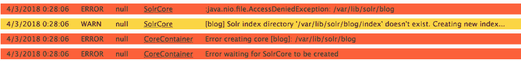
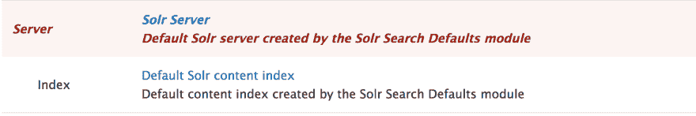
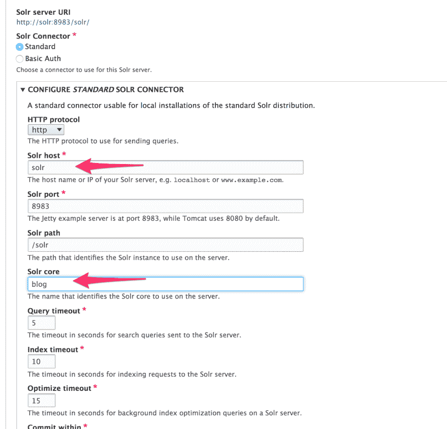

# 使用 Docker 设置 Solr 和 Drupal

> 原文：<https://dev.to/arturolinares/setup-solr-and-drupal-using-docker-3nh6>

# 使用 Docker 设置 Solr 和 Drupal

上次我试图从头开始创建一个使用 Solr 服务器的 Drupal 实例时，并没有我想象的那么容易。也许安装模块的命令行工具已经宠坏了我，我只是希望运行类似于`drupal module:install solr`的工具就能为我配置好一切。

这里是我如何使它工作，但请考虑我不是 Solr 专家。如果你知道更好的方法，请告诉我。

## 设置 Drupal

假设我们想要创建一个使用 Solr 搜索内容的博客。

首先，要创建一个基本的 Drupal 安装，我们可以使用最近从 [WeKnow](http://weknowinc.com) 发布的项目，通过 Docker 快速创建一个 Drupal 实例。遵循 README 文件，保留默认的`.env`值，这样我们就可以使用这个命令安装 Drupal:

```
$ docker-compose exec --user=82 php drupal site:install standard --db-host=mariadb --db-name=drupal --db-user=drupal --db-pass=drupal --quiet 
```

不要忘记添加 README 文件中提到的`hosts`条目，或者使用类似于 [hotel](https://github.com/typicode/hotel) 的代理。目标是使用 web 服务器可以识别的自定义域名(如果我们使用 localhost，并且在我们使用的`.env`文件中使用了`HOST_NAME=drupal.vm`，web 服务器将不会为请求提供服务)。

如果您在访问`http://drupal.develop`时看到一个新的 Drupal 安装，您就可以验证它正在工作。

## 安装 Solr

让我们现在安装 Solr。我们需要在模块中找到一些配置文件来设置我们的 Solr 核心，所以让我们把它下载到容器中:

```
$ docker-compose exec --user=82 php composer req drupal/search_api_solr 
```

我们将创建一个名为*博客*T5 的示例核心。复制位于`web/modules/contrib/search_api_solr/solr-conf/5.x/`到`env/solr/blog/conf/`的文件，并在`env/solr/blog/core.properties`中创建这个文件(你需要创建 *env* dir):

*env/Solr/blog/core . properties*

```
name=blog
config=solrconfig.xml
schema=schema.xml
dataDir=/var/lib/solr/books 
```

更新`docker-compose.yml`以包含`solr`容器，并配置其端口以及使用 traefik 访问它的方式(如果使用`.env`中的默认值，则使用`http://solr.drupal.develop`):

*码头-化合物. yml*

```
services:
  # ...
  solr:
    image: solr:5.5
    labels:
      - 'traefik.backend=solr'
      - 'traefik.port=8983'
      - 'traefik.frontend.rule=Host:solr.${HOST_NAME}'
    volumes:
      - ./env/solr/blog:/opt/solr/server/solr/blog
      - solrdata:/var/lib/solr

volumes:
  mysqldata:
    driver: "local"
  solrdata:
    driver: "local" 
```

> 不要忘记将`solr.drupal.develop`添加到您的 hosts 文件中)。

运行`docker-compose up -d`(并将`solr.drupal.development`的条目添加到您的主机文件中)之后，您将在 solr 中看到以下错误:

[T2】](https://res.cloudinary.com/practicaldev/image/fetch/s--s_ylRGp5--/c_limit%2Cf_auto%2Cfl_progressive%2Cq_auto%2Cw_880/https://d2mxuefqeaa7sj.cloudfront.net/s_B9921B2B19B493AF2F7DA42223C9598F9068F4CEAFE3B4757DB813CAC4A9C716_1520144934510_image.png)

这是因为用户和 uid 必须与 solr 进程在 solr 容器中运行的用户相匹配。为了解决这个问题，我们必须创建另一个容器来修复内核写入索引的位置。

我们将使用`just-containers/base-alpine` image，它有一些实用程序可以做到这一点( [s6](https://github.com/just-containers/s6-overlay) )。

添加 docker 文件以更新修复 perms 并更新 docker-compose 以使用这个新容器:

*。/docker files/Solr _ data/docker file*

```
FROM just-containers/base-alpine
VOLUME ["/var/lib/solr"]
ADD root / 
```

*./dockerfiles/solr_data/root/etc/fixattrs.d*

```
/var/lib/solr false solr,8983 0755 
```

并更新`docker-compose.yml`以包含该图像:

```
services:
  solr:
    image: solr:5.5
    labels:
      - 'traefik.backend=solr'
      - 'traefik.port=8983'
      - 'traefik.frontend.rule=Host:solr.${HOST_NAME}'

    # add the volumes from the new container
    volumes_from:
      - solr_data
    # the core configs
    volumes:
      - ./env/solr/blog:/opt/solr/server/solr/books

  # added container to fix perms
  solr_data:
    build: ./dockerfiles/solr_data
    volumes:
      - real_solr_data:/var/lib/solr

volumes:
  mysqldata:
    driver: "local"
  real_solr_data:
    driver: "local" 
```

现在，如果你运行`docker-compose up -d`并访问 Solr 页面，你应该会看到你的错误被修复。

## 配置 Solr

现在我们已经运行了服务器，让我们配置 Drupal，这样我们就可以将它用作搜索引擎。幸运的是，大部分的辛苦都是通过启用`search_api_solr_default`模块解决的。

```
$ docker-compose exec --user=82 php drupal moi search_api_solr_defaults 
```

转到 Search API configs ( `/admin/config/search/search-api`)，您将看到一个新的 Solr 服务器条目，尽管有错误，因为它缺少服务器名称和它将使用的核心。

[T2】](https://res.cloudinary.com/practicaldev/image/fetch/s--sXONkfn0--/c_limit%2Cf_auto%2Cfl_progressive%2Cq_auto%2Cw_880/https://d2mxuefqeaa7sj.cloudfront.net/s_B9921B2B19B493AF2F7DA42223C9598F9068F4CEAFE3B4757DB813CAC4A9C716_1520146790065_image.png)

点击编辑，设置主机(即。solr 容器名， *solr* )和我们之前创建的核心(*博客*):

[T2】](https://res.cloudinary.com/practicaldev/image/fetch/s--SC2Kif1l--/c_limit%2Cf_auto%2Cfl_progressive%2Cq_auto%2Cw_880/https://d2mxuefqeaa7sj.cloudfront.net/s_B9921B2B19B493AF2F7DA42223C9598F9068F4CEAFE3B4757DB813CAC4A9C716_1520147362408_image.png)

单击 save，当您返回到 Search API config 页面时，应该能够看到所有的绿色。你现在可以开始使用你的 solar 服务器进行搜索了。

> defaults 模块包含一个示例搜索页面，可帮助您轻松开始使用`/solr-search/content`。它被实现为一个视图。

## 参考文献

您可能会发现以下链接很有用:

*   [悬臂梁示例](https://github.com/phase2/outrigger-examples)
*   试试 Drupal

Permalink: [使用 Docker](arturolinar.es/blog/post/setup-solr-and-drupal-using-docker) 设置 Solr 和 Drupal