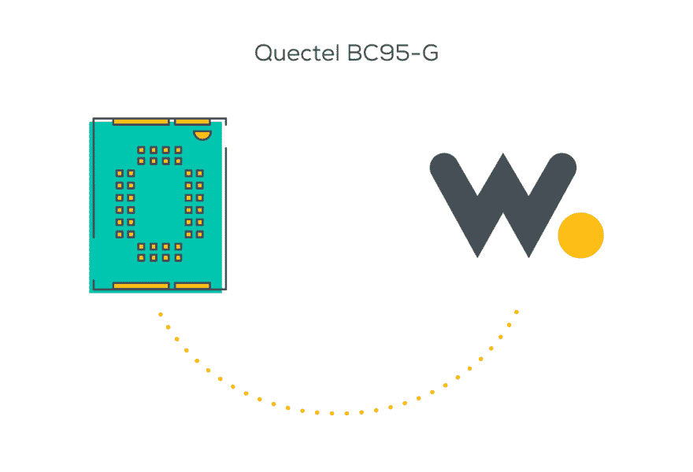
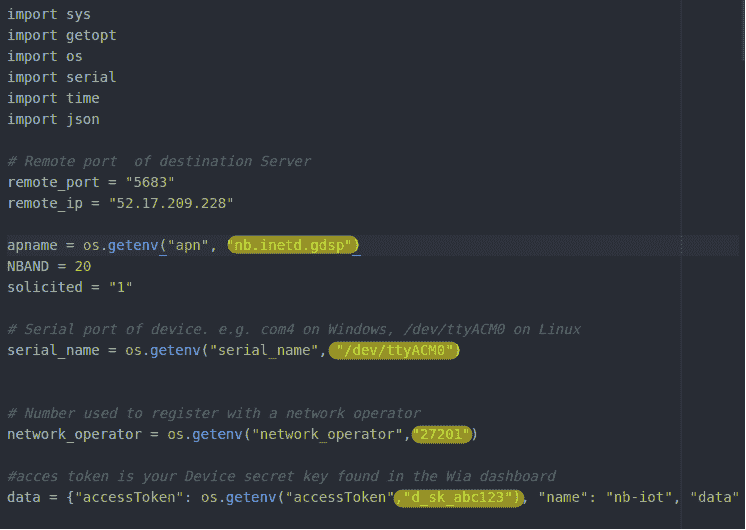
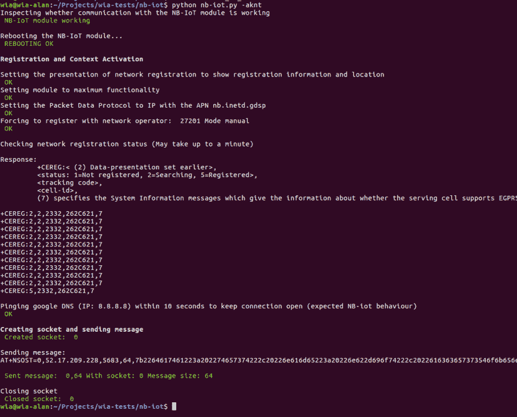

# 设置您的 Quectel BC95-G 并将任何事件发布到 Wia

> 原文：<https://dev.to/wiaio/setup-your-quectel-bc95-g-and-post-any-event-to-wia-2f3a>

 
在本教程中，我们将通过初始步骤来设置 NB-IoT 和 Quectel BC95-G，并将事件发布到 Wia。

### **组件**

*   Quectel BC95-G
*   NB-IoT 兼容天线
*   NB-IoT 兼容 SIM 卡(请向您的网络运营商咨询)

### **安装 Python 和 Pyserial**

如果你还没有，你需要在你的电脑上安装 Python 来完成这个教程。

*   [Python](https://www.python.org/downloads/)
*   2.7.x 版
*   遵循适用于您的操作系统的下载说明

**注意:python 环境变量**
在使用 Windows 时，你需要将 Python 添加到你的路径中，以便在你的操作系统中的任何地方使用它。更多关于[这里](https://docs.python.org/2/using/windows.html#excursus-setting-environment-variables)。

现在安装`pyserial`库:

*   对于 Windows，打开 PowerShell(或命令提示符)并运行命令`pip install pyserial`
*   对于 Mac/Linux 打开终端并运行命令`pip install pyserial`

**注意:运行命令的问题？**
在极少数情况下，如果`pip install pyserial`不起作用，可以尝试下面的方法来代替:
`python -m pip install pyserial`

### **下载代码**

*   对于 Windows，在您选择的位置打开 PowerShell，并在 PowerShell 终端中运行`git clone` `git@github.com:wiaio/nb-iot-utilities.git`
*   对于 Mac/Linux，在您选择的位置打开一个终端，并在终端中运行`git clone` `git@github.com:wiaio/nb-iot-utilities.git`

或者，你可以在这里下载 zip 文件[。](https://github.com/wiaio/nb-iot-utilities)

*   提取你选择的位置的压缩文件

找到`Quectel`文件夹，里面有另一个文件夹是用于`BC95-G`的，进入其中，有包含控制模块的命令的 Python 脚本。

### **查找设备的串口**

#### Linux 和 Mac OS X

*   从[这里](https://www.silabs.com/products/development-tools/software/usb-to-uart-bridge-vcp-drivers)下载并安装 USB 转 UART 桥驱动程序。为您的操作系统和体系结构选择合适的版本
*   打开终端窗口并运行命令`ls /dev/tty*`
*   查找名称以`/dev/tty`开头的设备，例如 Mac 上的`/dev/tty.usbmodemPy343431`或 Linux 上的`/dev/ttyUSB0/dev/ttyACM0`

**注意:对于 Linux，您可能需要运行下面的两个命令。一旦你完成了，重启你的电脑。这将添加允许您将草图上传到板上的权限。**

`sudo usermod -a -G tty ${USER}`
T1】

#### 窗口

*   从[这里](https://www.silabs.com/products/development-tools/software/usb-to-uart-bridge-vcp-drivers)下载并安装 USB 转 UART 桥驱动程序。为您的操作系统和体系结构选择合适的版本。
*   打开 Windows 开始菜单，搜索`Device Manager`
*   设备的 COM 端口将被列为`USB Serial Device`或类似的名称
*   记下 COM 端口(例如 COM4)
    *   现在将`initial_config.ino`代码复制并粘贴到 Arduino IDE 中
    *   点击`Upload`刷新电路板，现在您应该准备好与您的模块通信了。

### **更新 nb-iot.py**

在我们与设备交互之前，有几个变量需要更新文件`nb-iot.py`。

在您最喜欢的文本编辑器中，打开`nb-iot.py`并遵循以下步骤:

*   找到并替换`serial_name`为之前在教程中获得的端口
*   在 Wia 仪表板中找到并替换`accessToken`为您设备的密钥
*   找到并替换`apn`与您的运营商 APN(默认:沃达丰爱尔兰)
*   找到并使用您的运营商 ID 替换`network_operator`(默认:沃达丰爱尔兰)

**Wia CoAP API 端点详细信息**
`52.17.209.228`是 Wia CoAP API 的 IP 地址，`5683`是端口。

[T2】](https://res.cloudinary.com/practicaldev/image/fetch/s--8lCFrTo---/c_limit%2Cf_auto%2Cfl_progressive%2Cq_auto%2Cw_880/https://files.readme.io/bed4da1-serial_accesstoken.png)

对于`BC95-G`，有许多[支持的频段](https://www.quectel.com/UploadFile/Product/Quectel_BC95-G_NB-IoT_Specification_V1.0.pdf)，因此为了减少搜索 PLMN 所有频段的时间，限制由地区和您的网络运营商指定的频段非常有用。

*   找到并更换`NBAND`(默认:20(欧洲))

### **与设备接口**

*   对于 Windows，在 PowerShell 中，在 PowerShell 终端中运行`python nb-iot.py -a`
*   对于 Mac/Linux，打开一个终端并在终端中运行`python nb-iot.py -a`,该命令通过在设备上运行最简单的命令(AT)来检查设备是否正在使用我们的代码。

有关可用命令的完整列表:

*   对于 Windows，在 PowerShell 中，在 PowerShell 终端中运行`python nb-iot.py -h`
*   对于 Mac/Linux，打开一个终端并在终端中运行`python nb-iot.py -h`

### **向 Wia 发布事件**

要使用 NB-IoT 设备将事件发布到 Wia，请运行以下命令:

*   对于 Windows，在 PowerShell 中，运行命令 python `nb-iot.py -aknt`
*   对于 Mac/Linux 打开终端并运行命令`python nb-iot.py -aknt`

该脚本执行以下操作:

*   检查代码是否可以与设备接口
*   重置设备
*   将设备连接到网络
*   打开一个套接字，通过 UDP 向 Wia 发送一条消息，输出应该如下图所示:

### **常见错误**

某些设备的固件可能较旧，与您尝试连接的网络不兼容。您需要联系您的经销商以获取最新的固件和更新软件。

对于`BC95-G`,如果您没有更新固件，模块将在前台的 PLMN 中进行深度搜索，这意味着可能需要几个小时才能完成扫描并连接到网络。这种深度搜索在固件版本 1.9+的后台进行。

如果您仍然无法连接，请给我们留言。