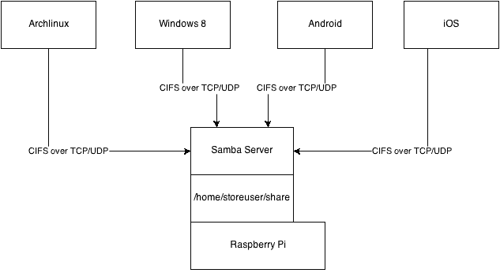
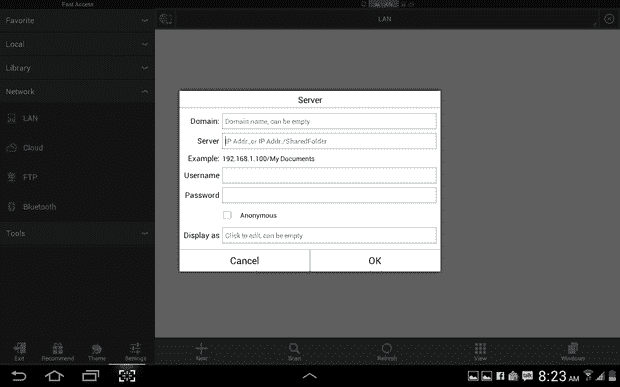
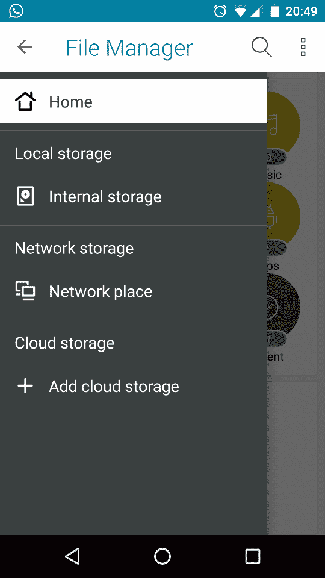
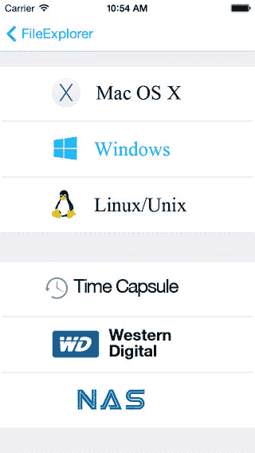

# 带树莓皮和桑巴的家庭储物件

> 原文：<https://dev.to/petarov/shared-home-storage-with-raspberry-pi-and-samba-38d9>

# 目录

*   [目标](#goal)
*   [树莓派](#rpi)
    *   [移除 X11](#remove-x11)
    *   [存储用户](#storage-user)
*   [桑巴服务器](#samba-server)
    *   [安装](#samba-server-install)
    *   [配置](#samba-server-conf)
*   [Clinets](#clients)
    *   [Linux 客户端](#linux-client)
        *   [查看股份](#linux-client-shares)
        *   [fstab 安装](#linux-client-fstab)
    *   [安卓客户端](#android-client)
    *   [iOS 客户端](#ios-client)
*   [参考文献](#refs)

# 目标

这里的想法很简单。在 Raspberry Pi[【1】](#refs)设备上安装一个中央存储器，这样我们就可以在家里交换文件，而不用使用*云*或 *Skype* 或任何其他消息服务。整个事情并不难设置，我推荐给每个人，可以抽出一些时间和精力来做这件事。

我想拥有的东西:

1.  放置和交换文件的中央存储。
2.  可通过桌面和移动设备访问。
3.  仅在内部网络上可用。
4.  用户/密码保护。
5.  一个最终用我得到的 RPi 做些事情的理由。

[T2】](https://res.cloudinary.com/practicaldev/image/fetch/s--WjsysnSB--/c_limit%2Cf_auto%2Cfl_progressive%2Cq_auto%2Cw_880/https://thepracticaldev.s3.amazonaws.com/i/kxofvivme0llfdl6x154.png)

最初，我想在 RPi 设备上安装一个专用的云或存储解决方案，但是，我发现配置一个 Samba 服务器更加简单和直观。

# 树莓派

安装一个 Raspbian Lite【T1【2】，用`dd`把图像复制到你的 SD 卡上。查看官方安装指南[【3】](#refs)。

在 Linux 上，以下内容应该足够了:

```
dd bs=4M if=2018-10-09-raspbian-stretch.img of=/dev/sd? conv=fsync 
```

小心`sd?`部分！确保那是你的 SD 卡设备。

## 删除 X11(可选)

编辑:如果你下载了 Raspbian Lite，你不需要在这里做任何事情。

如果您想在没有桌面环境的情况下仅将 Raspbian 用作服务器，这可能是个好主意。你也可能会释放高达 500 兆的 SD 卡空间。

```
sudo apt-get remove --purge x11-common
sudo apt-get autoremove 
```

## 存储用户

添加名为`storeuser`的新用户。所有共享文件和文件夹都将存储在该用户的主目录中。

```
sudo adduser storeuser 
```

对这个人禁用 shell 登录也是一个好主意。最后，我们只想将这个用户作为 Samba 共享配置的基础。

```
sudo usermod -s /usr/sbin/nologin storeuser 
```

将创建一个新的个人文件夹`/home/storeuser`。接下来，创建一个`share`文件夹，共享文件和文件夹将保存在该文件夹下。

```
sudo cd /home/storeuser && mkdir share 
```

调整对共享文件夹的读/写权限:

```
sudo chown -R storeuser /home/storeuser/share
sudo chgrp -R storeuser /home/storeuser/share
sudo chmod -R 1770 /home/storeuser/share 
```

关于`1770`权限。我们将粘性位[【4】](#refs)设置为`1`，只允许这个文件夹`storeuser`的所有者编辑或删除文件。

创建一个示例文件，例如自述文件，以便在共享文件夹中至少有一个文件用于测试。

```
sudo touch /home/storeuser/share/README 
```

# 桑巴服务器

设置 Samba 共享有多种方法。出于我的需要，我选择了单用户密码保护的共享机制，但是您可以将其扩展到使用组和更复杂的身份验证方案。

## 安装

```
sudo apt-get install samba samba-common-bin 
```

## 配置

编辑`smb.conf`文件:

```
nano /etc/samba/smb.conf 
```

没错！我用了`nano`。我还是无法在另一个终端退出`vim`。处理好它。😊

为了安全起见，将您的网络添加到允许的主机:

```
[global]

hosts allow = 192.168.1\. 127. 
```

我在家里使用的是单子网网络。根据您的网络配置进行调整。

添加一个`workgroup`名称并启用 Windows 互联网名称服务:

```
[global]

hosts allow = 192.168.1\. 127.
workgroup = homeworld.net
wins support = yes 
```

现在配置共享。在`smb.conf`文件的末尾添加以下内容:

```
[mystorage]
   comment= my home storage
   path=/home/storeuser/share
   browseable=Yes
   writeable=Yes
   only guest=no
   create mask=1770
   directory mask=1770
   public=no 
```

`path`指定服务用户将被授予访问权限的目录。`browseable`控制该共享是否出现在网络视图的可用共享列表和浏览列表中。

向本地 Samba `smbpasswd`文件添加一个新的`storeuser`密码。该用户必须已经存在于系统中。我们将使用我们之前创建的`storeuser`。

```
smbpasswd -a storeuser 
```

这正是客户端将用来访问 Samba 共享的用户名和密码。

# 嫖客

## Linux 客户端

我在家里经常使用 Arch Linux，所以下面的描述主要针对这种情况。然而，这在其他 Linux 发行版上应该不会有太大的不同。

### 查看股票

我们可以首先通过使用`smbtree`来查看网络中可用的共享。就这样，为了乐趣和荣耀。

```
smbtree -U storeuser 
```

出现提示时，给出您之前使用`smbpasswd`设置的`storeuser`密码。结果应该如下所示:

```
MYDOMAIN.TLD
    \\RASPBIAN              my raspbian server
        \\RASPBIAN\storeuser        Home Directories
        \\RASPBIAN\IPC$             IPC Service
        \\RASPBIAN\mystorage        my home storage 
```

这将打印一个包含所有已知域、这些域中的服务器以及这些服务器上可用的共享的树。

### fstab 挂载

创建目标装载文件夹。

```
sudo mkdir /mnt/storage 
```

通过将共享添加到`/etc/fstab`来设置自动挂载。

```
//RASPBIAN/mystorage /mnt/storage cifs username=storeuser,password=<password>,comment=noauto,x-systemd.automount,_netdev,uid=<your linux user>,gid=<your linux user group> 0 0 
```

如果你没有使用`systemd`(对此我不怪你😉)，拆下`noauto,x-systemd.automount`部分。

*好吧，这到底是什么`_netdev`诡计？*

基本上，这意味着我们希望推迟装载共享，直到网络接口启动[【5】](#refs)。如果还没有建立连接，尝试安装是没有意义的。

让我们通过运行以下命令来显式装载共享:

```
sudo mount -a 
```

您应该会看到我们之前在`/mnt/storage`中创建的样本`README`文件。

## 安卓客户端

有许多 Android 工具可供选择。几乎所有支持 SMB 共享的东西都应该可以工作。过去我用的是 ES 文件浏览器[【6】](#refs)，但是我发现广告太碍事了，所以我换成了文件管理器[【7】](#refs)

这里有一个 ES 文件资源管理器的快速设置概述。

*   从应用菜单中选择`Network` / `LAN`，然后用`New`添加一个新连接。
*   键入 RPi 设备的服务器名称或 IP 地址。
*   键入`storeuser`用户名和密码。

[T2】](https://res.cloudinary.com/practicaldev/image/fetch/s--aapH-BRz--/c_limit%2Cf_auto%2Cfl_progressive%2Cq_auto%2Cw_880/https://thepracticaldev.s3.amazonaws.com/i/f1abbbbux0zncxhbyi2d.png)

现在，您应该能够以读/写权限访问 Samba 共享了。

设置文件管理器也很容易。只需从菜单中使用`Network place`选择您的共享并输入凭证。

[T2】](https://res.cloudinary.com/practicaldev/image/fetch/s--yGcAdd29--/c_limit%2Cf_auto%2Cfl_progressive%2Cq_auto%2Cw_880/https://thepracticaldev.s3.amazonaws.com/i/ouip5s8b60qpsh74u8gk.png)

## iOS 客户端

我正在使用免费的文件浏览器[【7】](#refs)从 iOS 设备访问 Samba 共享。免费版仅限一份，对我来说已经足够好了。

配置相当容易。添加新的`Linux/Unix`共享并配置 RPi 设备的服务器名称或 IP 地址。

键入`storeuser`用户名和密码。

[](https://res.cloudinary.com/practicaldev/image/fetch/s--FswXAWEC--/c_limit%2Cf_auto%2Cfl_progressive%2Cq_auto%2Cw_880/https://thepracticaldev.s3.amazonaws.com/i/1new2cle3m70y05t36ur.jpg)

现在，您应该能够以读/写权限访问 Samba 共享了。

你知道其他好的工具吗？免费或付费。在下面留言。

# 参考文献

1.  [raspberrypi.org](https://www.raspberrypi.org)
2.  [raspberrypi.org/downloads](https://www.raspberrypi.org/downloads/raspbian)
3.  [raspberrypi . org/documentation/installation/installing-images/readme . MD](http://www.raspberrypi.org/documentation/installation/installing-images/README.md)
4.  [en.wikipedia.org/wiki/Sticky_bit](http://en.wikipedia.org/wiki/Sticky_bit)
5.  [coding Berg . com/Linux/systemd _ when _ to _ use _ net dev _ mount _ option](http://codingberg.com/linux/systemd_when_to_use_netdev_mount_option)
6.  用于 Android 的 ES 文件浏览器
7.  安卓系统的文件管理器
8.  [iOS 版免费文件浏览器](https://itunes.apple.com/us/app/fileexplorer-free/id510282524?mt=8)
9.  桑巴套件配置文件引用-[samba.org/samba/docs/man/manpages-3/smb.conf.5.html](https://www.samba.org/samba/docs/man/manpages-3/smb.conf.5.html)
10.  Arch Linux 芽？桑巴维基-[wiki.archlinux.org/index.php/samba](https://wiki.archlinux.org/index.php/samba)