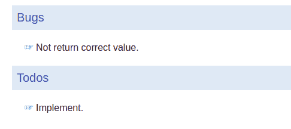

# 在 GoDoc 中显示评论

> 原文：<https://dev.to/yyagi/show-comments-in-godoc--1nog>

当使用`notes`选项运行`godoc`命令时，GoDoc 在代码中显示注释。`notes`选项可以指定正则表达式匹配要显示的音符标记(默认为`BUG`)。

```
$ godoc --help
usage: godoc package [name ...] 
(snip)
  -notes string
        regular expression matching note markers to show (default "BUG") 
```

```
package exter

type Exter struct {
}

func NewExter() {
    // TODO(who): implement
    return Exter{}
}

func (exter *Exter) Run() error {
    // BUG(who): Not return correct value
    return nil
} 
```

例如，上面有一段代码，doc 显示如下。

[T2】](https://res.cloudinary.com/practicaldev/image/fetch/s--TVhKPt5i--/c_limit%2Cf_auto%2Cfl_progressive%2Cq_auto%2Cw_880/https://thepracticaldev.s3.amazonaws.com/i/djglmcrs1gb9lzznjll7.png)

但是如果你把`(who)`从注释中移除，注释不会显示在 GoDoc 中。

这是因为 GoDoc 的限制。

笔记需要写注释为`MARKER(uid): note body`。另外，`MAKER`需要 2 个或更多大写字母【A-Z】和至少一个字符的`UID`。

这是在`Note`处描述的类型注释。https://godoc.org/go/doc#Note
T2

`MARKER`的 Regex 在这里:[https://github . com/golang/go/blob/035 F9 e 8102 D3 b 46877 b 7462 fcd 365324272 D1 d0 e/src/go/doc/reader . go # L435](https://github.com/golang/go/blob/035f9e8102d3b46877b7462fcd365324272d1d0e/src/go/doc/reader.go#L435)

`(uid)`被强制有点不寻常(至少对我来说；) )，所以要小心。