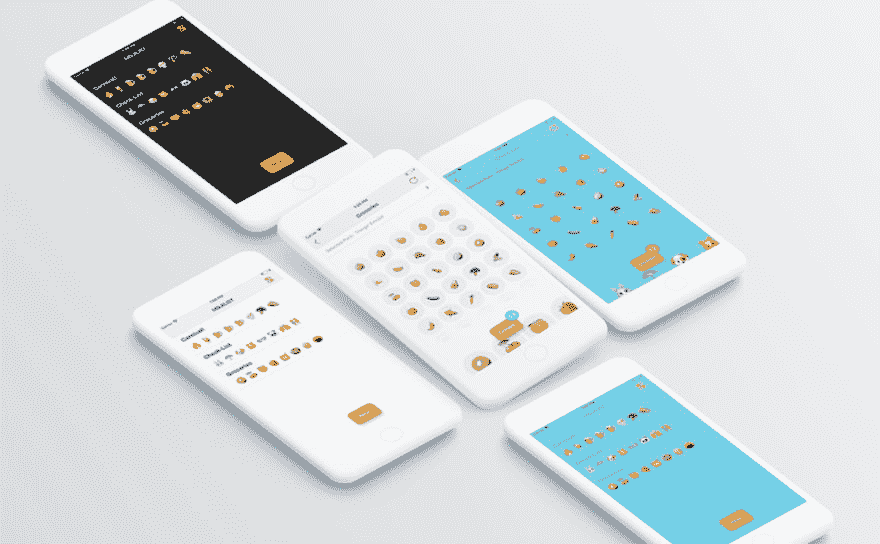

# Show DEV:苹果拒绝了我的应用，所以我决定开源它

> 原文：<https://dev.to/thiagoricieri/show-devto-apple-rejected-my-app-so-i-decided-to-open-sourcing-it-4ibe>

[T2】](https://res.cloudinary.com/practicaldev/image/fetch/s--IjJtBJaO--/c_limit%2Cf_auto%2Cfl_progressive%2Cq_auto%2Cw_880/https://thiago.ricieri.com/assets/posts/2018/mojilist-screens.jpg)

*最初发布于[我的博客](https://thiago.ricieri.com/open-sourcing-my-latest-ios-app)。遵循“展示 HN”的相同理念，这篇文章旨在向开发者社区传播信息。*

今年早些时候，我有一个项目，每月创建一个新的应用程序，试图将它们货币化或作为一个副业来运营。我从解决我的一个问题的想法开始。

我想要一种简单的方法，只用表情符号来创建购物清单。只是，**只允许表情符号**。与其写:

```
- Bananas
- Apples
- Cookies
- Meat
- Chicken
- Rice
- ... 
```

Enter fullscreen mode Exit fullscreen mode

我想要一个这样的列表:

```
🍌🍎🍖🍪🍚🍗... 
```

Enter fullscreen mode Exit fullscreen mode

很傻，但仍然很有趣。[在这里查看存储库](http://github.com/thiagoricieri/Mojilist)。

## 投入时间让它发生👨🏻‍💻

我很开心地创建了它，从头开始探索 iOS 的新项目架构，并尝试了一些不错的库，如 Realm 和 Spring。我甚至计算了我投资创建它的时间，这样我就可以计算出我需要通过出售它来获得多少收入:

| 应用 | 花费的时间 | 每小时雷亚尔 | 总成本 |
| --- | --- | --- | --- |
| 莫吉里斯特 | Fifty-one | 10 万雷亚尔 | 5100 雷亚尔 |

## 拒绝☹️

一切都很好，我很高兴发布，我生成了所需的截图，我已经将二进制文件发送给苹果公司进行审查。令我惊讶的是，这款应用因为使用表情符号而被拒绝:

[](https://res.cloudinary.com/practicaldev/image/fetch/s--7v_iKop6--/c_limit%2Cf_auto%2Cfl_progressive%2Cq_auto%2Cw_880/https://thiago.ricieri.com/assets/posts/2018/apple-answer1.png) 

<figure>

<figcaption>
<small>答自苹果(1)</small>
</figcaption>

</figure>

[](https://res.cloudinary.com/practicaldev/image/fetch/s--bEmuhdDR--/c_limit%2Cf_auto%2Cfl_progressive%2Cq_auto%2Cw_880/https://thiago.ricieri.com/assets/posts/2018/apple-answer2.png) 

<figure>

<figcaption>
<small>答自苹果(2)</small>
</figcaption>

</figure>

首先，我很惊讶他们执行这样的政策，对我来说这毫无意义:他们已经对商店中的任何销售收取很大一部分费用(30%)，我期望的最低限度是免费使用他们在整个平台上推广的表情符号。他们又不是不会因此得到报酬🤷‍♂️

## 开源项目

除了个人意见，我需要画很多图标来获得重新提交的机会，我认为我的时间最好投资在其他东西上(比如学习 Node.js、React.js 或创建另一个不使用表情符号的应用程序)😡)。所以我决定开源这个项目，以获得社区反馈，也许还能从中创造一些别的东西。对于初级开发人员来说，这可能是一个很好的开端，让他们尝试了解如何从头开始构建一个应用程序。

不幸的是，我不得不删除我使用的图标，因为它是受版权保护的。但除此之外，其余都是在 Apache 2.0 许可下分发的。[在 GitHub](http://github.com/thiagoricieri/Mojilist) 和[查看资源库，让我知道你的想法](https://twitter.com/thiagoricieri)！