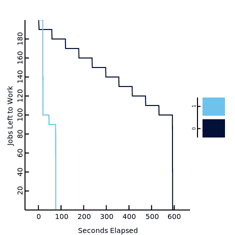

# show dev:co worker——JVM 的新作业队列

> 原文：<https://dev.to/mythra/showdev-coworker---a-new-job-queue-for-the-jvm-1dnn>

如果你曾经编写过 ruby on rails 应用程序，你会知道一个非常常见的模式是拥有一个作业运行器，比如[延迟作业](https://github.com/collectiveidea/delayed_job)、 [Sidekiq](https://github.com/mperham/sidekiq) ，或者类似的框架。然而，您可能会惊讶，在 Java 生态系统中并没有这么多！事实上，直到现在，唯一的标准解决方案之一是[杰斯克](https://github.com/gresrun/jesque)。

##  [米苏拉](https://github.com/Mythra) / [同事](https://github.com/Mythra/Coworker)

### 一个相当不错的 JVM 延迟作业队列。

<article class="markdown-body entry-content container-lg" itemprop="text">

# 存档通知#

Coworker 最初是从一个内部项目开源的，以展示我们正在测试的对我们非常有效的想法。它已经明显过时了，而且因为它是在什么时候写的，所以关于 Kotlin 协程的文档不是很好。结果，我发现了一些存在的错误/缺陷。我计划在某个时候重写这些，但是还没有时间。如果您有任何问题，请随时联系我们，询问 SQL/代码是如何工作的(SQL 与内部相同，可以相信是最有效的)。

# 合作者

Coworker 是为基于 JVM 的语言构建的延迟工作运行程序，用 kotlin 编写。这位同事开始是一项实验，将协同思想引入背景工作。如果你在等待一个外部系统，允许你做其他的事情。

具体由同事介绍…

</article>

[View on GitHub](https://github.com/Mythra/Coworker)

## 上下文

对于那些以前没有处理过作业队列的人来说，您可能会好奇为什么需要一个作业队列？它解决什么问题？

假设您正在开发一个 web 应用程序，并且您需要做一些可能需要很长时间的事情。例如，您调用另一个可能失败的应用程序，您可能想要重试，总的来说，这需要几分钟的时间。您可能开始担心 HTTP 超时，因为您的服务器需要很长时间来响应。如果是这样的话，将它重构为一个作业可能是有意义的。然后给用户一个作业 ID，他们可以检查完成状态。这样，您就不会有 HTTP 超时，呼叫仍然在后台发生。应该在后台运行的这些较长任务的一些示例包括:

*   向大量的人发送时事通讯
*   图像大小调整
*   批量导入
*   检查垃圾邮件

我相信您可以为您的具体应用设想更多。然而，如果你在 Java 中寻找作业队列，你会发现没有多少解决方案！据我所见，许多人推荐以下几样东西:

*   *构建自己的* -虽然这确实可行，但这意味着你必须自己构建和维护一个解决方案。
*   使用一个本地线程池 -虽然这肯定是可行的，但是如果一个 web 服务器在有一个它还没有运行的任务队列的时候关闭了，这会带来一个问题，导致任务的丢失。更不用说，如果您在一个跨一系列主机分发数据包的负载平衡器后面，这将很难检查作业的状态。
*   使用作业调度器 -有些人推荐使用像 [Quartz](http://www.quartz-scheduler.org/) 这样的作业调度器。虽然 quartz 很棒，但将它用作作业队列被明确标记为反模式，这是有充分理由的。用 Quartz 同时运行数百个特定的图像大小调整任务执行起来非常慢，因为 Quartz 根本不是为此而构建的。

## 同事前来救援

在 java 中，同事加入实际作业队列的空间，比如 [Jesque](https://github.com/gresrun/jesque) 。然而，为了在实际工作中更有效地处理工作，已经从头开始构建了 Coworker。通过从 ruby library [InstJobs](https://github.com/instructure/inst-jobs) 获取在生产之火中构建的想法，并像 Fibers 一样建立在本地执行的想法上。有了这些特点结合 ***我们就有了力量*** 。

[T2】](https://res.cloudinary.com/practicaldev/image/fetch/s--78TNGcx8--/c_limit%2Cf_auto%2Cfl_progressive%2Cq_66%2Cw_880/https://public-clownfront-distribution.insops.nimg/IHaveThePower.gif)

这种能力是在一台机器上每秒执行数百个任务。具体来说，同事的电梯间推介的一些特点包括:

*   自我修复:把你的工作节点贴在一个自动伸缩的群组里，不用管它！如果底层节点失效，作业将自动重新调度。
*   失败工作表:允许您跟踪失败作业的总数。
*   N-Strands:现在您可以根据特定的标签来限制您的作业，这样您就可以确保一个真正的大客户不会让您的整个作业队列陷入饥饿。
*   屈服:没错，在纤程/协程中一直被使用的著名关键词在这里也适用于您的工作。现在，如果队列中出现优先级更高的工作，您的作业就有能力让位于它们。

我们为您带来所有这些功能(甚至更多)，而不牺牲最重要的东西。善待你的数据库。我们实施了多种保护措施，以确保我们尽可能少地占用您的数据库空间。我们知道您可能会与您的客户共享您的工作数据库，我们不想拖您的后腿。

### 性能测试

如果你看了同事的自述文件，你首先会看到的是我们的性能测试领域。具体来说，您会看到一个类似如下的图表:

[T2】](https://res.cloudinary.com/practicaldev/image/fetch/s--24TSvcGo--/c_limit%2Cf_auto%2Cfl_progressive%2Cq_auto%2Cw_880/https://raw.githubusercontent.com/SecurityInsanity/Coworker/master/bench/coworker-timings.png)

其中，Coworker 是标记为“1”的行，Jesque 是标记为“0”的行。现在你可能在想“GitHub 上的一个性能测试图，这可能是为了让同事总是获胜而设计的”。这在技术上是正确的，但只是因为 Coworker 是为更快地运行现实生活中的工作场景而构建的！

具体来说，该性能测试如下:

*   排队 200 个作业:
    *   100 个作业只是回显到标准输出，然后立即完成。这意味着映射到“快速运行的作业”或您排队做很少工作，然后退出的作业。我相信你的申请中会有一些这样的内容。
    *   100 个对 google.com 进行 HTTP 调用的作业，并在退出前等待一分钟。这意味着要表示长时间运行的作业或您希望等待它完成的作业。
*   计算在所有作业被标记为完成之前经过的秒数。

尽管这并不是完美的表示(我们永远无法完美地反映您的应用程序)，但它是您实际工作负载的更好表示，而不是将 100，000 个立即退出的作业排队，然后查看需要多长时间才能完成，因为这不是作业的常见用例。(不过需要注意的是:如果你的作业队列是这样的:Jesque 在这个具体的测试中要比 Coworker 快很多。这是因为 Jesque 使用 Redis 作为它的存储库，可以比 SQL 更快地查询作业。)

如果你注意到在这种情况下，同事在 70 秒内完成！相比之下，杰斯克的近 600 秒的工作完成时间。那么*为什么*这里的同事要快得多？嗯，很简单！屈服了。同事有能力为 HTTP 调用工作让步，而 Jesque 没有。所以 Jesque 阻塞了所有 10 个工作线程。等待这项漫长的工作完成。与此同时，同事可以让出更多时间去做其他工作。

### [t1 的边](#nstrands)

同事带来的下一个真正重要的东西是 NStrands！如上所述，NStrands 是一种非常好的方法，可以确保你的工作在各种情况下都不会缺乏。如果你曾经为一家企业运行过大型应用程序，你会知道有些客户比其他客户更大。如果您使用大量延迟作业，这可能会导致一个问题！具体来说，你的大客户可能会让你的工作资源变得匮乏。我的意思是大客户正在排队 ***如此多的工作*** 以至于所有的工人最终都在为 ***工作，以至于一个客户*** 而其他人都必须等待他们的工作完成。

大客户可能不会注意到他们占用了你所有的资源。毕竟他们只是在利用系统。但是，使用率较低的客户肯定会注意到，因为完成作业所需的时间比以前长了。

不过，这并不总是客户的事情。也许你有一份非常非常普通的工作，并且经常排队等候。这份工作你可能会遇到类似的问题！在有如此多的工作要完成的地方，他们也只是让你的工人挨饿，不允许很多有用的工作实际上被完成。

使用上面的客户端示例，我们可以创建一个如下所示的 NStrand 规则:`account:.* -> 5`。接下来我们要做的是，每次我们对一个作业进行排队时，我们会将它“标记”为值:`account:${account_id_that_queued_this_job}`。例如，如果你属于账户 1，你将一个作业排队，它将被标记为:`account:1`；如果你属于账号 2，就会被打上标签:`account:2`，以此类推。

接下来，在我们的假设场景中，假设账户“1”是我们的大客户，账户“2”、“3”和“4”是我们的小客户。比方说，每当用户访问一个页面时，我们就将一个作业排队，以便在后台更新我们的分析。因为帐户“1”要大得多，所以我们假设他们排队 10 个作业，而帐户“2”/“3”/“4”各排队 1 个作业。我们有一个包含 10 个工作线程的作业箱。同事如何安排这项工作？

[T2】](https://res.cloudinary.com/practicaldev/image/fetch/s--5OR9jQzr--/c_limit%2Cf_auto%2Cfl_progressive%2Cq_auto%2Cw_880/https://public-clownfront-distribution.insops.nimg/thonk.png)

该同事实际上会一次安排 8 个作业，并在队列中留下 5 个！具体来说，它将运行 5 个“帐户:1”作业，以及每个帐户“2”/“3”/“4”作业。因为您已经设置了一个规则，您只希望在特定时间运行特定帐户的 5 个作业！然后，一旦其中一个“帐户:1”作业完成，它将看到只有 4 个作业正在工作，然后排队下一个“帐户:1”作业。这样你的大客户就不会饿死你的一个员工。

### 监听/通知

最后，我们利用 PostgreSQL 较少使用的特性，以便比大多数基于 SQL 的队列更快地执行作业(并且负载更少)。具体来说，它使用[监听/通知](https://www.postgresql.org/docs/current/static/libpq-notify.html)。这允许我们在新工作进入队列*时进行验证，而不需要轮询它*。(然而，应该注意，监听/通知完全是短暂的。我们仍然需要偶尔扫描表，寻找没有被锁定的、我们不知道的工作。不过，我们可以多做*少做*常做)。

然而，我们也担心构建数据库内存！因为尽管 LISTEN/NOTIFY 位于“表”之外，所以我们在请求任何已经到达的通知时不会降低查询速度，但是随着时间的推移，这些通知确实会在数据库内存中积累起来！因此，为了解决这个问题，我们运行了一个 sidecar 线程，持续检查通知，以便将它们从 DBs 内存中取出，放到 worker 节点上。然后我们把它们推进一个通道。这样，被延迟的工作人员就可以在任何时候检查它们，我们的数据库不仅仅使用它所有的内存。

### 还有更多...

Coworker 还有一些我们没有谈到的其他特性，比如能够将[静态函子排队以在后台运行](https://coworker.kungfury.io/#/insert-work?id=using-handle-asynchronously)，它不会将您锁定在特定的 web 框架中，等等。然而，我们把它留给读者作为练习。如果你正在用 Kotlin/Java 构建一个 web 应用程序，并且你需要一个延迟的作业运行器，那么 Coworker 可能就是你的选择！