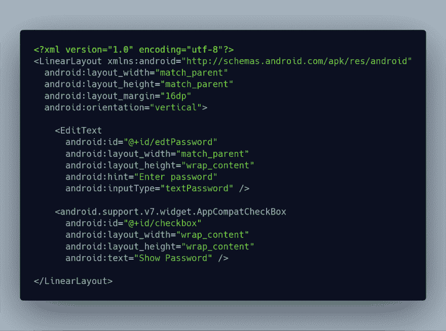
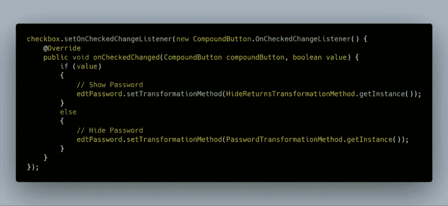

# 在 Android 的编辑文本中显示/隐藏密码

> 原文：<https://dev.to/wajahatkarim/showhide-password-in-edittext-in-android-520b>

#### 如何在 android 的 EditText 中一行显示/隐藏密码点

> 这篇文章是我今天学习的系列的[的一部分，最初发布在我的](https://medium.com/p/65c64e1dcb6) [TIL Github 库](https://github.com/wajahatkarim3/Today-I-Learned/)和我在 wajahatkarim.com[的网站](http://wajahatkarim.com)

通过材料设计和最新的材料主题化，android 开发人员经常使用 TextInputLayout 及其强大的密码切换功能。但是，有时您的应用程序有这样的遗留设计:

[T2】](https://res.cloudinary.com/practicaldev/image/fetch/s--6FLEzb6Q--/c_limit%2Cf_auto%2Cfl_progressive%2Cq_auto%2Cw_880/https://cdn-images-1.medium.com/max/403/1%2AA_JaZR1u_LSG7kj2XIoZWA.png)

在这些情况下，您必须使用复选框及其 OnCheckedChangeListener 来显示/隐藏密码。所以，最近我不得不这样做，依靠 TextInputLayout 的自动密码切换功能，我忘记了如何做。所以，这是我学到的方法。

#### 虚拟布局

[T2】](https://res.cloudinary.com/practicaldev/image/fetch/s--KWepVZdT--/c_limit%2Cf_auto%2Cfl_progressive%2Cq_auto%2Cw_880/https://cdn-images-1.medium.com/max/1024/1%2AemHoVTmlyfk_DQZgVqU4VQ.png)

现在，您可以使用[EditText # setTransformationMethod()](https://developer.android.com/reference/android/text/method/TransformationMethod)切换密码，如下所示:

[T2】](https://res.cloudinary.com/practicaldev/image/fetch/s--MNDbAO-e--/c_limit%2Cf_auto%2Cfl_progressive%2Cq_auto%2Cw_880/https://cdn-images-1.medium.com/max/1024/1%2AIZs1t9k3N5IfKu_dj8nkLg.png)