# 辅助项目:水冷我的电脑

> 原文：<https://dev.to/moriahmaney/side-project-water-cooling-my-pc-5fi4>

*注意:这是我在 moriahmaney.com 的个人网站上发布的*

# 简介

十几岁的时候，我开始对电脑游戏感兴趣，并制造了我的第一台台式电脑。从那时起，我做了多次迭代和升级，直到我最终到达一个地方，我足够舒适地用水冷却我的电脑。爱好者通常使用水冷来降低温度和噪音，并在保持良好温度的同时使硬件组件超频。

免责声明:我并不自称是水冷方面的专家。如果你打算用水冷却一台电脑，这个指南主要是作为一个过程的介绍，并记录我自己的旅程水冷却我的电脑。它无论如何都是不全面的。

# 零件清单

| 项目 | 类型 | 环 |
| 母板 | 华硕 Strix Z370-E | [http://a.co/5Dq88Cr](http://a.co/5Dq88Cr) |
| 处理器 | Intel i7-8700K | [http://a.co/fZD5R7U](http://a.co/fZD5R7U) |
| 图形卡 | EVGA GeForce GTX 1080 Ti SC 黑色版 | [http://a.co/9IbItRz](http://a.co/9IbItRz) |
| 随机存取存储 | 海盗船复仇 LPX 16GB (2x8GB) DDR4 | [http://a.co/5hmcAUN](http://a.co/5hmcAUN) |
| 电源 | Corsair RM750x | [http://a.co/bXYCbwB](http://a.co/bXYCbwB) |
| 储存；储备 | 金士顿 240GB 固态硬盘 | [http://a.co/8QtGGgp](http://a.co/8QtGGgp) |
| 储存；储备 | 金士顿 120GB 固态硬盘 | [http://a.co/5oXpV3U](http://a.co/5oXpV3U) |
| 储存；储备 | WD 黑色 2TB 硬盘 | [http://a.co/bbt9Jfk](http://a.co/bbt9Jfk) |
| CPU 水块 | EK-supreme EVO | [https://bit.ly/2rIgtLk](https://bit.ly/2rIgtLk) |
| GPU Waterblock | EK-FC 泰坦 X 帕斯卡 | [https://bit.ly/2MaONxv](https://bit.ly/2MaONxv) |
| GPU 背板 | EK-FC 泰坦 X 帕斯卡背板 | [https://bit.ly/2KiQDHB](https://bit.ly/2KiQDHB) |
| 泵/储罐 | EK-XRES 140 Revo D5 脉宽调制 | [https://bit.ly/2h11XJi](https://bit.ly/2h11XJi) |
| 散热器 | EK-酷流 CE 280 | [https://bit.ly/2fUpQpV](https://bit.ly/2fUpQpV) |
| 粉丝 | 埃克-伐尔达尔埃沃(2) | [https://bit.ly/2MlCTA3](https://bit.ly/2MlCTA3) |
| 装管 | ek-dur clear | [https://bit.ly/2FvLedA](https://bit.ly/2FvLedA) |
| 设备 | EK-ACF Fitting 10/13mm (8) | [https://bit.ly/2nyxckA](https://bit.ly/2nyxckA) |
| 液体 | 普里莫奇尔武埃 | [https://bit.ly/2P0QfAm](https://bit.ly/2P0QfAm) |
| 电缆 | CableMod ModFlex Pro | [https://bit.ly/2Ozgwoz](https://bit.ly/2Ozgwoz) |
| PCI-E 扩展 | 被压扁了 | [http://a.co/hBH9W3r](http://a.co/hBH9W3r) |
| 情况 | 分形设计定义 R6 | [https://bit.ly/2LZp6Pv](https://bit.ly/2LZp6Pv) |

# 流程

## 测试

如果您完全从零开始构建，提前使用原始冷却(空气)来构建您的 PC 是一个重要的步骤。这将确保您的所有组件在增加额外的水冷复杂性之前正常工作。从头开始构建 PC 超出了这篇文章的范围，所以我将在这里进行深入探讨。

## 规划

正确地规划你的回路是确保你的组件一起工作并避免在不兼容的部分上花费额外的钱的最重要的方法之一。另外，建议提前把你的循环画出来。如果你是独自建立回路，建议在这个阶段测量管道长度。我有另一个人来帮助我，所以我们运行管道，标记它，并在我们走的时候切割它。

## 拟合

我最初为这个版本订购了 NZXT H500，然后意识到 NZXT 500i 是唯一能够垂直安装 GPU 的版本。由于这是我想要的 as titic 的核心组件，我重新订购了一台 NZXT H500i，并不得不等待它的到来。它一到，我就开始试装蓄水池/泵和辐射器，只是意识到如果没有大量的过度拥挤，它们就不适合这个箱子。重要的一点是，NZXT H500i 是一个全新的案例，所以我没有太多的评论，只是继续希望。这是你照我说的去做而不是照我做的去做的地方，提前计划，这样它就不会发生在你身上。

## 更贴切

在意识到我的第二个案例也没有成功后，我做了大量的研究，最终决定用分形设计来定义白色的 R6。我看了无数个带有水冷功能的 YouTube 版本*,以确保它确实合适。我不得不再等一个星期，等待这个箱子的到来，但当它到来时，我终于可以再做一次试衣了。下面是一个干配合的照片(我已经删除了泵和水库，但你得到的想法)。*

[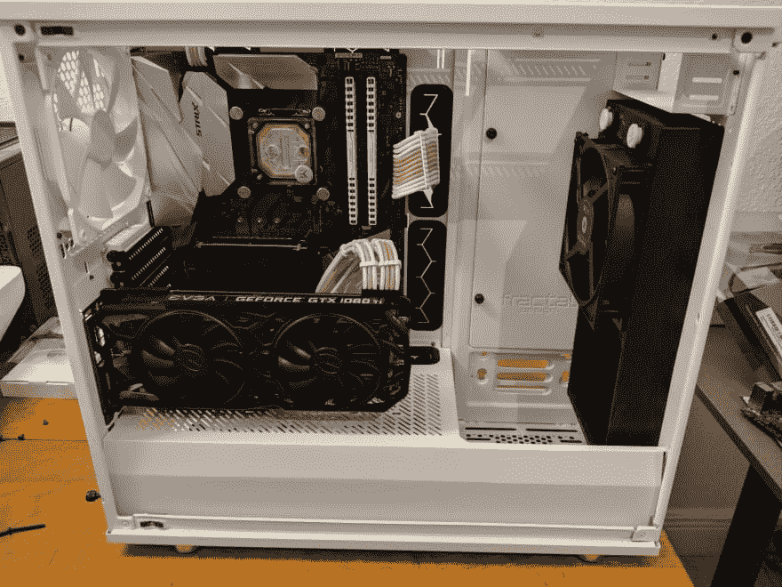T2】](https://res.cloudinary.com/practicaldev/image/fetch/s--dwSheRYZ--/c_limit%2Cf_auto%2Cfl_progressive%2Cq_auto%2Cw_880/https://thepracticaldev.s3.amazonaws.com/i/y3g8qz8pbdvomeeomp17.jpg)

## 组装

我通过安装电源和将电缆穿过机箱来开始这个构建，以使它们完全符合我的需要。这是很好的第一步，尤其是如果你想要干净的电缆管理。下面是机箱背面的电缆管理照片。

[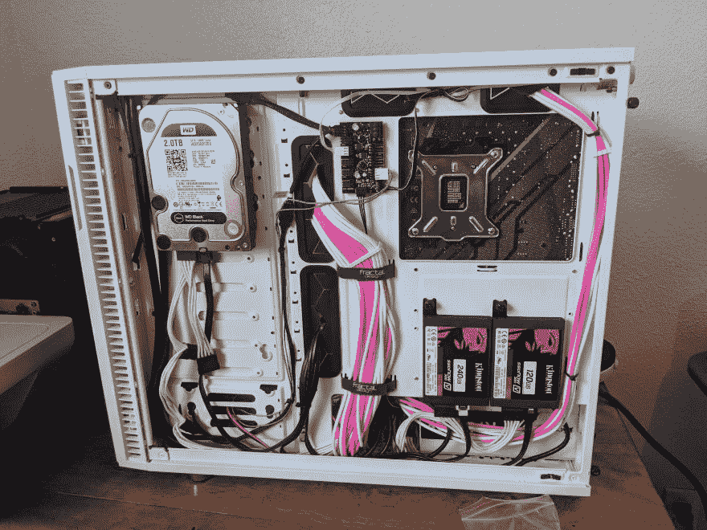T2】](https://res.cloudinary.com/practicaldev/image/fetch/s--1juIOs52--/c_limit%2Cf_auto%2Cfl_progressive%2Cq_auto%2Cw_880/https://thepracticaldev.s3.amazonaws.com/i/loasvv06h4p3qxjn3yve.jpg)

接下来，将 CPU 水块安装到主板上，注意不要拧得过紧。

无论你购买什么样的 GPU water block，都应该附带从显卡上卸下空气冷却器和安装 water block 的说明。下面是一些过程的照片，以形象化这一步。

[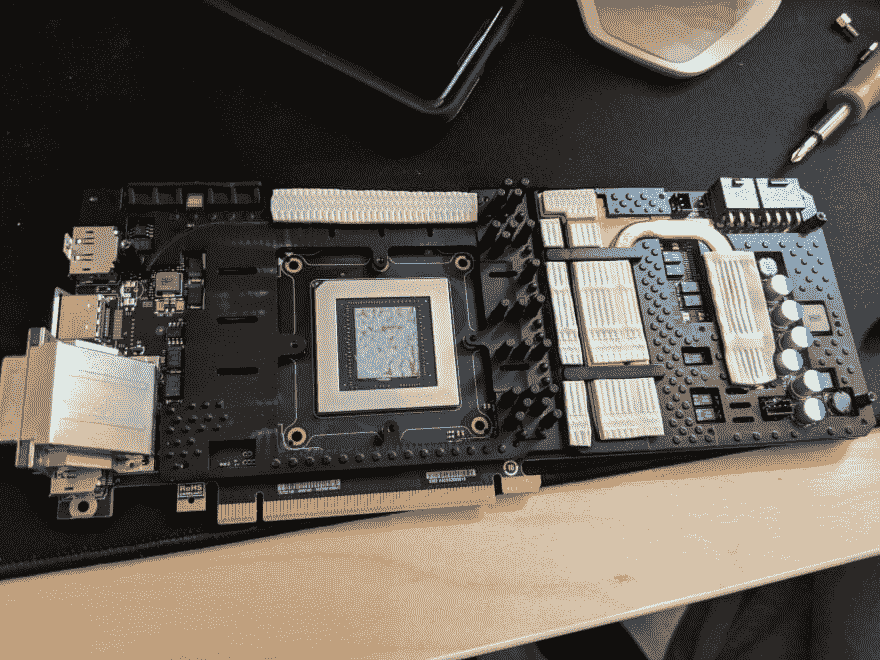](https://res.cloudinary.com/practicaldev/image/fetch/s--0nvP_0v_--/c_limit%2Cf_auto%2Cfl_progressive%2Cq_auto%2Cw_880/https://thepracticaldev.s3.amazonaws.com/i/7dv4qhclxr30zh6sb7fk.jpg)
[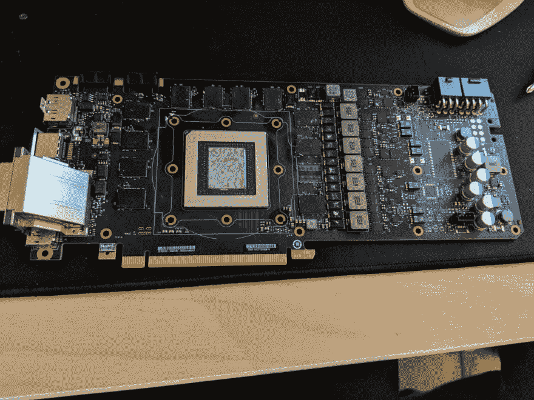T6】](https://res.cloudinary.com/practicaldev/image/fetch/s--plzYkhrn--/c_limit%2Cf_auto%2Cfl_progressive%2Cq_auto%2Cw_880/https://thepracticaldev.s3.amazonaws.com/i/yvchol59gdtokow7n5g6.jpg)

一旦你拆下了空气冷却器和原来的隔热垫，说明书会告诉你新隔热垫的位置以及如何安装阻水板。下面是我的 GPU 完全安装了挡水板的照片。

[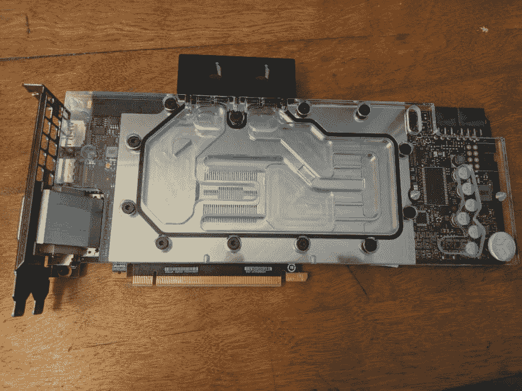T2】](https://res.cloudinary.com/practicaldev/image/fetch/s--w9zlC9P5--/c_limit%2Cf_auto%2Cfl_progressive%2Cq_auto%2Cw_880/https://thepracticaldev.s3.amazonaws.com/i/5xosm9rwsagvcu679mx7.jpg)

下一步是将散热器、风扇和水箱安装在机箱内。下面是安装了这些组件的照片。

[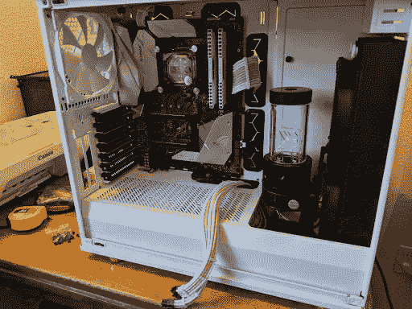T2】](https://res.cloudinary.com/practicaldev/image/fetch/s--BAm1AInn--/c_limit%2Cf_auto%2Cfl_progressive%2Cq_auto%2Cw_880/https://thepracticaldev.s3.amazonaws.com/i/gnzourg23q8kox7ie4mz.jpg)

接下来，在任何没有管道和盖子的端口上安装管件。之后，将 GPU 装入机箱。我在这一步使用了垂直电缆，因为我想要一个垂直安装的 GPU。

安装好一切后，我开始在套管内下油管，做好标记，并在每次下油管时进行切割。如果你是单独做这件事，你可能已经测量了这些长度并切割它们，所以这一步是不必要的，你可以直接跳到附加管。下面是我测量、切割和连接油管时的照片。

[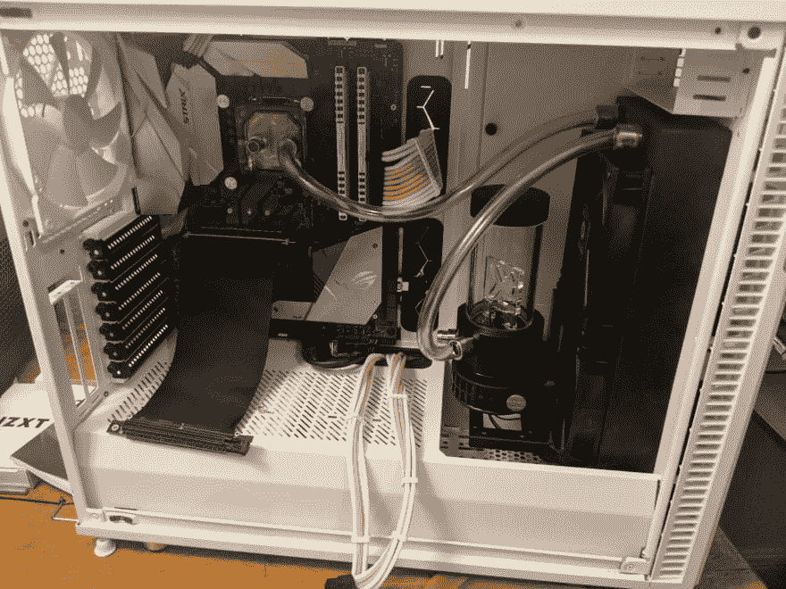](https://res.cloudinary.com/practicaldev/image/fetch/s--QKocQb8U--/c_limit%2Cf_auto%2Cfl_progressive%2Cq_auto%2Cw_880/https://thepracticaldev.s3.amazonaws.com/i/0b47fw5lxdtjlzl9q08d.jpg)
[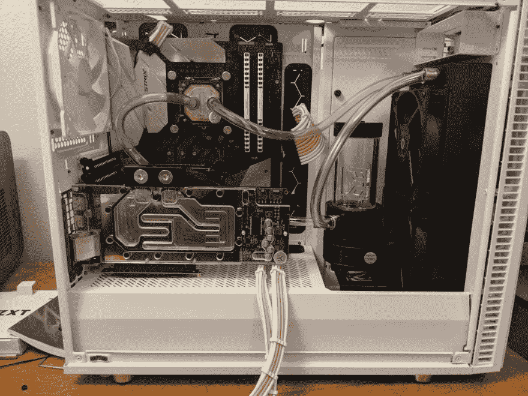](https://res.cloudinary.com/practicaldev/image/fetch/s--WjiX7rL_--/c_limit%2Cf_auto%2Cfl_progressive%2Cq_auto%2Cw_880/https://thepracticaldev.s3.amazonaws.com/i/0mc4pdxz4f2e80a09xv7.jpg)
[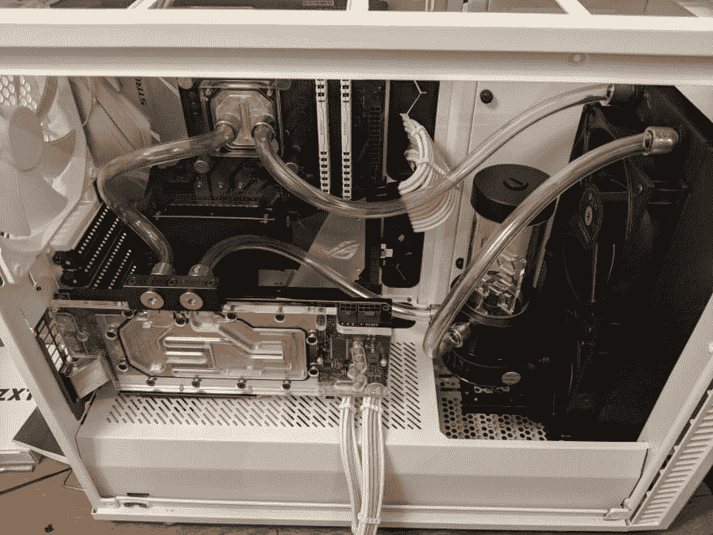](https://res.cloudinary.com/practicaldev/image/fetch/s--2B7daOEf--/c_limit%2Cf_auto%2Cfl_progressive%2Cq_auto%2Cw_880/https://thepracticaldev.s3.amazonaws.com/i/kg8mxii22qstqxtg01sf.jpg)

## 泄漏测试

在你做泄漏测试之前，你应该在你建造的每一套配件下放置尽可能多的纸巾。这将有助于捕捉任何漏水，你可以很容易地触摸测试纸巾，以确保它们保持干燥。

为了填充我的回路，我用一个厨房漏斗和一根备用管子来填充蓄水池。然后(使用电源 ATX 24 针上的跳线来运行泵)，我慢慢地添加与蒸馏水混合的 PrimoChill Vue 系统制剂，循环电源以将水通过回路。一旦循环充满，我让它运行几个小时，直到我满意没有泄漏。下面是我的电脑在泄漏测试时的照片。

**注意:不要在水箱中没有水的情况下运行泵。这会很快烧坏你的泵**

[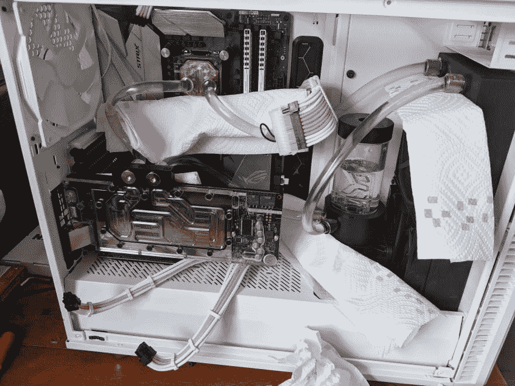T2】](https://res.cloudinary.com/practicaldev/image/fetch/s--M7tBo6FT--/c_limit%2Cf_auto%2Cfl_progressive%2Cq_auto%2Cw_880/https://thepracticaldev.s3.amazonaws.com/i/xlgfaoto3emey747y5vx.jpg)

泄漏测试后，我移除跳线并重新连接我的组件。我正常使用系统三天，让系统准备运行，同时继续密切关注任何泄漏。

## 齐平

为了冲洗循环，我从机箱中卸下了 GPU，并从插头那里将它排入一个碗中。一旦水位足够低，我们就拿起箱子，非常小心地将它倾斜(**)，直到剩余的液体排出。之后，我用蒸馏水重新装满它，并在用跳线运行几分钟后再次排空它，如上面泄漏测试部分所述。**

 **## 笔芯

一旦系统完全排空，我就使用我的最终液体(PrimoChill Vue)按照泄漏测试部分所述的相同过程重新加注。我让它正常运行了几天，以消除任何气泡，然后在水库顶部，直到它尽可能满，我可以舒服地使它。下面是一些完成后的照片。

[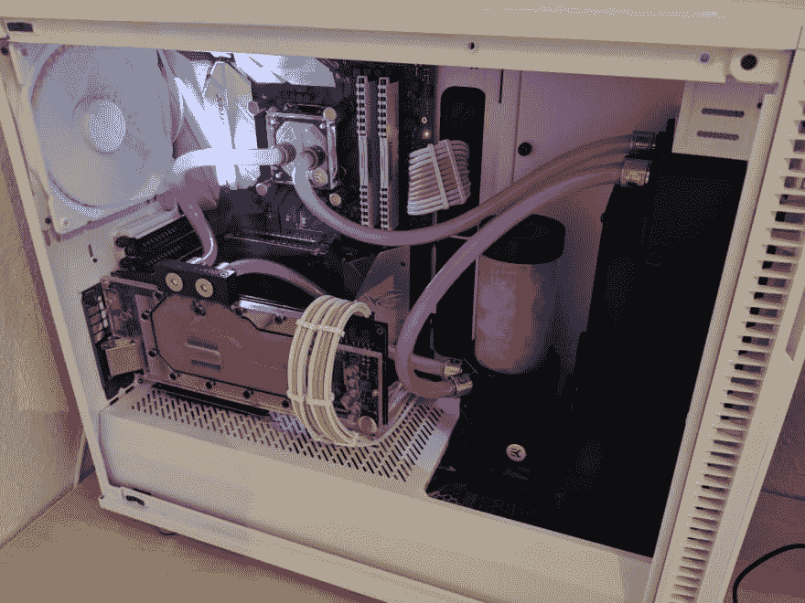](https://res.cloudinary.com/practicaldev/image/fetch/s--xyouikzj--/c_limit%2Cf_auto%2Cfl_progressive%2Cq_auto%2Cw_880/https://thepracticaldev.s3.amazonaws.com/i/7xmgljj0ufqmlfcvz3a4.jpg)
[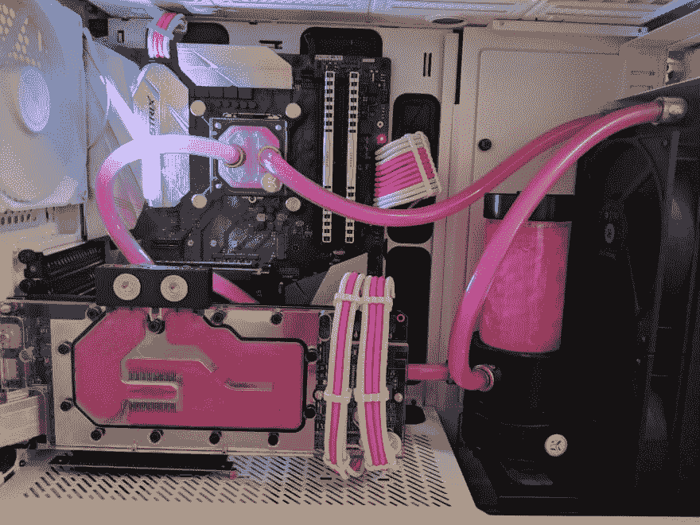](https://res.cloudinary.com/practicaldev/image/fetch/s--_ld8aN7C--/c_limit%2Cf_auto%2Cfl_progressive%2Cq_auto%2Cw_880/https://thepracticaldev.s3.amazonaws.com/i/bkiqr9uf7g73lfv94a75.jpg)
[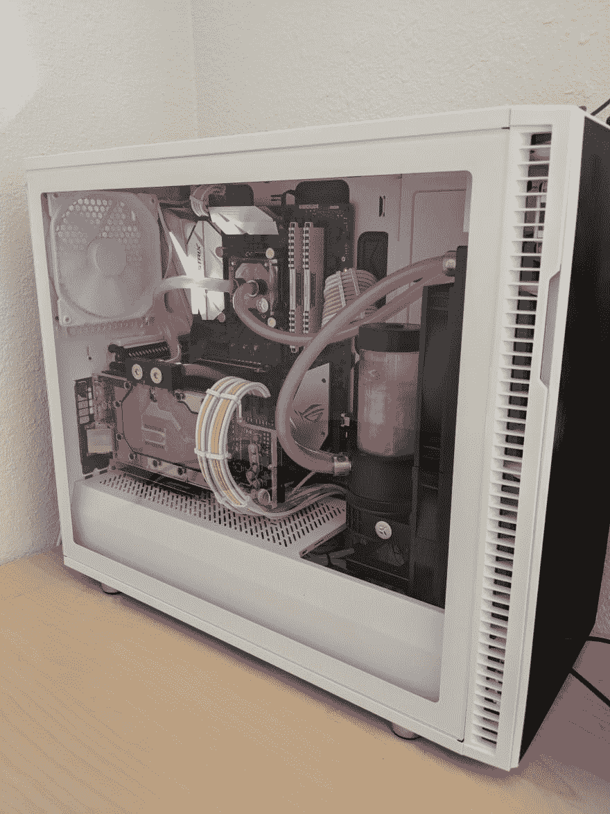](https://res.cloudinary.com/practicaldev/image/fetch/s--61WTwozs--/c_limit%2Cf_auto%2Cfl_progressive%2Cq_auto%2Cw_880/https://thepracticaldev.s3.amazonaws.com/i/0bbdfzq84verpdneij17.jpg)
[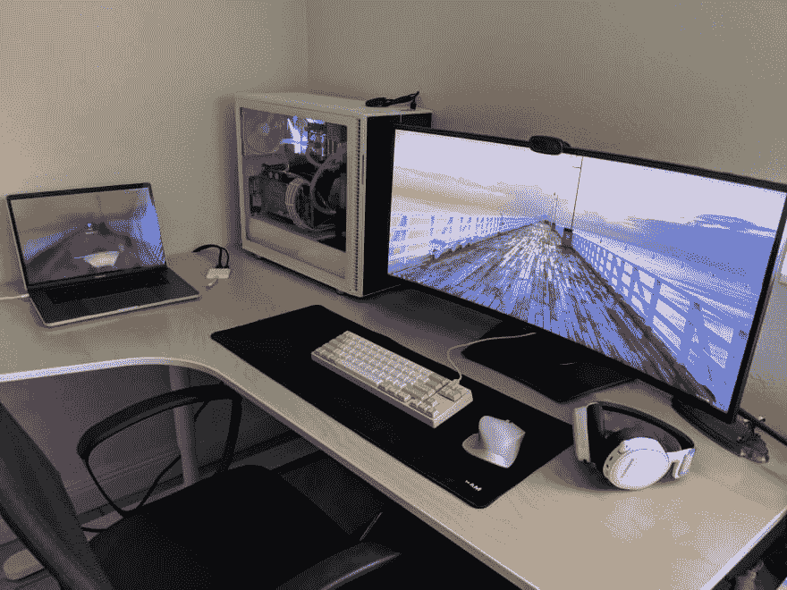](https://res.cloudinary.com/practicaldev/image/fetch/s--MCvOwcCT--/c_limit%2Cf_auto%2Cfl_progressive%2Cq_auto%2Cw_880/https://thepracticaldev.s3.amazonaws.com/i/937l7o1kbfkbdj9r6ooc.jpg)

## 外卖

最后，我对这个版本的结果非常满意。这是我第一次在感觉已经完成的地方进行构建(至少目前是这样)。如果我可以再做一次，我肯定会更加小心，在没有等待评论和制作视频上线之前，不会订购一个全新的案例。水冷是一个昂贵而复杂的过程，但现在我有了一台电脑，我真的为自己制造的电脑感到骄傲。

# 资源

*   [水冷 101 -基础知识](https://choosemypc.net/wcguide/)
*   [选择水挡](https://www.reddit.com/r/watercooling/comments/1uh8d3/guide_deciding_what_type_of_water_block_to_use/)
*   [零售商列表](https://reddit.com/r/watercooling/wiki/retailers)
*   [r/水冷廊道](https://www.reddit.com/r/watercooling/wiki/gallery)
*   [JayzTwoCents YouTube 频道](https://www.youtube.com/user/Jayztwocents)
*   [电脑零件拾取器(检查兼容性)](https://pcpartpicker.com/)**