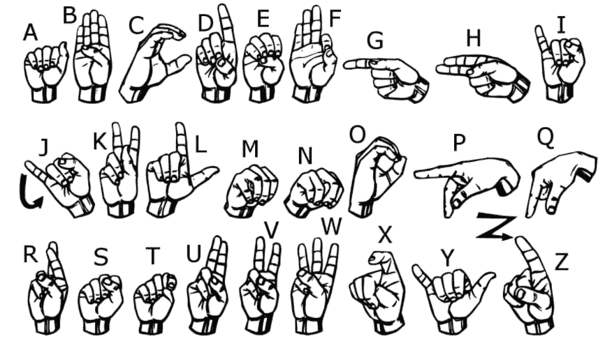

# 手语和静态手势识别

> 原文：<https://dev.to/blackbird/sign-language-and-static-gesture-recognition-1k58>

[](https://res.cloudinary.com/practicaldev/image/fetch/s--H7kgNN02--/c_limit%2Cf_auto%2Cfl_progressive%2Cq_auto%2Cw_880/https://cdn-images-1.medium.com/max/876/1%2A0xLa5BD6LJfMnGoXJb7wiQ.png) 

<figcaption>手语</figcaption>

手势识别是机器视觉领域的一个开放问题，机器视觉是计算机科学的一个领域，它使系统能够模拟人类视觉。手势识别在改善人机交互方面有许多应用，其中之一是在手语翻译领域，其中符号手势的视频序列被翻译成自然语言。

### 数据集

数据集格式的模式与经典 MNIST 非常相似。每个训练和测试用例将一个标签(0–25)表示为每个字母 A-Z 的一对一映射(由于手势运动，没有 9=J 或 25=Z 的用例)。**训练数据** (27，455 例)和**测试数据** (7172 例)大约是标准 MNIST 的一半大小，但在其他方面类似于标签的标题行 pixel1，pixel 2…pixel 784，它们代表灰度值在 0-255 之间的单个 28x28 像素图像。

### 数据预处理

由于数据集已经给出了图像的 CSV 值，我们不需要做太多的预处理。如果图像的数据集是 raw 格式的，我们必须在做任何进一步的操作之前将它们转换成 CSV 格式的数组。我们仍然执行以下步骤:

*   分离要素(784 像素列)和输出(结果标签)
*   重塑特征
*   结果上的一个热编码

```
X_train = train.drop(['label'],axis=1)  
X_test = test.drop(['label'], axis=1)  

X_train = np.array(X_train.iloc[:,:])  
X_train = np.array([np.reshape(i, (28,28)) for i in X_train])  
X_test = np.array(X_test.iloc[:,:])  
X_test = np.array([np.reshape(i, (28,28)) for i in X_test])

num_classes = 26  
y_train = np.array(y_train).reshape(-1)  
y_test = np.array(y_test).reshape(-1)  
y_train = np.eye(num_classes)[y_train]  
y_test = np.eye(num_classes)[y_test]

X_train = X_train.reshape((27455, 28, 28, 1))  
X_test = X_test.reshape((7172, 28, 28, 1)) 
```

### 型号

我们将使用 Keras 来构建简单的 CNN(卷积神经网络)。

CNN 总共有 7 层:

1.  带 relu 的第一个卷积层
2.  第一个最大池
3.  带 relu 的第二卷积层
4.  第二大池
5.  变平
6.  带有 relu 的第一个完整层
7.  带 s 形的输出图层

```
def model():  
  classifier = Sequential()  
  classifier.add(Convolution2D(filters=8,   
                               kernel_size=(3,3),  
                               strides (1,1),  
                               padding='same',  
                               input_shape=(28,28,1),  
                               activation='relu',  
                               data_format='channels_last'))  
  classifier.add(MaxPooling2D(pool_size=(2,2)))  
  classifier.add(Convolution2D(filters=16,   
                               kernel_size=(3,3),  
                               strides=(1,1),  
                               padding='same',  
                               activation='relu'))  
  classifier.add(MaxPooling2D(pool_size=(4,4)))  
  classifier.add(Flatten())  
  classifier.add(Dense(128, activation='relu'))  
  classifier.add(Dense(26, activation='sigmoid'))  
  classifier.compile(optimizer='adam',  
                     loss='categorical_crossentropy',   
                     metrics=['accuracy'])  
  return classifier 
```

然后在训练集上拟合模型，并在测试集上检查准确性。

```
classifier.fit(X_train, y_train, batch_size = 100, epochs = 100)  
y_pred = classifier.predict(X_test) 
```

请注意，y_pred 中的输出是数组格式，每个训练示例有 26 个值。我们得看看哪个最大，然后再创建 y_pred。

### 结果

*   训练集准确率:96.06 %
*   测试集准确率:87.77%

### 用数据集完成代码

##  [ blackbird71SR ](https://github.com/blackbird71SR) / [神经网络项目](https://github.com/blackbird71SR/Neural-Network-Projects)

### 神经网络项目

<article class="markdown-body entry-content p-5" itemprop="text">

# 神经网络

## 1.[预测银行业的客户流失](https://github.com/Omkar-Ajnadkar/Neural-Network-Projects/tree/master/Predicting%20Customer%20Churn%20In%20Banking)

## 2.[预测 StackOverflow 上的标签](https://github.com/Omkar-Ajnadkar/Neural-Network-Projects/tree/master/Predict%20tags%20on%20StackOverflow)

## 3.[手语和静态手势识别](https://github.com/Omkar-Ajnadkar/Neural-Network-Projects/tree/master/Sign%20Language%20and%20Static-Gesture%20Recognition)

</article>

[View on GitHub](https://github.com/blackbird71SR/Neural-Network-Projects)

发送任何建议和错误的请求…