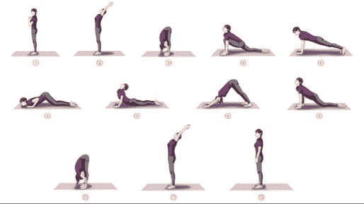

# 报名积极生活

> 原文：<https://dev.to/forethought_de/sign-up-for-active-life--8gg>

[T2】](https://res.cloudinary.com/practicaldev/image/fetch/s--862NaR2e--/c_limit%2Cf_auto%2Cfl_progressive%2Cq_auto%2Cw_880/https://thepracticaldev.s3.amazonaws.com/i/cr0w03zaea3s63eq0iyu.jpg)

今天，我决定报名参加多由瑜伽的“28 天瑜伽初学者课程”；它是由纽约的瑜伽和普拉提教练 Kristin McGee 教授的，完全免费，而且是在线的，这意味着我可以在家里随时练习。

这是我在 2018 年积极生活的第一步。这里有人今年开始练瑜伽了吗？事情进展如何？请与我们所有人分享你的经历。让我们开始积极的生活。

*本文使用的图片来自生活艺术网站*