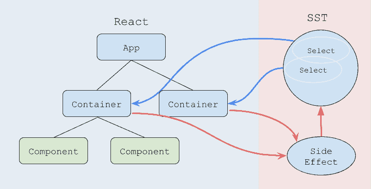
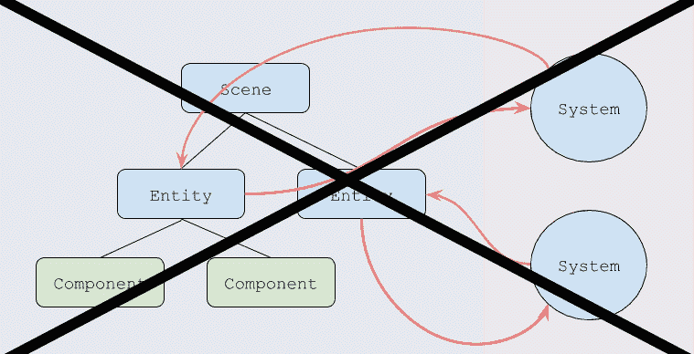
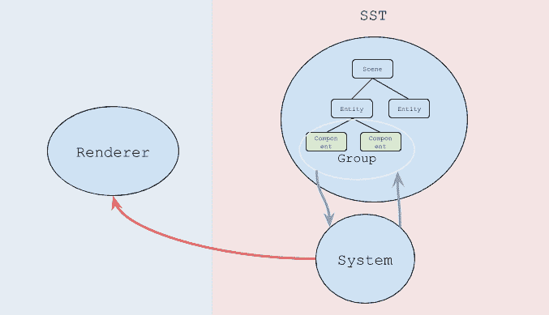

# 实体组件系统与 Redux 的相似性

> 原文：<https://dev.to/ryohey/similarity-between-entity-component-system-and-redux--5cpa>

我是一名开发移动应用程序和 Web 应用程序的前端工程师。

我感兴趣的是数据如何映射到 UI。在 React 中，UI 组件是将数据映射到 VDOM 的函数。难的是如何管理数据。

我们使用 Redux，将所有数据作为单一状态树和单一事实来源进行管理。SST 是高度集中的，反对关注点分离。然而，我们将能够控制事情。

[T2】](https://res.cloudinary.com/practicaldev/image/fetch/s--oWD7gs7O--/c_limit%2Cf_auto%2Cfl_progressive%2Cq_auto%2Cw_880/https://thepracticaldev.s3.amazonaws.com/i/wl4cy69ywiovz2wvjv5d.png)

我们可以说应用程序具有将状态映射到视图的功能，以及将前一状态映射到下一状态的功能。

我最近了解了 Unity 的实体组件系统(ECS)。ECS 由实体、组件和系统组成，并带有组。实体类似于游戏对象，但它没有功能，只有数据。组件只是数据。系统是收集实体并利用其组件做一些事情的特征。Group 很有趣，它显示了具有指定组件的实体，并且它类似于 duck typing 的思想。例如在 A-Frame 中，[框实体=位置+几何+材质](https://aframe.io/docs/0.8.0/introduction/entity-component-system.html#examples)。

[T2】](https://res.cloudinary.com/practicaldev/image/fetch/s--DpT_l58O--/c_limit%2Cf_auto%2Cfl_progressive%2Cq_auto%2Cw_880/https://thepracticaldev.s3.amazonaws.com/i/x3c00lcfgentz0hqzq0g.png)

我最初认为 ECS 就像是一个游戏组件的替代品。几天后，我注意到 ECS 和 Redux 很像！

[T2】](https://res.cloudinary.com/practicaldev/image/fetch/s--C9VqHQth--/c_limit%2Cf_auto%2Cfl_progressive%2Cq_auto%2Cw_880/https://thepracticaldev.s3.amazonaws.com/i/clkkjnkh6koplgqzppog.png)

所以实体和组件就是状态。系统是减速器和副作用。组是选择器。场景图现在 SST！

这太棒了。有趣的是，源自两个完全不同领域的解决方案正在向类似的解决方案发展。一个从数据的复杂性中创建 Redux，一个从场景的复杂性中创建 ECS。我很期待 Redux 的想法如何利用 Unity，以及 ECS 的想法如何在 Web 上得到利用。特别是，使用群体思维方式似乎很有趣。