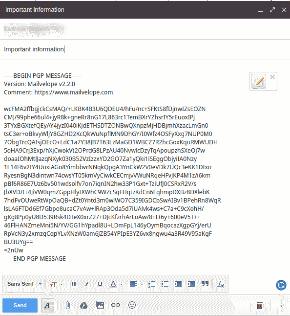

# 简单安全的电子邮件发送

> 原文：<https://dev.to/jorgecedi/simple-and-secure-email-sending-22j2>

发送和接收安全的电子邮件并不难。在这项任务中有大量的工具供您选择。Mailvelope 就是其中之一，而且相当好用。但首先，让我向您解释一下不对称加密，以及它对安全通信如此有用的原因。

# 非对称加密

假设 Alice 想要向 Bob 发送一条包含 Alice 当前位置的安全消息。但是她知道 Bob 倾向于让他的计算机无人看管，没有密码，电子邮件是开着的，她也知道 Bob 的同事有点好奇。所以爱丽丝想要一种方法来避开好奇的目光。

Alice 向 Bob 寻求在他们之间发送安全消息的方法，但是 Bob 不想与 Alice 或任何人共享密码。所以鲍勃决定给爱丽丝发送一个**公钥**。Alice 使用这个公钥来加密她想要与 Bob 共享的信息，但是 Alice 和 Bob 都不能用这个密钥来解密该信息。为了解密消息，鲍勃必须使用他的**私钥**(很明显，鲍勃不应该与任何人共享他的私钥)。因此 Bob 可以与任何人共享他的公钥，而不用担心有人会解密这些信息。

总之，Bob 与 Alice 共享他的公钥，Alice 用 Bob 的公钥加密消息，她通过电子邮件(或任何其他通信渠道)发送消息，Bob 用他的私钥解密消息。这样，Alice 和 Bob 可以防止 Bob 的同事看到原始邮件。

# 邮件信封

那么，在现实生活中我该怎么做呢？嗯，这是邮件发送的地方。Mailvelope 是一个浏览器插件，让我们加密和解密文件和消息，管理我们的密钥，它提供了一个简单的用户界面来集成主要的邮件提供商。它使用 GPG 作为加密方法。

首先，您需要在浏览器中安装扩展。你可以在这个链接找到
[https://www.mailvelope.com/](https://www.mailvelope.com/en)

然后，您必须创建一个密钥对(您的私钥和与之关联的公钥)。

[T2】](https://res.cloudinary.com/practicaldev/image/fetch/s--EUNI9Y0G--/c_limit%2Cf_auto%2Cfl_progressive%2Cq_auto%2Cw_880/https://thepracticaldev.s3.amazonaws.com/i/b1cjtj2k1old8qt1pkcv.png)

生成密钥对后，扩展会将您的公钥上传到 Mailvelope 密钥服务器，并给您一个包含您的公钥的链接(也存储在您的本地计算机上，您可以在扩展仪表板中显示它)。同时，您的私钥将保留在您的本地计算机上。你永远不应该分享你的私人钥匙。

为了给某人发送消息，你需要他的公钥。你可以直接问或者试着在密钥服务器上找。Mailvelope 将从那里开始，每当你撰写一封邮件时，首先点击 Mailvelope 图标，然后你只需键入邮件并选择收件人。Mailvelope 将为该收件人加密邮件。

就是这样！现在，您可以通过电子邮件发送和接收安全信息。