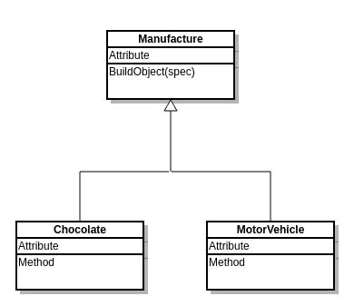

# 简单的工厂模式。网络核心

> 原文：<https://dev.to/gary_woodfine/simple-factory-pattern-in-c-and-net-core-3263>

帖子[简单工厂模式](https://garywoodfine.com/simple-factory-pattern/)最早出现在[加里伍德费恩](https://garywoodfine.com)上。

在软件开发中，软件设计模式是对经常出现的问题的可重用解决方案。软件设计模式是用于解决问题的描述或模板，可以在许多不同的情况下使用。

1994 年，所谓的四人帮(g Of)出版了他们的书，[Design Patterns:Elements Of Reusable Object-Oriented Software](https://amzn.to/2N22a2H)，在书中，他们提出了一系列针对常见设计问题的简单明了的解决方案。

这本书捕获了 23 种模式，使软件架构师能够创建灵活、优雅且最终可重用的设计模式，而不必为自己重新发现或重新发明设计解决方案。对于那些想要了解更多关于通用软件设计模式以及如何实现它们的开发人员来说，这是一个很好的资源。然而，这本书没有涵盖所有的软件设计模式，也肯定没有涵盖一些最常见的软件模式。

简单工厂模式可能是使用最广泛的模式之一，同时，它也是使用最少的软件模式之一。我经常在代码库中遇到这样的场景，当开发人员遇到问题时，他们不是优雅地处理它，而是经常用额外的 cruft 逻辑行污染函数方法。这通常会导致额外的逻辑错误，或者导致以后的可伸缩性和适应性问题。

与工厂方法模式或抽象工厂模式相比，简单工厂模式是最简单形式的工厂类，是用于创建其他对象的*工厂对象。简单来说，Factory 有助于将所有的对象创建放在一个地方，避免将`new`键值分散到整个代码库中。*

简单工厂模式返回的类将具有相同的父类和方法，但根据所提供的数据类型，执行任务的方式会有所不同。

## 简单工厂模式实现

让我们看一下图表，从高层次上了解简单工厂模式在 C#和。网芯。简单工厂设计模式是一种抽象形式，它隐藏了对象实现的实际逻辑，因此初始化代码可以专注于使用，而不是内部工作。

[T2】](https://res.cloudinary.com/practicaldev/image/fetch/s--OOPxjpOv--/c_limit%2Cf_auto%2Cfl_progressive%2Cq_auto%2Cw_880/https://garywoodfine.com/wp-content/uploads/2018/08/SimpleFactoryPattern.jpg)

在图中`Manufacture`是一个基类，类`Chocolate`和`MotorVehicle`是从它派生的，根据提供的参数，`Manufacture`类决定返回哪个子类。

使用`Manufacture`类的开发人员并不真正关心返回哪个子类，因为每个子类都有相同的方法，但会有不同的实现。工厂类如何决定返回哪一个，完全取决于所提供的数据。它可能是非常复杂的逻辑，然而，大多数时候它是非常简单的逻辑。

### 代码示例

为了构建一个简单工厂模式的假设样本，考虑一个典型的名和姓场景。如果我们考虑要构建一个应用程序，它将从各种应用程序获取用户名字符串输入。但是，字符串的提供方式有些不一致。在一个应用程序中，它作为`"FirstName LastName"`传递，而在另一个应用程序中，它作为`"LastName, FirstName"`传递。

当我们可以根据接收到的输入利用不同的类来处理这种情况时，我们不想让不同的字符串操作策略污染我们的代码库。

使用简单的`If then`语句来决定显示名称的哪个版本是一个简单的决定。

我们将从定义一个简单的类开始，该类将用户名作为构造函数中的字符串参数，并允许您取回拆分的名称。

首先，我们将为用户名定义一个简单的基类，由我们需要的基本属性组成。

```
public class UserName
    {
        public string FirstName { get; set; }
        public string LastName { get; set; }
    } 
```

Enter fullscreen mode Exit fullscreen mode

#### 派生类

我们可以开发两个非常简单的派生类，实现抽象类，并在构造函数中将用户名分成两部分。在这个例子中，当我们需要使用`FirstName`第一个场景
时，我们将假设用户名由一个空格分隔开

```
 public class FirstNameFirst : UserName
    {
        public FirstNameFirst(string username)
        {
            var index = username.Trim().IndexOf(" ", StringComparison.Ordinal);

            if (index &lt;= 0) return;

            FirstName = username.Substring(0,index).Trim();
            LastName = username.Substring(index + 1).Trim();
        }
    } 
```

Enter fullscreen mode Exit fullscreen mode

在第二个类中，我们将假设名称由逗号分隔。

```
 public class LastNameFirst : UserName
    {
       public LastNameFirst(string username)
       {
            var index = username.Trim().IndexOf(",", StringComparison.Ordinal);

           if (index &lt;= 0) return;

           LastName = username.Substring(0,index).Trim();
           FirstName = username.Substring(index + 1).Trim();
       }
    } 
```

Enter fullscreen mode Exit fullscreen mode

### 构建简单的工厂模式

我们将构建一个简单的工厂，它简单地测试逗号的存在，然后返回一个或另一个类的实例。

```
public class UsernameFactory
    {
        public UserName GetUserName(string name)
        {
            if (name.Contains(",")) return new LastNameFirst(name);

            return new FirstNameFirst(name);
        }
    } 
```

Enter fullscreen mode Exit fullscreen mode

[T2】](https://res.cloudinary.com/practicaldev/image/fetch/s--hg23iUiH--/c_limit%2Cf_auto%2Cfl_progressive%2Cq_auto%2Cw_880/https://garywoodfine.com/wp-content/uploads/2018/08/UserNameFactory.jpg)

### 单元测试简单工厂模式

我们现在可以使用 xUnit 单元测试框架简单地测试我们的工厂模式，如下所示。

```
public class UsernameFactoryTests
    {
        private UsernameFactory _factory;

        public UsernameFactoryTests()
        {
            _factory = new UsernameFactory();
        }

        [Fact]
        public void ShouldGetFirstNameFirst()
        {
            //arrange
            var user = "Gary Woodfine";

            //act
            var username = _factory.GetUserName(user);

            //assert
            Assert.Equal("Gary", username.FirstName);
            Assert.Equal("Woodfine", username.LastName);

        }

        [Fact]
        public void ShouldGetLastNameFirst()
        {
            //arrange
            var user = "Woodfine, Gary";

            //act
            var username = _factory.GetUserName(user);

            //assert
            Assert.Equal("Gary", username.FirstName);
            Assert.Equal("Woodfine", username.LastName);

        }
    } 
```

Enter fullscreen mode Exit fullscreen mode

正如你现在看到的，当我们调用`GetUserName`函数时，我们简单地传入字符串，工厂方法决定将用户名实例的哪个版本传回到应用程序。开发人员不需要关心任何所需的字符串操作。

简单工厂设计模式是一种抽象形式，它隐藏了对象实现的实际逻辑，因此初始化代码可以专注于使用，而不是内部工作。提供了我们需要的细节，我们需要做的就是传入名称字符串，工厂将决定使用哪个类来格式化数据。

### 总结

这是简单工厂模式的基本原则，创建一个抽象来决定返回几个可能的类中的哪一个。开发人员只需调用该类的一个方法，而不知道实现细节或实际使用哪个子类来实现逻辑。

这种方法有助于将数据依赖问题从类的有用方法中分离出来。

帖子[简单工厂模式](https://garywoodfine.com/simple-factory-pattern/)最早出现在[加里伍德费恩](https://garywoodfine.com)上。