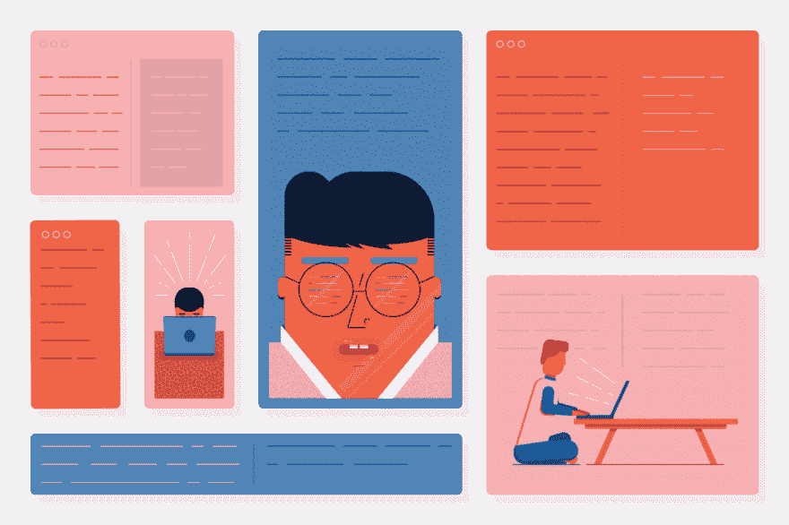
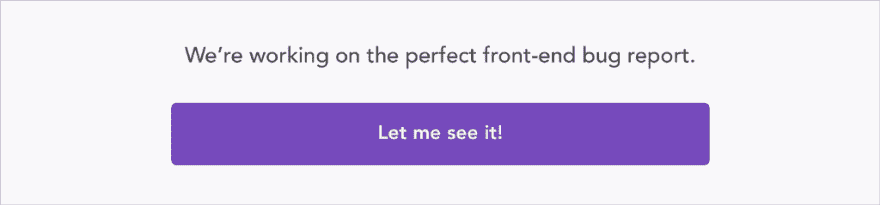

# 设计师可以做一些简单的事情来让他们的前端开发人员开心

> 原文：<https://dev.to/bnevilleoneill/simple-things-designers-can-do-to-make-their-front-end-developers-happy-6bi>

### 设计师可以做一些简单的事情让他们的开发同事开心

[T2】](https://res.cloudinary.com/practicaldev/image/fetch/s--epDjTxTp--/c_limit%2Cf_auto%2Cfl_progressive%2Cq_auto%2Cw_880/https://cdn-images-1.medium.com/max/1024/1%2AUsqmuXYQlsqbb554NUu9rw.png)

当我作为一名前端开发人员工作时，有时我会收到在我称之为*打印心态*下创作的设计。印刷材料和网站都可以被认为是二维图像，应该以一种审美愉悦的方式传达信息，但相似之处也就到此为止了。

设计者使用的工具对于印刷和网页设计来说通常是相同的，这可能会导致忽略两者之间的差异。在这篇文章中，我想强调一些设计师在设计网站时应该记住的事情。

如果你从事网页设计已经有一段时间了，下面这些可能看起来是简单的常识。但你会惊讶的。虽然我最初写这篇文章主要是为了那些刚刚起步或从平面设计过渡到网页设计的设计师，但即使是最有经验的设计师也应该记住他们的开发人员。

### 提供所有可能的状态

当项目需求声明用户应该能够填写联系人表单时，很容易认为几个文本输入和一个大按钮就可以了。

实际上，这只是开始。

显然，当表单正确提交时，最小状态是成功。但互联网是一个非常复杂的东西，东西随时可能坏掉，用户会犯错误或根本不理解界面。表单的字段和按钮的错误状态、明确的验证消息和禁用状态是必须的。

表单是一个非常明显的例子，但是设计者也应该意识到任何动态或交互元素中的非理想状态。在设计新闻提要时，请记住可能没有任何新闻条目。设计还应该指出空状态是否是错误的结果，或者是否只是没有要显示的项目。

[T2】](https://logrocket.com/?cid=banner_b)

### 想想用户流量

仅仅通过查看设计来捕捉用户流错误需要一些经验。幸运的是，我们人类非常擅长讲述和理解故事。一个好的用户流就像一个好的故事——通过查看一个单一的视图(可以说是一个场景),用户应该能够知道他们处于流程的哪个部分，他们是如何到达那里的，以及如果需要的话如何返回。

迷失在数字界面中是非常令人恼火的，而编写不合逻辑的界面更令人恼火。在交出设计之前，花一点时间告诉别人(它[可能是一只橡皮鸭](https://en.wikipedia.org/wiki/Rubber_duck_debugging)！)你设计的故事。用户点击哪里，为什么，应该发生什么，设计如何处理不应该发生的事情。

如果你想更上一层楼，创建一个数字原型或动画。一张图片可能抵得上一千个单词，但是一部动画——你猜对了——甚至可以抵得上每秒六万个单词。查看[原理](http://principleformac.com/)、[图玛](https://www.figma.com/)，或者如果你有更多的时间，根据这个[原型工具大列表](http://prototypingtools.co/)做你自己的研究。一个可点击的原型可以节省大量的开发时间，因为改变原型总是比重写代码花费的时间少。

### 创建风格指南

风格指南是非常有用的东西之一，但是经常被忽视。对于开发人员来说，它提供了一个项目中使用的所有组件的清晰概述，对于设计人员来说，它是一个可以大大加快项目正在进行的开发的库。

这也有助于将项目视为一个设计系统，而不仅仅是一系列视觉上相关的视图。一旦系统完成并记录在风格指南中，添加新的视图或组件就容易多了。最重要的是，给新团队成员准备一份风格指南比带他们浏览所有可能的视图要快得多。

查看 MailChimp 的和[孤独星球的](http://rizzo.lonelyplanet.com/styleguide)风格指南，寻找一些高质量的例子。

### 为移动用户设计

你的用户可能是在手机上看你的网站，很可能是在不稳定的 3G 连接上。坐在有超高速 wifi 的办公室里看着 27 英寸的屏幕很容易忘记，但在外面，[移动正在吃掉世界](https://www.ben-evans.com/benedictevans/2016/12/8/mobile-is-eating-the-world)。

这里有三个关键点:屏幕尺寸、带宽和性能。

这不仅仅是关于小屏幕，这是关于任何可以想象的屏幕，大到巨大的 4K 屏幕，大多数网站在这些屏幕上看起来只是…很小。设计时，忘记任何固定的屏幕尺寸。不管屏幕大小如何，界面都应该看起来很棒，并且应该适应各种限制——否则你是在强迫用户适应，而他们没有时间去适应。

还记得上次你试图在一个糟糕的咖啡馆或酒店无线网络上查找某个网站吗？对许多人来说，这是每天的现实。对于高分辨率全屏背景图像或在网站上加载两种以上的自定义字体，请三思。

最后但同样重要的是性能。你的高端电脑在处理那些获得所有奖项的非常互动和惊艳的网站时，大概是没有问题的。但请记住，其中一些甚至无法在一部糟糕的手机上加载，而这部手机可能是其他人唯一的互联网连接设备。

### 记住内容变化

有时在网站开发完成后会有这种不安的感觉——即使开发者做了所有完美的事情，它看起来还是比最初的设计差一些。然后，开发人员看到设计上的所有文本都与其他内容完美地对齐，并且每张图片都有完美的颜色和构图。

你不能责怪设计师把它做得很漂亮——毕竟这是他们的工作。但有时设计师会忘记内容会发生变化，有些人的姓氏会占用两行文字。最好是放下这种想象中的完美长度副本，创造出在任何配置下都好看的设计。那才是真正的品质标志。

### 坚持一格

技术在进步，越来越多的事情成为可能，但是保持元素与网格一致不仅会使开发更快，还会使站点在旧浏览器上更可靠。

当你选择了一个网格尺寸，坚持下去。对于开发人员来说，设计人员最讨厌的事情之一就是改变一个组件或页面的网格大小。就像风格指南一样，一致性是快乐的关键。

### 保持文件有条理

设计文件可能会变得混乱。然而，它们是开发人员的主要信息来源。命名和逻辑分组的层，特别是当它们描述不同的组件状态时，是设计者尊重开发人员工作的标志。

至于图像，一个很好的经验法则是，如果某些东西可以导出为 SVG 格式的矢量图形，它就应该是。SVG 文件比光栅图像要轻得多，并且可以通过代码(例如图标颜色)进行操作。

### 就这样！

我希望我暗示一些设计师不擅长他们的工作，没有伤害任何人的感情——与此无关。前端是一个不断变化的领域，即使是程序员也很难跟上所有发生的事情。很难要求设计者了解现代网络标准和实践的所有古怪之处。我希望这篇文章将有助于弥合设计和代码之间的差距。

*附加链接:*

*   [前端设计清单](https://github.com/thedaviddias/Front-End-Design-Checklist)
*   [前端开发清单](https://frontendchecklist.io/)

### Plug: [LogRocket](http://logrocket.com) ，一款适用于网络应用的 DVR

[T2】](http://logrocket.com)

LogRocket 是一个前端日志工具，可以让你回放问题，就像它们发生在你自己的浏览器中一样。LogRocket 不需要猜测错误发生的原因，也不需要向用户询问截图和日志转储，而是让您重放会话以快速了解哪里出错了。它可以与任何应用程序完美配合，不管是什么框架，并且有插件可以记录来自 Redux、Vuex 和@ngrx/store 的额外上下文。

除了记录 Redux 操作和状态，LogRocket 还记录控制台日志、JavaScript 错误、堆栈跟踪、带有头+正文的网络请求/响应、浏览器元数据和自定义日志。它还使用 DOM 来记录页面上的 HTML 和 CSS，甚至为最复杂的单页面应用程序重新创建像素级完美视频。

免费试用。

* * *