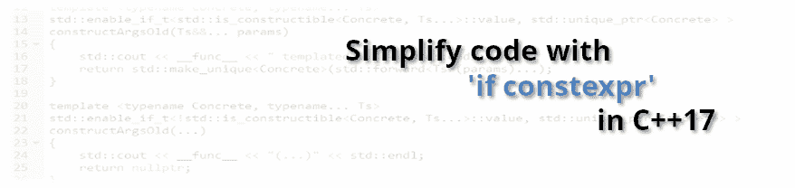

# 在 C++17 中用“if constexpr”简化代码

> 原文：<https://dev.to/fenbf/simplify-code-with-if-constexpr-in-c17--2fnc>

[T2】](http://www.bfilipek.com/2018/03/ifconstexpr.html)

在 C++17 之前，我们有一些很难看的方式在 C++中编写`static if` ( `if`在编译时工作):你可以使用标签分派或 [SFINAE](http://www.bfilipek.com/2016/02/notes-on-c-sfinae.html) (例如通过`std::enable_if`)。幸运的是，这种情况已经改变了，我们现在可以从`if constexpr`中获益了！

让我们看看如何使用它并替换一些`std::enable_if`代码。

**一注:**本文来自我的博客: [Bartek 的编码博客:用 C++17 中的‘if const expr’简化代码](https://www.bfilipek.com/2018/03/ifconstexpr.html)。

## [T1】简介](#intro)

以`if constexpr`的形式出现的静态 if 是 C++17 中的一个惊人特性。最近@Meeting C++有一个帖子，Jens 展示了他如何使用`if constexpr` : [简化一个代码示例:如果 constexpr 如何在 C++17 中简化你的代码](http://meetingcpp.com/blog/items/How-if-constexpr-simplifies-your-code-in-Cpp17.html)。

我找到了另外两个例子来说明这个新特性是如何工作的:

*   数字比较
*   参数数量可变的工厂

我想这些例子可能会帮助你理解 C++17 中的`static if`。

但是首先，我想回忆一下关于`enable_if`的基本知识，以设置一些背景。

## 为什么编译时如果？

首先，你可能会问，为什么我们需要`static if`和那些复杂的模板表达式...正常的`if`不就行了吗？

这里有一个测试代码:

```
template <typename T>
std::string str(T t)
{
    if (std::is_same_v<T, std::string>) // or is_convertible...
        return t;
    else
        return std::to_string(t);
} 
```

Enter fullscreen mode Exit fullscreen mode

上面的例程可能是一些用于打印的简单实用程序。由于`to_string`不接受`std::string`,我们可以测试并返回`t`,如果它已经是一个字符串。听起来很简单...但是试着编译一下这段代码:

```
// code that calls our function
auto t = str("10"s); 
```

Enter fullscreen mode Exit fullscreen mode

您可能会得到这样的结果:

```
In instantiation of 'std::__cxx11::string str(T) [with T = 
std::__cxx11::basic_string<char>; std::__cxx11::string =
 std::__cxx11::basic_string<char>]':
required from here
error: no matching function for call to 
'to_string(std::__cxx11::basic_string<char>&)'
    return std::to_string(t); 
```

Enter fullscreen mode Exit fullscreen mode

`is_same`为我们使用的类型(字符串)生成`true`,我们可以直接返回`t`,无需任何转换...那到底怎么了？

这里是要点:

编译器编译了这两个分支，并在`else`案例中发现了一个错误。它不能拒绝这个特定模板实例化的“无效”代码。

这就是为什么我们需要静态 if，它会“丢弃”代码，只编译匹配的语句。

## `std::enable_if`

在 C++11/14 中编写静态 if 的一种方法是使用`enable_if`。

`enable_if`(以及 C++14 以来的`enable_if_v`)。它有相当奇怪的语法:

```
template< bool B, class T = void >  
struct enable_if; 
```

Enter fullscreen mode Exit fullscreen mode

如果输入条件`B`为真，`enable_if`将评估为`T`。否则，它就是 [SFINAE](http://www.bfilipek.com/2016/02/notes-on-c-sfinae.html) ，一个特定的函数重载被从重载集合中移除。

我们可以将我们的基本示例重写为:

```
template <typename T>
std::enable_if_t<std::is_same_v<T, std::string>, std::string> strOld(T t)
{
    return t;
}

template <typename T>
std::enable_if_t<!std::is_same_v<T, std::string>, std::string> strOld(T t)
{
    return std::to_string(t);
} 
```

Enter fullscreen mode Exit fullscreen mode

不容易...对吗？

请看下面我们如何用 C++17 中的`if constexpr`来简化这样的代码。在你读完这篇文章后，你将能够很快地重写我们的`str`实用程序。

## 用例 1 -比较数字

首先，让我们从一个简单的例子开始:`close_enough`函数，它作用于两个数字。如果数字不是浮点数(比如当我们有两个`ints`的时候)，那么我们就可以比较它。否则，对于浮点来说，最好使用一些ε。

我在[实用现代 C++预告片](https://h-deb.clg.qc.ca/WG21/PracticalCpp/Temperature.html)上找到了这个样本——由 [Patrice Roy](https://twitter.com/PatriceRoy1) 编写的现代 C++特性的精彩预演。他也非常友好，允许我举这个例子。

C++11/14 版本:

```
template <class T>
constexpr T absolute(T arg) {
   return arg < 0 ? -arg : arg;
}

template <class T>
constexpr enable_if_t<is_floating_point<T>::value, bool> 
close_enough(T a, T b) {
   return absolute(a - b) < static_cast<T>(0.000001);
}
template <class T>
constexpr enable_if_t<!is_floating_point<T>::value, bool> 
close_enough(T a, T b) {
   return a == b;
} 
```

Enter fullscreen mode Exit fullscreen mode

如你所见，这里有一个`enable_if`的用法。和我们的`str`函数很像。代码测试输入数字的类型是否是`is_floating_point`。然后，编译器可以从重载决策集中移除一个函数。

而现在，我们来看看 C++17 版本:

```
template <class T>
constexpr T absolute(T arg) {
   return arg < 0 ? -arg : arg;
}

template <class T>
constexpr auto precision_threshold = T(0.000001);

template <class T>
constexpr bool close_enough(T a, T b) {
   if constexpr (is_floating_point_v<T>) // << !!
      return absolute(a - b) < precision_threshold<T>;
   else
      return a == b;
} 
```

Enter fullscreen mode Exit fullscreen mode

哇...所以只有一个函数，看起来很像普通函数。用近乎“正常”的 if:)

`if constexpr`在编译时评估`constexpr`表达式，然后丢弃其中一个分支中的代码。

BTW:你能看到这里使用的其他一些 C++17 特性吗？

### 玩代码

用一个活代码例子去主文:
[Bartek 的编码博客:用 C++17 中的‘if const expr’简化代码](https://www.bfilipek.com/2018/03/ifconstexpr.html#play-with-the-code)

## 用例 2 -具有可变参数的工厂

在有效的现代 C++的第 18 项中，Scott Meyers 描述了一种叫做`makeInvestment` :
的方法

```
template<typename... Ts> 
std::unique_ptr<Investment> 
makeInvestment(Ts&&... params); 
```

Enter fullscreen mode Exit fullscreen mode

有一个工厂方法可以创建`Investment`的派生类，主要优点是它支持可变数量的参数！

例如，以下是建议的类型:

```
class Investment
{
public:
    virtual ~Investment() { }

    virtual void calcRisk() = 0;
};

class Stock : public Investment
{
public:
    explicit Stock(const std::string&) { }

    void calcRisk() override { }
};

class Bond : public Investment
{
public:
    explicit Bond(const std::string&, const std::string&, int) { }

    void calcRisk() override { }
};

class RealEstate : public Investment
{
public:
    explicit RealEstate(const std::string&, double, int) { }

    void calcRisk() override { }
}; 
```

Enter fullscreen mode Exit fullscreen mode

书中的代码太理想化了，不起作用——直到你的所有类都有相同数量和类型的输入参数:

[Scott Meyers:有效的现代 C++的修改历史和勘误表](http://www.aristeia.com/BookErrata/emc++-errata.html):

> 接口`makeInvestment`是不现实的，因为它暗示所有派生的对象类型都可以从相同类型的参数中创建。这在示例实现代码中尤其明显，其中参数被完美地转发给所有派生类构造函数。

例如，如果您有一个需要两个参数的构造函数和一个有三个参数的构造函数，那么代码可能无法编译:

```
// pseudo code:
Bond(int, int, int) { }
Stock(double, double) { }
make(args...)
{
  if (bond)
     new Bond(args...);
  else if (stock)
     new Stock(args...)
} 
```

Enter fullscreen mode Exit fullscreen mode

现在，如果你写`make(bond, 1, 2, 3)` -那么`else`语句不会被编译-因为没有`Stock(1, 2, 3)`可用！为了工作，我们需要类似静态 if - if 的东西，它将在编译时工作，并且将拒绝不匹配条件的代码部分。

在一些帖子之前，在一位读者的帮助下，我们提出了一个可行的解决方案(你可以在 [Bartek 的编码博客:Nice C++工厂实现 2](http://www.bfilipek.com/2016/03/nice-c-factory-implementation-2.html) 中了解更多)。

下面是可行的代码:

```
template <typename... Ts> 
unique_ptr<Investment> 
makeInvestment(const string &name, Ts&&... params)
{
    unique_ptr<Investment> pInv;

    if (name == "Stock")
        pInv = constructArgs<Stock, Ts...>(forward<Ts>(params)...);
    else if (name == "Bond")
        pInv = constructArgs<Bond, Ts...>(forward<Ts>(params)...);
    else if (name == "RealEstate")
        pInv = constructArgs<RealEstate, Ts...>(forward<Ts>(params)...);

    // call additional methods to init pInv...

    return pInv;
} 
```

Enter fullscreen mode Exit fullscreen mode

正如你所看到的,“魔法”发生在`constructArgs`函数内部。

主要思想是当类型可以从一组给定的属性构造时返回`unique_ptr<Type>`,否则返回`nullptr`。

### c++ 17 之前

在我之前的解决方案(C++17 之前)中，我们使用了`std::enable_if`，看起来是这样的:

```
// before C++17
template <typename Concrete, typename... Ts>
enable_if_t<is_constructible<Concrete, Ts...>::value, unique_ptr<Concrete>>
constructArgsOld(Ts&&... params)
{
    return std::make_unique<Concrete>(forward<Ts>(params)...);
}

template <typename Concrete, typename... Ts>
enable_if_t<!is_constructible<Concrete, Ts...>::value, unique_ptr<Concrete> >
constructArgsOld(...)
{
    return nullptr;
} 
```

Enter fullscreen mode Exit fullscreen mode

[STD::is _ constructible @ CP preference . com](http://en.cppreference.com/w/cpp/types/is_constructible)——允许我们快速测试一个参数列表是否可以用来创建一个给定的类型。

在 C++17 中有一个助手:

```
is_constructible_v = is_constructible<T, Args...>::value; 
```

Enter fullscreen mode Exit fullscreen mode

所以我们可以把代码缩短一点...

尽管如此，使用`enable_if`看起来又丑又复杂。C++17 版本怎么样？

### 同`if constexpr`

下面是更新版本:

```
template <typename Concrete, typename... Ts>
unique_ptr<Concrete> constructArgs(Ts&&... params)
{ 
   if constexpr (is_constructible_v<Concrete, Ts...>)
      return make_unique<Concrete>(forward<Ts>(params)...);
   else
       return nullptr;
} 
```

Enter fullscreen mode Exit fullscreen mode

我们甚至可以使用 fold expression:
来扩展它的一些日志功能

```
template <typename Concrete, typename... Ts>
std::unique_ptr<Concrete> constructArgs(Ts&&... params)
{ 
    cout << __func__ << ": ";
    // fold expression:
    ((cout << params << ", "), ...);
    cout << "\n";

    if constexpr (std::is_constructible_v<Concrete, Ts...>)
        return make_unique<Concrete>(forward<Ts>(params)...);
    else
       return nullptr;
} 
```

Enter fullscreen mode Exit fullscreen mode

凉爽的...对吗？:)

所有复杂的语法都消失了；对于`else`的情况，我们甚至不需要函数重载。我们现在可以将表达性代码包装在一个函数中。

`if constexpr`评估条件，仅编译一个程序块。在我们的例子中，如果一个类型可以从一组给定的属性中构造出来，那么我们将编译`make_unique`调用。如果不是，则返回`nullptr`(甚至不编译`make_unique`)。

### 玩代码

用一个活代码例子去主文:
[Bartek 的编码博客:用 C++17 中的‘if const expr’简化代码](https://www.bfilipek.com/2018/03/ifconstexpr.html#play-with-the-code-1)

## 总结起来

编译时`if`是一个惊人的特性，它极大地简化了模板代码。更重要的是，它比以前的解决方案更具表现力，也更好:标签调度或`enable_if` (SFINAE)。现在，你可以很容易地表达你的意图，类似于“运行时”代码。

在这篇文章中，我们只涉及了基本的表达式，我一如既往地鼓励您更多地使用这个新特性并进行探索。

## 更多来自作者

Bartek 最近出版了一本书-[**【C++ 17 详解】**](https://leanpub.com/cpp17indetail?utm_source=devto&utm_campaign=simpleifconst) -与其阅读论文和 c++规范草案，你可以用这本书来学习新的