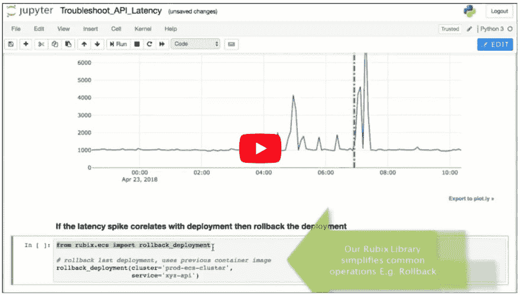
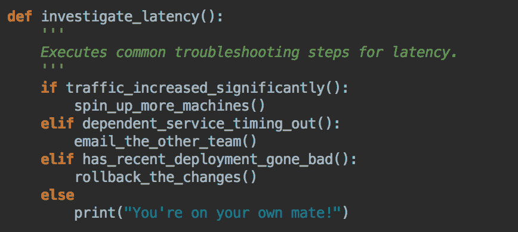

# 使用 Jupyter 笔记本电脑简化开发工作

> 原文：<https://dev.to/amit1rrr/simplify-devops-with-jupyter-notebook-e33>

Jupyter Notebook 是一款神奇的数据探索工具。它将**的 markdown 文本、可执行代码和输出全部组合在一个浏览器**的单一文档中。虽然 Jupyter 对于数据科学来说很棒，但我将展示 Notebook 在一个完全不同的用例中的使用:DevOps Runbook 或者简单地说，*一种快速响应系统中断的方法*。

## 问题

想象一下，你正在和心爱的人共度一个夜晚，突然看到一系列关于 API 延迟攀升的 slack/pager 警报。从那以后一切都走下坡路了。您上网并检查所有常见的可疑点:**最近的部署、相关服务、负载平衡器、传入流量、数据库等等**。你从终端跳到 AWS 控制台，跳到 NewRelic，跳到电话会议等等。我们只能说，在你找到并解决问题之前，整个经历都充满压力。

更成熟的组织维护事故响应操作手册。Runbook 概述了要遵循的步骤，并排除了调试中的猜测工作。首先，让我们看看当前形式的操作手册面临的一些挑战:

*   您需要手动执行每个步骤，不需要自动化
*   除非写得很好，否则下面的说明可能会有歧义/混乱
*   让每个人都参与进来以保持操作手册的更新是一项相当大的努力

## 解

为了解决这些问题，我建议使用 Jupyter 笔记本来写操作手册。下面是您的 API 延迟调试会话在笔记本环境中的样子(请在全屏模式下观看此视频，如果需要，可以查看原始的 [youtube 链接](https://www.youtube.com/watch?v=vvLXSAHCGF8&feature=youtu.be&showinfo=1&rel=0))。

[T2】](https://www.youtube.com/watch?v=vvLXSAHCGF8)

正如您在视频中看到的，用户可以从笔记本电脑中绘制图表、检查部署时间、回滚更改、运行 SQL 查询、shell 脚本和 SSH。

## 好处

以下是以可执行笔记本格式维护操作手册的一些好处。

*   少一些困惑。代码比用英语写的指令更具确定性。
*   减少事故时间和影响。随叫随到响应速度更快，调查/解决问题所需的代码唾手可得。
*   按照您自己的节奏实现自动化。因为 Notebook 支持 markdown，所以可以直接导入现有的 runbooks 在每个 sprint 中自动执行一些步骤。
*   更好的协作。它提供了一个一流的平台，用于共享开发者为解决某个问题而保留的所有部落知识和本地脚本。
*   当我们将单个步骤结合起来构建更复杂的逻辑时，就有了真正的力量。今天以下是可能的。这是迈向自我修复系统的一步。

[T2】](https://res.cloudinary.com/practicaldev/image/fetch/s--m5sc1sn5--/c_limit%2Cf_auto%2Cfl_progressive%2Cq_auto%2Cw_880/https://uploads-ssl.webflow.com/5adf07174a787c7249ade79f/5b0ff5c76249257adda9ed3b_screen-shot-2018-03-27-at-10-08-18-am.png)

## 挑战

可执行笔记本格式是有前途的，但目前的 Jupyter 实现存在一些挑战。

*   典型的 Jupyter 安装是单用户本地安装，要求 Jupyter 服务器在本地运行。共享笔记本没有简单的方法。
*   谷歌联合实验室可能是个不错的选择，但它托管在谷歌服务器上。笔记本电脑服务器需要自我托管的代码，以访问我们的 VPC 内的所有基础设施。
*   任何基础设施代码都需要凭证、ssh 密钥等。我们需要一种安全共享它们的方式&而不仅仅是把它贴在笔记本代码片段的任何地方。

我正在构建一个解决这些挑战的平台 [Nurtch](http://nurtch.com) ，这个平台&提供了一种在团队内部编写和共享可执行操作手册的简单方法。[文档](http://docs.nurtch.com)提供了 Nurtch 功能和操作方法的完整概述。[让我知道](mailto:amit@nurtch.com)你对这种事件响应方法的看法。