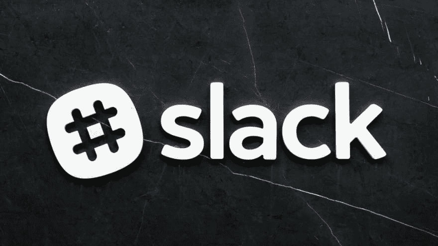
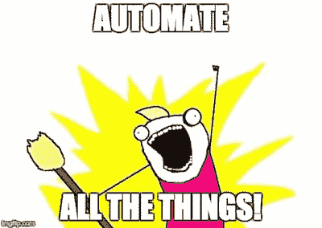

# 松弛集成

> 原文：<https://dev.to/binarydigit/slack-integrations-280i>

[T2】](https://res.cloudinary.com/practicaldev/image/fetch/s--u2ebfb53--/c_limit%2Cf_auto%2Cfl_progressive%2Cq_auto%2Cw_880/https://images.unsplash.com/photo-1496200186974-4293800e2c20%3Fixlib%3Drb-0.3.5%26q%3D80%26fm%3Djpg%26crop%3Dentropy%26cs%3Dtinysrgb%26w%3D1080%26fit%3Dmax%26ixid%3DeyJhcHBfaWQiOjExNzczfQ%26s%3D5f47e02399585ae7a0e37ba7cbc1e379)

在我目前的工作中，我们总是需要每天获得一条特定的信息，并将其发布到 slack 频道。只需要大约十分钟...但是为什么要花 10 分钟，而不到 1 分钟呢？毕竟，作为一名开发人员的本质是高效工作(我完全是为了自动化)！

[T2】](https://res.cloudinary.com/practicaldev/image/fetch/s--Qjgq3WuB--/c_limit%2Cf_auto%2Cfl_progressive%2Cq_auto%2Cw_880/https://binarydigit.io/conteimg/2018/07/automate_all_the_things.jpg)

我决定学习如何使用引入的 webhooks 进行松散集成。这比我想象的要容易得多！我通过 [Slack docs](https://api.slack.com/incoming-webhooks) 按照说明做了一个小的 Github repo，以防有人对做一个简单的集成感兴趣。我决定使用一个[非官方的 QDB api 包装器](https://github.com/MarkNjunge/qdb-api)，并在点击特定路线时在频道中随机出现一个 [qdb.us](http://www.qdb.us/) 报价。

随意[叉它](https://github.com/lizrodriguez/qdb_slack_integration)，到处玩玩，看看自己能不能做点有趣的事。😁