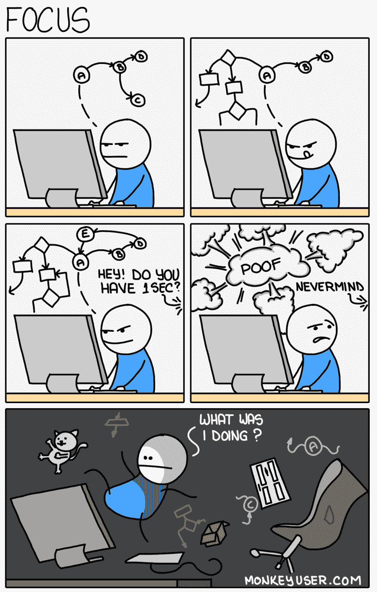
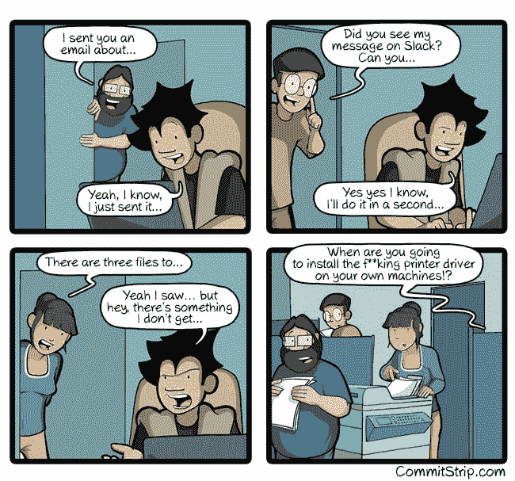

# Slack 一直打断你，但是你可以阻止它

> 原文：<https://dev.to/nebojsac/slack-keeps-interrupting-you-but-you-can-stop-it-883>

*或“千刀万剐免死”。你的生产力是受害者。*

扼杀一个程序员生产力的最便宜的方法，是让他加入一个公司的松散团队，让他出现在所有的频道上，让每个人都可以随心所欲地戳、敲、戳他。丁丁、弹出窗口和推送通知的冲击会很快让他疲惫不堪。

正如人类还没有进化到能够处理在线社交网络一样，程序员也还需要几代人才能完全弄清楚如何在即时通讯中生存。不仅仅是程序员，这包括任何需要一次专注**小时**才能完成有意义工作的职业。

Slack 可能只花费每个用户 5 美元，但是如果你考虑到生产力的损失，我打赌这个数字在你的资产负债表上只是一个舍入误差。也就是说，如果您没有正确使用时差。

# 什么懈怠*不是*

好吧，事情是这样的。自从 Slack 成为事实上的聊天工具以来，我们一直指责它是注意力集中的种族灭绝。公司爱它，客户爱它，但程序员只容忍它。我认为我们只是用错了。

## Slack 不是实时的

想想以前的论坛。你会留下一条经过深思熟虑的信息，希望得到答复，然后继续你的一天。你要么很晚才回来，要么一旦收到回复的电子邮件通知(很慢才到)。

你会收到一条同样经过深思熟虑的信息。不是 10 个句子分散在一行中，当然也不是某人不连贯的思路，中途失去了重点。

> 沿途的某个地方...
> 
> 我们决定
> 
> 这个
> 
> 是一种可以接受的交流方式。
> 
> 求你了。停下来。

它不仅会把我的手机震落在桌子上，还会把一条信息分解成十几个中断。它也很难阅读，而且很多时候，当*“线索”*解开时，信息的重点就发生了变化。

打出单个*连贯的*段文字。如果你愿意，可以把它分成多个句子或行，但是保持在一条*单一*信息中。这样你就可以最大限度地减少杂乱和噪音。如果你想发送 20 个截屏，拉上拉链。没有人想滚动 3 个屏幕空间高度的垂直手机背景。

作为奖励，当你写下这些长消息时，你可以回答你自己的问题。这每天都发生在我身上。当我读到第三行的时候，我意识到我可以自己找到答案，或者答案比我想象的要简单。

## 时差不是问题跟踪器

我们能把这个烧到备用的边栏上吗？如果你的公司已经在使用像 Trello、吉拉或 Redmine 这样的项目管理工具，就没有理由直接在 chat 中报告问题。你已经有了合适的工具，使用它。

是的，有些事情可能不清楚。是的，你可能不确定这是一个实际问题。是的，你想尽快完成。但是你仍然希望你的其他项目继续进行。“松弛任务”很快将团队埋葬在“次要紧急侧钻”中，以至于问题跟踪器失去了它的目的。任何值得报道的事情都值得在问题跟踪器中报道，并在那里讨论、阐述**或结束**。

## 聊天不能代替通话

这里有一个小练习。这与时机有关。下一次你需要“快速讨论一些事情”时，一旦完成，记下第一条和最后一条信息的时间戳。我敢打赌，你看到的是 10 分钟内 8 个句子，或者说“每分钟 1 个句子”。

在这期间，你什么也做不了。或者你可以，但是你可能会因为注意力不集中而搞砸。那段时间你实际上被*屏蔽了*，直到对话结束。相比之下，在电话中，你可以在 2 分钟内讲清楚要点，并利用剩余的 8 分钟提供更多需要的信息。一旦你挂断电话，在你回到你的代码编辑器之前，你不会怀疑你是否会得到另一个消息。

[T2】](https://res.cloudinary.com/practicaldev/image/fetch/s--RKgTglqG--/c_limit%2Cf_auto%2Cfl_progressive%2Cq_auto%2Cw_880/https://i.redd.it/o1gnotfxi4k01.png)

## 现在需要你注意的事情最好是重要的

聊天是异步的，也应该如此使用。问题出现在默认的松弛设置和行为上。你听到通知，跑去看看发生了什么事*，万一它很重要*。99%的情况下，都不是。

如果你启用了这些浏览器弹出通知，我想知道你一天中是如何完成任务的。除非此时此刻需要你的注意力，否则就不值得打扰。

还有，这是什么时候成为常态的:

> "嘿，我刚给你发了封邮件，你看了之后告诉我一声。"

10 次中有 10 次没有紧急到保证那个消息。他们看到了就知道了。一旦他们准备好回应，他们就会回应。至少电子邮件没有任何实时的伪装。

[T2】](https://res.cloudinary.com/practicaldev/image/fetch/s--Rurby22m--/c_limit%2Cf_auto%2Cfl_progressive%2Cq_auto%2Cw_880/https://www.commitstrip.com/wp-content/uploads/2017/05/Strip-Drivers-de-limprimante-non-install%25C3%25A9s-650-finalenglishUD-1.jpg)

# 保持理智的方法

既然我已经抱怨完了，这里有一个清单，可以让你最大限度地减少干扰。

## 杀通知

首先，将所有渠道通知首选项更新为“仅提及”。没必要每条信息都通知你。

此外，由于你不能真正做到这一点的私人信息，教你的团队/公司使用公共渠道比私人信息更频繁。此外，教他们不要标记你，除非它需要立即关注-当你看到它时，你会看到它。

哦，还有禁用浏览器弹出通知，那个东西本来就不应该存在。

## 建立一些基本规则

有几个非常简单的规则，你可以和你的松散团队分享，以最大限度地减少干扰:

*   尝试将您的聊天消息分组为较少的较大消息，以减少通知。
*   除非情况紧急，否则不要在公共频道上@某人。
*   如果你回复的是“好的”或者“谢谢！”几分钟或更长时间后，使用表情符号反应来确认信息。
*   还是那句话，多使用公共渠道而不是私人渠道。
*   如果你有两个以上的问题，最好安排一个简短的电话。

## 介绍禅时或禅日

好的，这是我个人最喜欢的。在 Slack 中有一个 DnD 模式，它可以监视你的通知——甚至是私人信息——这太棒了。在建筑物着火的情况下，发送者可以“突破”你的 DnD 模式将消息发送给你，但大多数时候他们不会觉得有必要。

现在，不要总是处于 DnD 模式，因为公司可能需要你时不时地有空和阅读聊天，你应该建立某些“禅”的时间块。

在 Pathway，我们每周只做一天禅，但你可能会有好几个禅日。或者每天做 3 小时禅坐。

这意味着你的 DnD 模式开启了，每个人都知道在那个时候不要给你发无聊的消息，除非是重要的事情。这在公司买入的情况下效果更好，但在现实中，无论如何，你只要在更大的时间里使用 DnD 就可以了。你的大脑仍然会让你时不时地检查懈怠，但现在它是按照你的方式进行的，而不是被打断。

# 底线

懈怠不是一个不好的工具，但我们作为一个社会仍然不确定什么是适当的懈怠礼仪。我们不明白我们的信息在另一端做了什么，也不明白被打断的代价。随着在这个话题上做的更多，我们得到了更理智的聊天默认，事情会变得更好，但在那之前:打盹你的懈怠。

### 资源:

[MonkeyUser.com 漫画。](https://i.redd.it/o1gnotfxi4k01.png)
[CommitStrip](https://www.commitstrip.com/wp-content/uploads/2017/05/Strip-Drivers-de-limprimante-non-install%C3%A9s-650-finalenglishUD-1.jpg)