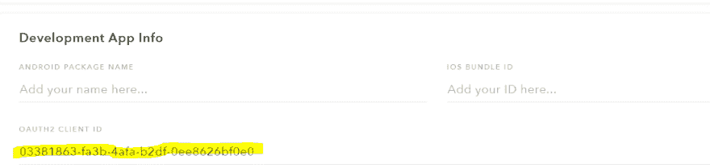
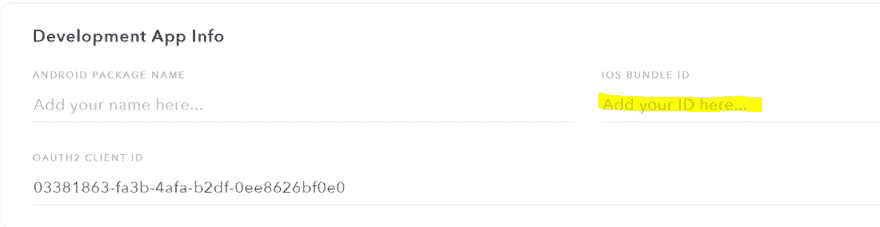

# Snapchat Snap Kit SDK 教程

> 原文：<https://dev.to/bbookman/snapchat-snap-kit-sdk-tutorial-for-ios-swift-22ej>

[媒体上的原始帖子](https://medium.com/adventures-in-ios-mobile-app-development/snapchat-snap-kit-sdk-tutorial-for-ios-swift-311863074bab)

# 关于卡扣套件

> Snap Kit 允许像您这样的开发人员在您的平台上集成 Snapchat 的一些最佳功能，并允许您的社区与他们的朋友以及世界各地的 Snapchat 用户分享他们在您的应用程序中最喜爱的时刻！— Snapchat

*以下教程假设您对 Xcode、Swift 和 Cocoapods 有所了解*

[本教程的资源库可以在这里找到](https://github.com/bbookman/SnapKitSample-iOS)

# Snapchat Snap Kit 开发者门户

## 第一步

如果您没有 Snapchat 帐户，请[注册一个](https://accounts.snapchat.com)。否则，您可以使用 Snapchat 凭据登录门户。

在门户上创建应用程序(实际上是注册 OAUTH 密钥)是不言自明的。

## 第二步

注意/复制**开发应用信息> OAUTH2 客户端 ID**
[](https://res.cloudinary.com/practicaldev/image/fetch/s--tgWyT6FZ--/c_limit%2Cf_auto%2Cfl_progressive%2Cq_auto%2Cw_880/https://cdn-images-1.medium.com/max/1100/1%2AUSph3YYDV7RqI0StptCrsw.png) 中的值

## 第三步

在开发者门户中，添加应用的 iOS 捆绑包 ID(请参见[查找应用的包名](https://help.tune.com/marketing-console/finding-your-apps-package-name/)以获取帮助)

[T2】](https://res.cloudinary.com/practicaldev/image/fetch/s--aF4_VJ0g--/c_limit%2Cf_auto%2Cfl_progressive%2Cq_auto%2Cw_880/https://cdn-images-1.medium.com/max/1100/1%2ATFQRfYHX8NzEEvxVnnCWwA.png)

## 第四步

在“重定向 URL”部分至少添加一个重定向 URL。

您可以选择任何您想要的 URL，只要该 URL 符合以下要求:

*   必须是独一无二的(对于应用程序的世界来说)。或许选择您的名字加上应用程序名称)
*   必须采用 some scheme name://some destination 的格式
*   必须与您将在项目的 Info.plist 中设置的 SCSDKRedirectUrl 相同(说明如下)。换句话说，您将复制您添加到开发人员门户的值，并将其粘贴到 Info.plist 中

# 快照套件 SDK

## 第五步

为 cocoapods 初始化您的项目并添加 SnapSDK

```
pod 'SnapSDK', :subspecs => ['SCSDKLoginKit', 'SCSDKCreativeKit', 'SCSDKBitmojiKit'] 
```

那就跑

```
pod install 
```

# 信息列表

如果你只想抓住要点，就跳到这一部分的底部。

## 第六步

**scsdkredicturl**和 **CFBundleUrlSchemes** 是相关的，以及您在 Snapchat 开发者门户中添加的重定向 URL 的值。

这些值可以完全虚构。只要这些值匹配并且是唯一的(见下文)。例如，如果我的应用程序被命名为这个疯狂的应用程序，我可以设置这些值:

```
<key>CFBundleURLSchemes</key>
                <array>
                    <string>thiscrazyapp</string>
                </array> 
```

和

```
<key>SCSDKRedirectUrl</key>
        <string>thiscrazyapp://myapp</string> 
```

然后点击右边的 add 按钮，将**thisraczyapp://myapp**添加到 Snapchat 开发者门户的 Redirect URLs 部分

来自 snapchat 开发人员的说明:

> 重定向 URL 本身不需要有任何关联的含义——所以一般来说，唯一真正的标准是选择一个 URL，其方案不太可能与另一个应用程序的方案相冲突。如果你的应用已经使用了一个 URL 方案，那么你可能只是想重用它。否则，你的 firstandlastname 的 URL 方案可能很适合你。在您的情况下，您可能希望使用重定向 URL yourfirstandlastname://snap-kit/auth
> SCSDKClientId 的字符串值是来自开发人员门户的 OATH2 客户端 Id。

lsapplicationquerieschemes 也需要添加到一个新的 Info.plist 中。

> lsapplicationquerieschemes(string-array):这应该包含 snapchat、bitmoji-sdk 和 itms-apps。

```
 <key>LSApplicationQueriesSchemes</key>
    <array>
        <string>itms-apps</string>
        <string>snapchat</string>
        <string>bitmoji-sdk</string>
    </array> 
```

添加所有三个**scsdkscope**(没有理由不添加)

登录套件提供以下范围:

*   [https://auth.snapchat.com/oauth2/api/user.external_id:](https://auth.snapchat.com/oauth2/api/user.external_id:)授予对特定于您应用的稳定用户 ID 的访问权限
*   [https://auth.snapchat.com/oauth2/api/user.display_name:](https://auth.snapchat.com/oauth2/api/user.display_name:)授权访问用户的 Snapchat 显示名称
*   [https://auth.snapchat.com/oauth2/api/user.bitmoji.avatar:](https://auth.snapchat.com/oauth2/api/user.bitmoji.avatar:)授权访问用户的 Bitmoji 头像；可由用户切换

```
<key>SCSDKScopes</key>
    <array>
        <string>https://auth.snapchat.com/oauth2/api/user.external_id</string>
        <string>https://auth.snapchat.com/oauth2/api/user.display_name</string>
        <string>https://auth.snapchat.com/oauth2/api/user.bitmoji.avatar</string>
    </array> 
```

信息列表要点: