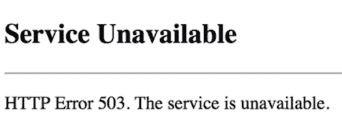

# 所以你的精品开发店需要处理超级碗广告流量？

> 原文：<https://dev.to/ben/so-your-boutique-dev-shop-needs-to-handle-super-bowl-ad-traffic-cac>

昨天是美国的传统，吃很多食物，看新英格兰爱国者队踢足球，哦，当然，还有商业广告！

液体错误:内部

超级碗广告因其娱乐价值而闻名。他们比你的典型广告得到更多的关注。在开发领域，大规模的消费者关注与大流量的扩大密切相关！

你可能还记得去年木材 84 的惨败。该公司制作了一个感人的视频，号召人们访问网站了解更多信息。已经过去一年了，我不想提起那些参与者的旧伤，但这是一个很好的案例研究。

[https://www.youtube.com/embed/J0Uk6ctu7nI](https://www.youtube.com/embed/J0Uk6ctu7nI)

也许他们并不知道它会有多成功，但是当美国人蜂拥到他们的网站时，它几乎立即被拥抱致死。

[T2】](https://res.cloudinary.com/practicaldev/image/fetch/s--VqyMjU2L--/c_limit%2Cf_auto%2Cfl_progressive%2Cq_auto%2Cw_880/https://thepracticaldev.s3.amazonaws.com/i/dn6q145hlsh0pd5wu7js.png)

该网站的建立是为了每分钟处理 [150，000 个请求](http://adage.com/article/super-bowl/84-lumber-made-a-statement-website-crashed/307870/)，甚至远远不能满足流量。不用说，对于那些参与者来说，这是一个不太理想的结果。

事后我们知道犯了错误，但是做好这件事说起来容易做起来难，因为涉及的专业知识类型并不总是完全一致。负责创造这种广告体验的组织不是像谷歌、亚马逊或网飞那样的规模化专业公司。是代理。他们的专长是弹出体验。通常是一个 Wordpress 网站，伴随着视频和社交媒体活动。他们根本不是一个工程驱动的组织。

对于这样的机构来说，一个简单的答案是改变他们内部的专业知识类型，或者雇佣专家来完成这样的项目。但事后看来，这些答案很容易给出。我将提供一些建议，让您将 scale 视为一家可能没有交付时间或预算的商店。

## 了解有帮助的服务

像这样的机构不是通过原始工程，而是通过理解插入哪些服务来处理规模。没有理由认为登录页面需要由具有任何容量限制的服务器直接提供服务。知道如何通过内容交付网络(CDN)插入和服务整个页面是非常重要的。

有很多很棒的 CDN 服务。目前我们使用[快速](https://www.fastly.com/)，但是[云辉](https://www.cloudflare.com/)、[云锋](https://aws.amazon.com/cloudfront/)和其他的也可以。我认为网络生活也是商店绝对应该意识到的一种服务。用好这些服务，几乎所有的扩展问题都会被这些专家外包给美妙的工程。

除了 CDN 之外，还不断有新兴服务在必要时处理大规模数据。 [AWS Lambda](https://aws.amazon.com/lambda/) 和其他每天推出的云服务提供了专门的机会，避免了担心大规模的需要。留意哪些是可用的，但不要使用那些你不需要的(稍后会详细介绍)。

## 接受约束

通常是一些小事情使得缩放这类页面变得困难。从一个 CDN 为你所有的 HTML 和资产提供服务必然会有设计上的限制。你可能想要服务，但是接受他们是一个很好的方式。你可能不需要*在你繁忙的着陆处使用*那种超级专业的功能，因为你需要它来避免停机。解释客户在他们的理想愿景中可以拥有什么，不可以拥有什么，应该已经成为代理公司和咨询公司的核心能力。理解你的尺度强加的设计约束，并且能够很好地解释它，将会有很大的帮助。

## 避免假想的缩放问题

> 实用 Dev[@ thepracticaldev](https://dev.to/thepracticaldev)第一章:名字很酷的数据库2016 年 11 月 21 日下午 17:27

我想说的是，扩展问题并不像我们有时想象的那样普遍。通常我们的默认方法就足够了。如果你不在问题不存在的时候过度设计问题，那就更容易证明它们是真正的问题。不要成为在扩展问题上喊狼来了的开发人员！

快乐编码。