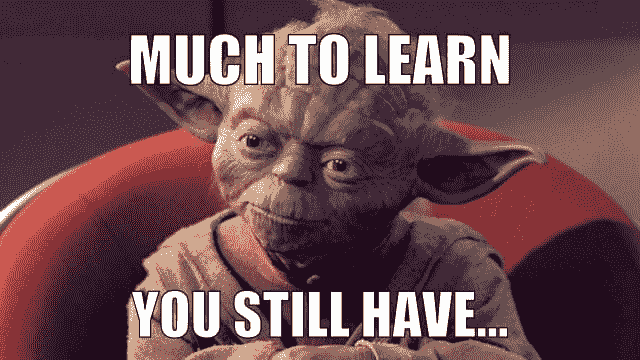
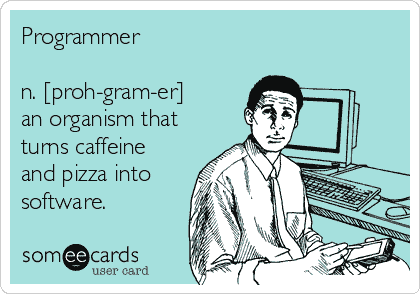

# 软技能:软件开发人员的生活手册-书评

> 原文：<https://dev.to/jhotterbeekx/soft-skills-the-software-developers-life-manual---book-review-24bm>

*这是对[软技能:软件开发人员的生活手册](https://www.amazon.com/Soft-Skills-software-developers-manual/dp/1617292397)的书评。*

每个人都读过大量关于技术主题的书籍，比如编程语言、设计模式、最佳实践等等。这对我来说没什么不同，最终导致了一种感觉，我可以最好地描述为触及某种天花板。我已经做了大约 15 年的软件工程师，大部分时间都在专注于提高编程水平。不要误解我，我并不了解我所使用的语言的一切，我并不知道所有的原则或模式，但我通常知道如何找到我需要的东西。我想这让我想到，如果我想在这个领域有所发展，我必须深入一些高级领域，这意味着投入大量时间。有点像 80/20 法则的剩余部分。

因此，当这本书在一位软件工程师同事推荐的书单上与我不期而遇时，我惊喜万分。它向我描绘了我可能喜欢编码并覆盖该领域的图像，但是作为一名软件工程师，生活的剩余部分是什么呢？我说“生活的剩余部分”是有原因的，因为很多书都集中在与客户交谈或工作面试等领域，但这本书承诺除了编码之外，还会关注软件工程师生活中的方方面面。所以我上个月开始阅读，现在我想和你分享我对这本书的看法。

[T2】](https://res.cloudinary.com/practicaldev/image/fetch/s--fYbJXzEo--/c_limit%2Cf_auto%2Cfl_progressive%2Cq_auto%2Cw_880/https://thepracticaldev.s3.amazonaws.com/i/a6mkg08wa66cfdpowd1j.png)

## 结论

从结论开始？我疯了吗？一点也不，我要告诉你我对这本书的真实看法，所以你可以自己决定它是否足够有趣。如果你还想要更多，你可以阅读我的章节。我宁愿你花时间读一本好书，而不是一篇评论，所以你自己决定你会读多远。

当你读这本书时，你会觉得约翰·桑梅兹的意图是与你分享他多年的生活经验。他不仅关注与客户、同事和经理打交道，还关注寻找爱情、财务、生产力和保持身材。这些章节分为 7 个主要部分，我将进一步处理。写作风格易于阅读，章节很小，当你有 15 分钟或半小时空闲时，可以快速阅读。它充满了实际的例子，个人故事和任务，以帮助你开始改善你的生活。当你读了更多关于相同主题的书时，你会注意到流行技术之间有很多相似之处，但是是以一种更简单和实用的方式。其中很多感觉非常熟悉，而有些地方感觉不可用，除非你生活在美国或文化和金融类似的国家。有些章节取决于你在职业生涯的哪个阶段有用，但是，大部分部分真的很好，我认为大约 70%的书在某种程度上适用于大多数软件工程师。我的结论是，这是任何软件开发人员的必读之作，我甚至会把它和《干净的代码》和《设计模式》这样的书放在一起，这些东西在你的生活中太重要了，不能不考虑。我的评分是 4.5 分，满分 5 颗星。[T2】](https://res.cloudinary.com/practicaldev/image/fetch/s--ZunjDJyz--/c_limit%2Cf_auto%2Cfl_progressive%2Cq_auto%2Cw_880/https://thepracticaldev.s3.amazonaws.com/i/gasfgajqf024suvc5cko.png)

## 第一节:职业生涯

约翰关注你的事业。这不仅是初学软件的工程师的必读书目，也是业内任何工程师的必读书目。它关注的主题包括确定你的生活和职业目标、人际交往能力和工作面试。还有就业选择，你有没有想过自己创业？或者想爬得更高一点呢？他着眼于一些实际的东西，比如远程工作和消除无聊。关于这一部分，我最喜欢的两件事是他关于“假装直到你成功”的章节，这是对越来越多的冒名顶替综合征的抗衡，稍后我可能会写一篇博客。我真正喜欢的另一章是他的结束语，名为“不要对技术过于虔诚”。标题说明了一切。不要再争论 Mac 比 windows 好，或者一周中的任何一天 C#都比 C++好，拥抱技术，不要评判你不知道的东西，如果它被广泛使用，它可能是好的，如果不是伟大的。对此我只能说一句话，那就是【阿门】！

## 第二节:营销自己

这一部分包括你自己的品牌。更多地把自己看作提供服务的人，而不是雇员。你会读到关于建立你的品牌，为什么这很重要，以及如何建立这一点。他涉及的主题包括写博客，这实际上是我开始在 dev.to 上写作的原因。但不仅仅是写作，他还继续创建一个成功的博客，增加价值，使用社交网络。以及更高级的演讲、展示、培训、写书和文章。对我来说，这部分中最好的一章是他的最后一章，他真的很喜欢以好的一章结尾。在这种情况下，它被称为“不要害怕看起来像个白痴”，看着自信一步一步不舒服地增长。

## 第三节:学习

我可以很简短的说这个。约翰为自己制定了一个非常有效的 10 步学习计划。它着眼于大局，但也帮助你采取措施，取得进展，并防止被淹没的感觉。对我来说，这本书最鼓舞人心的部分是这一节，“教学:学你想学的？教你必须。”他的 10 步计划的最后一步是教导他人，这是一个逻辑清晰的步骤，直到我真正读了它，我才明白。也许这是他创作的尤达的照片，或者他只是对此有一个伟大的愿景，不管是哪种方式，这一部分让我兴奋不已，我毫不犹豫地加入了 [dev.to](https://dev.to/) 导师项目，并从中学习。

[T2】](https://res.cloudinary.com/practicaldev/image/fetch/s--ZcREVWFU--/c_limit%2Cf_auto%2Cfl_progressive%2Cq_auto%2Cw_880/https://thepracticaldev.s3.amazonaws.com/i/xycruf04lmm5952mpi9f.jpg)

## 第四节:生产力

关于这个主题有数百万篇文章，老实说，约翰写的东西并不新鲜。然而，它们很容易理解和应用，这真的很重要。想想保持专注、番茄工作法和多任务处理。他还谈到了耗尽的危险，这是我们行业的一个大问题。最后，他处理诸如浪费时间、养成习惯以及如何坚持下去等问题。这不是我最喜欢的部分，但我已经记在了脑子里，但从他的实际观点和个人经历来看还是很棒的。

## 第五节:财务

在这里，他看着你的收入，他试图帮助你增加你的支出。如果你感兴趣的话，这里有很多关于投资的个人故事和更高级的东西。他谈到了不同种类的投资和债务的危险，并以他 33 岁退休时的精彩个人生活故事作为结尾。这是我最不喜欢的一章，主要是因为他年轻时的职业生涯和他所做的投资在我生活的国家不现实。你能像他那样在房地产上投资多少是相当有限的，而且像硅谷那样的起薪在这里也是刚刚出现的。虽然我真的很喜欢他在这部分的开放。

## 第六节:健身

有多少软件工程师真的很注意自己的健康？我知道这是一种刻板印象，我们靠咖啡和披萨生活，但这也有一定的道理。这一节的重点是让你健康。约翰年轻时曾是一名健美运动员，现在仍保持着非常好的身材。这使得他能相对容易地给你健康饮食、锻炼的好建议，甚至是帮助你达到目的的小玩意。对此我没什么可说的，他是对的，我们需要去了解一下。

[T2】](https://res.cloudinary.com/practicaldev/image/fetch/s--tG0oWqYr--/c_limit%2Cf_auto%2Cfl_progressive%2Cq_auto%2Cw_880/https://thepracticaldev.s3.amazonaws.com/i/hs9tz9t0m91d8ubm4088.png)

## 第七节:精神

这本书的结尾部分处理了精神问题，但没有变成精神问题。我喜欢，他保持他的实际观点，仍然谈论我们的思想，精神和灵魂。想想你的思想、心理健康和自我形象的影响。即使是寻找真爱的主题也像失败和帮助约翰获得成功的书一样被处理。这是本书的一个很好的结尾，尽管我认为在这一部分还可以有更多的内容。

## 坚持住，还有更

我不是在说你应该做的作业。我说的是简单的程序员。约翰不仅谈到了品牌和建立一个成功的博客，他还谈到了经验，所以他真的有一个。他的[简单的程序员博客](https://simpleprogrammer.com/)是对这本书的一个很好的补充，也是我每天必读的清单。除了这些博客之外，他还有一个 [YouTube 频道](https://www.youtube.com/user/jsonmez)，我真的可以推荐这个频道，更详细地涵盖了书中的许多章节以及书中没有的东西。最后但并非最不重要的是，他甚至提供有偿服务，帮助你在书中涉及的主题上表现出色。我没有后者的经验，但看看他的免费资料，这可能也很棒！