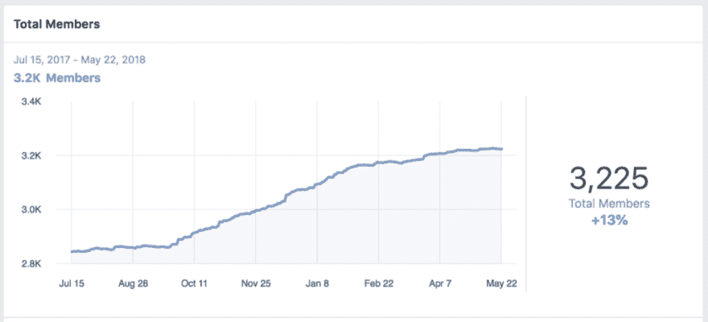
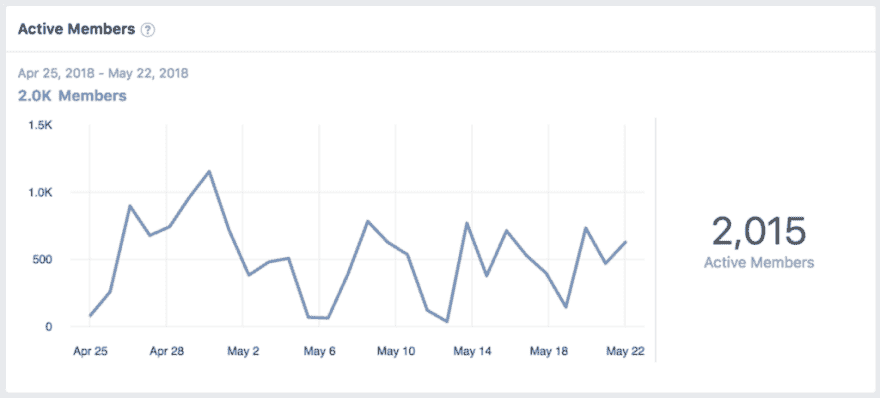
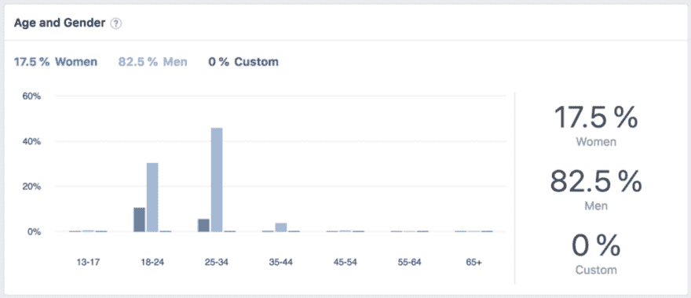
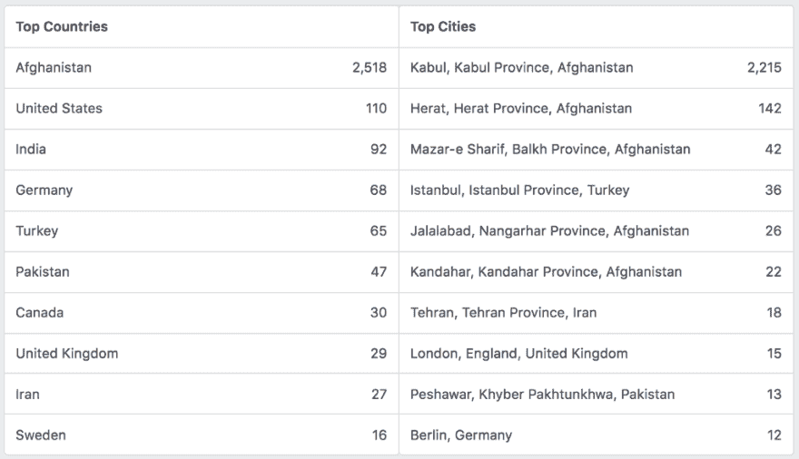
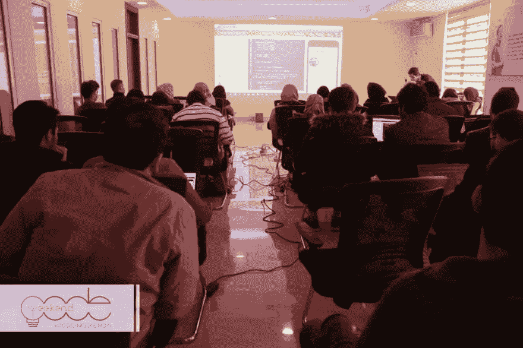

# 阿富汗的软件开发

> 原文：<https://dev.to/jamshid/software-development-in-afghanistan-dkk>

在阿富汗，软件业正在稳步但逐步地增长。互联网的可访问性不断扩大，政府投资和对数字化的关注，私营部门的发展和技术公司和初创公司的崛起，以及安全性和稳定性的整体改善，这些都是使这种增长放缓或加快的必要因素。然而，作为一个通过我在 2014 年创建的社区 CodeWeekend 密切关注阿富汗软件行业的人，我可以肯定地说，整体增长是有希望的。事实上，像 [CodeWeekend](https://codeweekend.net) 这样一个完全基于志愿者的非营利社区的成功，是软件开发商、技术公司和阿富汗政府共同支持的结果，该社区在阿富汗的三个不同城市(大多数在喀布尔)组织了 100 多次会议、研讨会和培训。

 

<figcaption>第 15 届 code 周末会议，卡丹大学</figcaption>

作为阿富汗最大的开发者社区，CodeWeekend 提供了一个关于开发者的情况和当今阿富汗软件业现状的案例研究。

CodeWeekend 与软件开发人员合作的机制是通过其脸书小组和脸书页面，以及其他方式。使用脸书分析，我们可以衡量参与度，并与我们拥有的其他数据源进行交叉检查，如活动出席记录。

从会员总数来看，有 3000 多名会员。下图显示了自去年以来+13%的会员增长，这可能是由于对计算机科学的兴趣增加，CodeWeekend 对其会员技能水平的增值或提供的网络机会，或者是由于软件行业更积极地参与市场，或者可能是上述所有因素的某种组合。

[T2】](https://res.cloudinary.com/practicaldev/image/fetch/s--fVF_dd2g--/c_limit%2Cf_auto%2Cfl_progressive%2Cq_auto%2Cw_880/https://cdn-images-1.medium.com/max/1024/0%2AUrTwYXn3WWmBO96L)

此外，在过去的 28 天里，有 2000 多名成员非常活跃，这表明他们高度参与了主要与技术和软件相关的小组内容。

[T2】](https://res.cloudinary.com/practicaldev/image/fetch/s--aMYmVI5o--/c_limit%2Cf_auto%2Cfl_progressive%2Cq_auto%2Cw_880/https://cdn-images-1.medium.com/max/1024/0%2AVzGwLgcldd6SlOv8)

此外，与世界其他地区相比，该群体中妇女的比例与妇女在该领域的代表性相当，即使只是略低:17.5%的群体成员是女性。

[T2】](https://res.cloudinary.com/practicaldev/image/fetch/s--IShiGyz5--/c_limit%2Cf_auto%2Cfl_progressive%2Cq_auto%2Cw_880/https://cdn-images-1.medium.com/max/1024/0%2AJFFT9xBuN-45bjt9)

从地理数据来看，CodeWeekend 成员大多来自阿富汗，排名靠前的城市是喀布尔、赫拉特和马扎里沙里夫三大城市地区。该小组的其他成员来自美国、印度和德国，因为有许多阿富汗开发人员因移民和/或出国留学而居住在这些国家。

[T2】](https://res.cloudinary.com/practicaldev/image/fetch/s--k_ETQPGd--/c_limit%2Cf_auto%2Cfl_progressive%2Cq_auto%2Cw_880/https://cdn-images-1.medium.com/max/1024/0%2AS67wxiKhOQQ3nPXs)

不仅是脸书集团的数据，CodeWeekend 活动的注册数据也显示，CodeWeekend 活动的平均参与者人数约为 25 人，最高的出席人数是 120 人，他们参加了去年在卡丹大学举行的一次会议。参与者几乎全是软件开发人员、计算机科学专业的学生和毕业生。偶尔也会在参与者中发现科技公司经理和创始人。

 

<figcaption>CodeWeekend 的 CodeCamp Sessions，NETLINKS</figcaption>

随着信息技术产业由于对使过程自动化和更高效的高需求而增长，作为 IT 产业的基本要素之一的软件产业也是如此。这种增长带来了基础设施建设和人力资源能力建设方面的投资，为从事这一领域的人带来了职业机会。例如，美国软件开发人员的平均年薪为 92，240 美元，瑞士为 85，709 美元，挪威为 70，776 美元，这些国家的软件开发人员往往是收入最高的。

虽然还不能与这些国家相提并论，但在阿富汗，信息技术和软件业无疑正在上升。以前，来自国外的开发人员被招募到该国从事软件和 IT 项目，但现在，有更多的阿富汗开发人员在政府和私营部门的公司工作。科技创业公司、孵化器和社区正在呈指数级增长。在阿富汗，这一新兴领域已经有了许多令人兴奋的发展，尽管现在还为时过早，在该行业达到经济更发达国家的成熟水平之前还有一段路要走。社会、技术和法规方面的障碍仍然存在，阻碍了信息技术产业的发展，也阻碍了软件产业的发展。