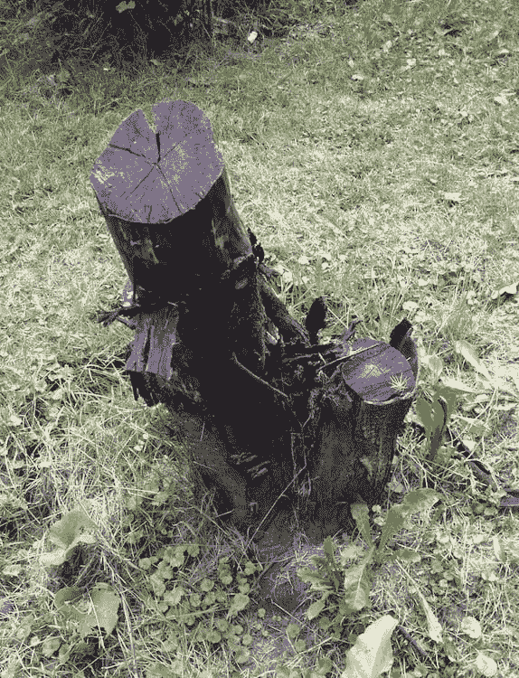

# 在波兰耕作一天的软件开发经验

> 原文：<https://dev.to/essentialdeveloper/software-development-lessons-from-a-day-of-farming-in-poland-55ki>

一个巴西程序员走进一个波兰农场，这听起来像是一个笑话的开头，但这就是我上个周末的开始。

这一切都是从我和我的女朋友被邀请去波兰参加婚礼开始的。我女朋友的家人住在克拉科夫附近的一个可爱的村庄，所以我们计划在那里呆一个多星期。

在旅行的前一天，我录制了 [Clean iOS Architecture pt.5 视频](https://www.essentialdeveloper.com/articles/clean-ios-architecture-pt-5-mvc-mvvm-and-mvp-ui-design-patterns)，所以在那里的第一个早上，我保持了自己规律的体育锻炼和作息时间。我在上午 11 点完成了视频剪辑，在那天剩下的时间里，我自愿帮忙做日常的农活。

就像我加入一个新的软件团队一样，我试图找到如何做出有意义的贡献。我通常寻找人们一直在努力解决或避免的代码区域。在农场里，我发现了一个完美的类比:园艺。

由于对农场其他领域(优先事项)的高要求，今年草(代码)增长失控。就像不可维护的乱七八糟的代码一样，草成了问题。花园通常得到很好的维护(QA ),但是，像软件团队一样，他们也面临技术、环境和社会挑战，并且有很好的理由为什么花园(代码库)不能被照顾得更好。例如，其中一个家庭成员外出旅行，无法做出贡献(开发人员度假/人员短缺)。下雨(不可控和不可预测的环境挑战)使工作更加困难，因为常用的工具不适合泥泞的地形。此外，拖拉机需要修理(技术挑战)并且修理它可能对整体农业需求更关键(优先事项)(比如保持 CI 服务器运行以不阻塞开发团队)。在农场的许多领域(如农作物)，工作是与时间赛跑(字面上的期限！).举个例子，树莓没有被及时采摘，它们腐烂了，所以如此重要的任务总是胜过园艺工作。

然而，园艺被搁置太久了。照顾野草并不是首要任务，但它妨碍了工作，让每个人都感到紧张(同样，就像那些我们找不到时间清理的杂乱代码一样)。简而言之，这项工作必须完成。由于我缺乏农业经验，解决草的问题可能是我们能做的最好的贡献。在那里，我们进入了一个清洁花园的配对会议。

 *草长得相当失控。这看起来像是一项艰难而又永无止境的工作。*

 *犯牛车里的碎草(历史)。*

我们首先开始修剪最直截了当的部分，那里的草没有那么高。我们还有一台神奇的机器(IDE/重构工具)来帮助我们。对于短草(测试和可预测的代码)，这真的是一个平稳和几乎毫不费力的工作。该机器有一个存储隔间(阶段)，可以“自动”存储(跟踪)切下的草(变化)。最终，我们会砍掉足够多的草，以至于我们不得不在继续之前清空隔间(提交)。

 *遥远的目的地。*

我们越早清空机器越好，因为引擎在几乎满的时候会变慢(完全满的时候会崩溃)。然而，如果我们过早地清空它，我们会浪费很多时间，却没有任何实际的好处。检查(状态)存储隔间(阶段)几乎不需要时间，所以我们会经常检查隔间，并决定我们是否有足够的数据提交，或者我们是否可以在提交前再坚持一会儿。“提交”的草被放入一辆手推车(历史)，随后被推到其他地方(远程)。

与 git 的类比并不完美，因为我们无法“还原”历史。我们能做到的最接近“恢复原状”的方法就是把被砍掉的草扔回地上，让它变得又脏又乱！但是我们从来都不想那样做。这个遥远的目的地是一个“再利用”草地的地方。没有任何东西被浪费，所以被砍掉的草和其他垃圾混合在一起成为堆肥。堆肥可以为土壤提供足够的养分来支持耕作(在模块之间共享/重用代码以实现业务目标)。

一路上，我们发现了许多障碍。比如蚂蚁和黄蜂的巢穴(bug)、树木(框架)、岩石(稳定性和安全性问题)、怪异的物体(不必要的依赖)和高高的草(缺乏测试和可见性)。

清除臭虫巢穴(修复臭虫)不是我们的目标，但是我们会不时遇到它们。重构不是修复 bug 的时候。相反，我们只是记录它们，这样如果它们是一个问题，我们就可以报告并在以后修复它们。例如，在某个时候，我们认为我们发现了一个蜂巢，这对农场来说可能是有价值的(另一个食物和收入来源)。我们向女朋友的爸爸举报了，结果只是一个马蜂窝，我们不想惹！

除了野生的臭虫巢穴，也有被控制的和想要的巢穴，比如人工养殖的蜂巢。蜂箱是农场的宝贵资产(像林挺，建立警告和错误)，所以它们被小心地保存在一个特殊的区域。有人建议我们不要打扰蜜蜂(遵守林挺规则！).机器的噪音可能会让蜜蜂感到受到威胁并攻击我们，所以蜂巢前的草地保持完好(不要违反团队规则)。

 *别惹蜜蜂！*

 *重构时发现的枯树。*

树木(框架)是花园的另一个重要部分，但对清理过程来说是超级烦人的障碍。我们必须操纵机器绕过树，因为它们是固定的，我们不能改变(像第三方或系统框架)。最终，我们发现了一棵枯树，就像一个不再需要的框架。枯死的树根(依赖物)仍然深埋在地下，所以我们记录了它，并把移除它的工作留到了改天。

 *斩草系统中一个残破而不必要的物体。*

比树更烦人的是那些不属于花园的东西，但它们却在那里。由于在整个系统中没有角色，不需要的对象只是烦人的东西。比如我们处理不掉的破车(因为坏了！).我们试过了，但是移动这辆车需要很大的力气。我们不得不割掉汽车周围的草，假装它不在那里。就像一套不完整的集成测试，甚至不能再构建了，但它存在于代码库中。

 *梯子在那里干什么？结果是孩子们只是在玩耍。*

我们还在一个完全意想不到的地方发现了一个梯子，因为那里没有任何东西可以够到。可移植的阶梯就像代码中从未引用的不必要依赖项的导入语句。这些很容易修复，我们只需删除它们！

石头是另一个大问题，因为它们可能会损坏刀片(稳定性和安全性问题)，甚至损坏我们的机器(破坏构建并停止进度)，所以我们必须在继续前进之前检查地面(编写更多测试)。当我们接近高草(系统中未经测试的、复杂的和耦合的部分)时，对岩石的恐惧(害怕破坏软件)变得越来越严重。

在某个时候，机器(IDE)耗尽了燃料(内存)并崩溃。我们再次给它加燃料(重启 IDE)并继续前进。

 *崩溃后重启我们的 IDE。*

在上面的机器照片中，请注意它“自动”储存切碎的草的储物格。这个“自动化”工具对我们的生产力来说是一个重要的组成部分，但是我们不知道我们将不得不很快抛弃它。

当我们完成了短草(经过测试的、可见的和可预测的)，我们偶然发现了最大的问题:高草(未经测试的、未知的和不可预测的)。高草是大家都害怕的代码区域。没有人愿意去碰它，因为害怕弄坏它或者被野虫子蛰到。“那里可能藏着大石头和安静的虫窝。而且你不要戳他们！”

 * IDE 没有储物格(生产力下降)。*

另一个大问题是高草是湿的。当在高高的湿草地上使用我们的重构机器时，它会很快填满存储空间，甚至更糟，堵塞隔间门。字面上创造了一个大泥球，将崩溃我们的机器(IDE)！我们唯一能做的保持生产效率的事情就是去掉储物格，让机器把草扔到一边。

 *在没有储物格的地方割草。*

移除储藏室解决了堵塞问题，但增加了人工工作量。就好像我们不得不停止使用我们的重构工具，因为结果太不可预测了。到了一定程度，手动完成工作的某些部分会更快、更舒适。这种情况经常发生在代码库中，虽然感觉不重构“更快更容易”，但总是慢一些。当我们不能用自动化工具轻松地重构代码时，我们几乎总是在浪费时间。如果每隔一周割一次草，这是一件容易的工作。如果再等一个月，就越来越难了。随着需要清理的工作量增加，我们开始向自己证明为什么我们不应该这样做，或者为什么我们应该再等一个月(这使事情变得更糟)。

在我们的情况下，我们现在不仅要割草，还要手动将草从地上收集到车上。这听起来很容易，但事实并非如此。

 *人工从地上收集被砍断的草。*

在这个过程中，我们有时会停下来晒晒太阳，评估我们是否做得很好，并找出我们可以改进的地方(番茄工作法或吊床驱动开发)。我们最终午休后回来，就像在办公室一样。几个小时后，我们到达了一个点，那里的草对机器来说太高了，因为没有能见度(缺乏测试)，而且我们太害怕岩石(稳定性和安全性问题)。没有我们的重构工具，我们现在有两个选择:手动小心地用镰刀割草(猎枪重构)或使用拖拉机(大规模重写)。

文章开头提到的那台破拖拉机差不多准备好了，是最可行的选择。第二天，拖拉机帮助无情地砍掉了所有的草，留下了一大堆草供人们捡拾。工作完成了。

## 结论

即使我们痛斥和没完没了地抱怨遗留和混乱的系统，这些系统中的许多仍然可以很好地转换为业务。我们正在开发的系统也是如此。在这一片混乱中，这个系统仍然有利可图(生产食物)。实际上有人建议不要割庄稼周围的草，不要破坏生产区。因此，在我们完成了草地之后，我们继续进行另一项任务来收集系统的利润。

 *李子:系统的盈利产品之一。*

 *挖土豆:系统的盈利产品之一。*

 *白菜:系统的盈利产品之一。*

 *把产品放在太阳下晒干，这样它们就不会腐烂。*

在农场度过美好的一天后，我们用捡来的新鲜食物准备了美味的一餐。这是一次难以置信的经历，我绝对想重复一遍。

* * *

最初发表于[www.essentialdeveloper.com](https://www.essentialdeveloper.com/articles/software-development-lessons-from-a-day-of-farming-in-poland)。

## 我们来连线

如果你喜欢这篇文章，请访问我们在[https://essentialdeveloper.com](https://essentialdeveloper.com)的网站，获得更多像这样的深度定制内容。

关注我们:[YouTube](https://youtube.com/essentialdeveloper)[Twitter](https://twitter.com/essentialdevcom)[脸书](https://facebook.com/essentialdeveloper)[GitHub](https://github.com/essentialdevelopercom)