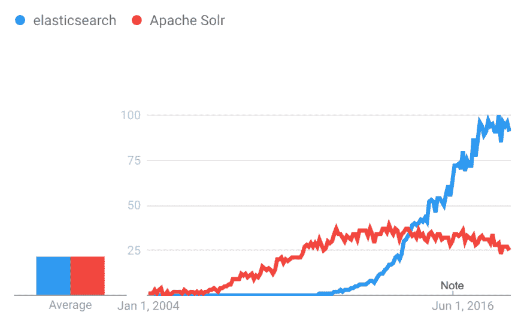
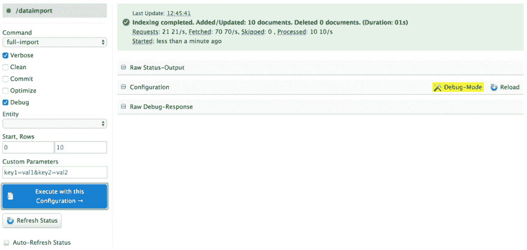
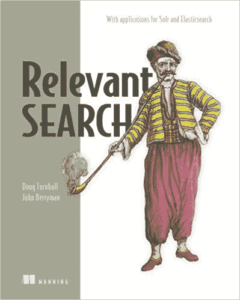

# Solr + Python —教程

> 原文：<https://dev.to/avikaminetzky/solr--pythona-tutorial-3cni>

**更新**:我已经把我的 Python 代码推送到 GitHub ( [回购来了](https://github.com/avremel/Solr-Python-Tutorial))。我的实现比本教程更高级一点。请参阅自述文件和代码注释。

> [T0】 Solr is a popular, high-speed and open-source enterprise search platform based on Apache Lucene (Solr website).

[T2】](https://res.cloudinary.com/practicaldev/image/fetch/s--J3FjuCPe--/c_limit%2Cf_auto%2Cfl_progressive%2Cq_auto%2Cw_880/https://thepracticaldev.s3.amazonaws.com/i/stwapm3402hoqq5vt10b.png)

## 目标

我的目标是演示如何构建一个具有搜索、分页、过滤和多选功能的电子商务图库页面，该页面反映了典型用户的期望。参见[这篇文章](https://baymard.com/blog/allow-applying-of-multiple-filter-values),它很好地解释了我正在尝试实现的多选过滤。

搜索应该像“mens shrt gap”或“gap 2154abc”这样的短语查询，将错别字、各种词形([词干](https://en.wikipedia.org/wiki/Stemming))和语音拼写考虑在内。

## Solr 设置

Solr 7 安装在我的本地计算机上，并与一个数据库有活动连接。Solr 正在使用 [deltaQuery](https://wiki.apache.org/solr/DataImportHandler) 特性(在`db-data-config.xml`中)来检测我的数据库中的变化，并将这些记录导入 Solr。

## Web 开发设置

我有一个 Python 3 的基本 Django/React 应用程序。关于如何集成 Django 和 React 的想法，请参见本文。我建议按照[这些说明](https://lucene.apache.org/solr/guide/6_6/using-python.html)来创建你自己的 Solr 客户端。

我曾考虑使用 [pySolr](https://github.com/django-haystack/pysolr) 作为客户端，但它缺乏良好的文档，似乎从 2015 年起就被忽视了(像大多数 Solr 库一样)。然而，如果您准备好梳理 GitHub 问题和代码库，pySolr 可以工作。

如果您使用 pySolr:

1.  在运行您的服务器之前，将`export DEBUG_PYSOLR=’true’`粘贴到您的终端中，您将能够查看 pySolr 生成的 URL。

2.  你在终端中看到的 URL 似乎并不涉及 URL 编码问题，所以像`Dolce & Gabbana`这样的查询可以在你的网站上运行，但当你将 URL 粘贴到浏览器中时就会中断。

## 刻面&刻面支点

方面与产品类别或规格同义。Solr 可以选择返回特定查询的可用方面及其各自的计数。您可以通过设置`facet.mincount=<number>`来控制一个刻面所需的最小产品数量。

例如，如果你卖的是品牌服装，`facets`可能指的是性别、风格和材料。如果搜索的是“男士休闲服装”，返回的面应该是这样的(注意对`gender`和`style`的约束):

```
"facet_fields" : {
   "gender" : [
       "Men" , 25,
       "Women" , 0 
    ],
   "style" : [
       "casual", 10,
       "dress", 0
    ],
   "material" : [
       "wool", 15,
       "cotton", 10
    ],
   } 
```

Enter fullscreen mode Exit fullscreen mode

## 示例查询

让我们来看一个例子:

```
from urllib.request import urlopen
import urllib.parse
import simplejson

def gallery_items(current_query):

    solr_tuples = [
        # text in search box
        ('q', "mens shirt gap"),
        # how many products do I want to return
        ('rows', current_query['rows_per_page']),
        # offset for pagination
        ('start', current_query['start_row'] * current_query['rows_per_page']),
        # example of a default sort, 
        # for search phrase leave blank to allow 
        # for relevancy score sorting
        ('sort', 'price asc, popularity desc'),
        # which fields do I want returned
        ('fl', 'product_title, price, code, image_file'),
        # enable facets and facet.pivots
        ('facet', 'on'),
        # allow for unlimited amount of facets in results
        ('facet.limit', '-1'),
        # a facet has to have at least one 
        # product in it to be a valid facet
        ('facet.mincount', '1'),
        # regular facets
        ('facet.fields', ['gender', 'style', 'material']),
        # nested facets
        ('facet.pivot', 'brand,collection'),
        # edismax is Solr's multifield phrase parser
        ('defType', 'edismax'),
        # fields to be queried
        # copyall: all facets of a product with basic stemming
        # copyallphonetic: phonetic spelling of facets
        ('qf', 'copyall copyallphonetic'),
        # give me results that match most fields
        # in qf [copyall, copyallphonetic]
        ('tie', '1.0'),
        # format response as JSON
        ('wt', 'json')
    ]

    solr_url = 'http://localhost:<port>/solr/<core>/select?'
    # enocde for URL format
    encoded_solr_tuples = urllib.parse.urlencode(solr_tuples)
    complete_url = solr_url + encoded_solr_tuples
    connection = urlopen(complete_url)
    raw_response = simplejson.load(connection) 
```

Enter fullscreen mode Exit fullscreen mode

短语搜索将在下一节——模式建模中讨论。

*   我建议对每个键值对使用元组，因为这样更容易`urlencode`。这也将更容易操作，特别是当你有一个复杂的`fq`和大量的`AND`、`OR`逻辑时(如果你正在进行过滤，这将很快发生)。
*   每个方面组都有自己的`fq`字段。这确保了`AND`逻辑被应用于滤波器组。下面是在方面组中应用`OR`逻辑的代码:

```
 def apply_facet_filters(self):
        if self.there_are_facets():
            for facet, facet_arr in self.facet_filter.items():
                if len(facet_arr) > 0:
                    new_facet_arr = []
                    for a_facet in facet_arr:
                        new_facet_arr.append("{0}: \"{1}\"".format(facet, a_facet))
                    self.solr_args.append(('fq', ' OR '.join(new_facet_arr))) 
```

Enter fullscreen mode Exit fullscreen mode

*   `facet.pivot.mincount`允许你控制一个`facet.pivot`所需的最小产品数量，但是要注意，如果你将[设置为 0，你的服务器很可能会崩溃](https://stackoverflow.com/questions/49837742/solr-facet-pivot-mincount-0-crashes-server)。
*   我发现字段值需要用引号括起来:`‘fq’: “brand: \”{0}\””.format(current_query[‘current_brand’])`
*   `facets`以类似于`[‘brand’, ‘gap’]`的数组返回，而不是我觉得不方便的`dict()`。以下是格式化它们的一种方法:

```
import more_itertools as mit
facets = {}

for k,v in raw_response['facet_counts']['facet_fields'].items():
    spec_list = [list(spec) for spec in mit.chunked(v, 2)]
    spec_dict = {}
    for spec in spec_list:
        spec_dict[spec[0]] = spec[1]
    facets[k] = spec_dict

raw_response['facet_counts']['facet_fields'] = facets 
```

Enter fullscreen mode Exit fullscreen mode

*   默认情况下，如果用户选择了一个方面组中的一个方面，Solr 将返回只包含所选方面的方面组，因为搜索范围已经缩小了。但是很多时候，用户仍然希望查看未选择的面和相关的计数，以启用多选。要允许此功能，使用[标记并排除](https://lucene.apache.org/solr/guide/6_6/faceting.html#Faceting-TaggingandExcludingFilters)。见[我的回购](https://github.com/avremel/Solr-Python-Tutorial)一个可能的实施。
*   要将价格范围创建为具有自定义间隔的过滤器，请使用 Trie `fieldTypes`之一将`price`复制到新字段。新字段应该将`indexed`和`stored`设置为`false`，将`docValues`设置为`true`。然后按照[说明](https://lucene.apache.org/solr/guide/6_6/faceting.html#Faceting-IntervalFaceting)添加自定义范围。参见下一节模式建模。参见[我的回购](https://github.com/avremel/Solr-Python-Tutorial)了解可能的实施。

## 模式建模

> 如果你能克服字段仅仅是为了存储数据属性而存在的想法，并接受你能操纵数据使它能如用户期望的那样被找到的想法，那么你就能开始有效地将相关性规则编程到搜索引擎中。(相关搜索，第 5 章)

我们准备修改文档模式中的字段，以符合用户对我们产品的理解。

看看关于如何更新模式的[文档](https://lucene.apache.org/solr/guide/6_6/schema-api.html)，特别是关于[标记化](https://lucene.apache.org/solr/guide/6_6/tokenizers.html)和[过滤](https://lucene.apache.org/solr/guide/6_6/filter-descriptions.html)的部分。了解[词干过滤器](https://lucene.apache.org/solr/guide/6_6/filter-descriptions.html)。问问自己哪些标记/过滤器与您情况相关，以及它是否应该在查询或索引时应用。

我将遵循文档中的[建议，将用户可能感兴趣的所有字段复制到一个单独的`copyall`字段中。这解决了](https://lucene.apache.org/solr/guide/7_2/putting-the-pieces-together.html#working-with-text)[白化大象问题](http://lucene.472066.n3.nabble.com/The-downsides-of-not-splitting-on-whitespace-in-edismax-the-old-albino-elephant-prob-td4327440.html)，以及信号不一致:

> 正如我们所说的，当用户搜索时，他们通常不关心文档如何分解成单个字段。许多搜索用户希望将文档作为一个整体来处理:他们的搜索词匹配得越多，文档就应该越相关。你可能会惊讶地发现，实现这一想法的搜索引擎功能姗姗来迟。相反，基于 Lucene 的多字段搜索依赖于以字段为中心的技术。以字段为中心的搜索取代了搜索术语，使字段分数成为排名函数的中心。在这一节中，我们将探究为什么以字段为中心的方法会产生相关性问题。您将会看到以字段为中心的排名函数会产生两个问题:
> 
> ***白化大象问题**——未能给匹配更多搜索词的文档更高的排名。*
> 
> ***信号不一致** —基于组成部分(标题对正文)的非直观评分的相关性评分，而不是对整个文档或更直观的较大部分的评分，例如整篇文章的文本或与这部电影相关的人。(相关搜索，第六章)*

我们将通过[管理 UI](https://lucene.apache.org/solr/guide/6_6/overview-of-the-solr-admin-ui.html) 使用[模式 API](https://lucene.apache.org/solr/guide/6_6/schema-api.html) 。您不能手动编辑模式文件( [why](https://lucene.apache.org/solr/guide/6_6/schema-api.html) )。下面是创建`copyall`字段的方法:

*   步骤 1:为字段创建一个`fieldType`。对于索引和查询时间，我使用了相同的`fieldType`。我一直保持词干轻，以确保品牌名称保持完整。

```
 <fieldType name="facets" class="solr.TextField">
        <analyzer>
          <tokenizer class="solr.ClassicTokenizerFactory"/>
          <filter class="solr.LowerCaseFilterFactory"/>
          <filter class="solr.StopFilterFactory"/>
          <filter class="solr.ClassicFilterFactory"/>
          <filter class="solr.EnglishMinimalStemFilterFactory"/>
        </analyzer>
      </fieldType> 
```

Enter fullscreen mode Exit fullscreen mode

*   步骤 2:创建一个`copyall`字段，其中一个面作为`fieldType`。设置`multiValued=true`允许字段中有多个值(作为一个数组)。Set `omitNorms=true`因为用户不关心每个字段的长度( [docs](https://lucene.apache.org/solr/guide/6_6/field-type-definitions-and-properties.html#field-default-properties) )，我们也不希望 Solr 关心。

*   步骤 3:为数据源中要复制的每个域创建复制域。记住，[没有 copyField 的](https://stackoverflow.com/questions/9632019/copyfield-chain)的链接。

```
 {
       "add-copy-field":{
           "source":"brand",
           "dest":"copyall"
        }
    } 
```

Enter fullscreen mode Exit fullscreen mode

*   步骤 4:如果您想创建一个用于拼音拼写的`copyall`，请重复步骤 1-3。使用适当的字段类型。我正在使用[贝德-莫尔斯过滤器](https://lucene.apache.org/solr/guide/6_6/filter-descriptions.html#FilterDescriptions-Beider-MorseFilter)。

*   步骤 5:添加一个 1 的平局决胜符来获得一个 most-fields 功能。文件提供了一个很好的解释。

#### **有些想法**:

*   为更受欢迎的产品添加[索引时间提升](https://wiki.apache.org/solr/SolrRelevancyFAQ#index-time_boosts)，你希望它们在搜索结果中排名更高。你也可以做一个查询时间提升，类似于`bf='div(1,popularity)'`的效果。

*   使用[功能查询](https://lucene.apache.org/solr/guide/6_6/function-queries.html)定制任何关于你的搜索结果的相关性评分。

*   考虑 [N-Gram](https://lucene.apache.org/solr/guide/6_6/filter-descriptions.html#FilterDescriptions-N-GramFilter) 过滤器的错别字容忍度。

*   考虑用于自动完成的 [Edge-N-Gram](https://lucene.apache.org/solr/guide/6_6/filter-descriptions.html#FilterDescriptions-N-GramFilter) 过滤器。

*   考虑将`text_en` `fieldType`用于常规英语单词(它是 Solr 附带的众多`fieldTypes` [之一):](https://lucene.apache.org/solr/guide/6_6/field-types-included-with-solr.html#field-types-included-with-solr) 

```
 <fieldType name="text_en" class="solr.TextField" positionIncrementGap="100">
    <analyzer type="index">
      <tokenizer class="solr.StandardTokenizerFactory"/>
      <filter class="solr.StopFilterFactory" words="lang/stopwords_en.txt" ignoreCase="true"/>
      <filter class="solr.LowerCaseFilterFactory"/>
      <filter class="solr.EnglishPossessiveFilterFactory"/>
      <filter class="solr.KeywordMarkerFilterFactory" protected="protwords.txt"/>
      <filter class="solr.PorterStemFilterFactory"/>
    </analyzer>
    <analyzer type="query">
      <tokenizer class="solr.StandardTokenizerFactory"/>
      <filter class="solr.SynonymGraphFilterFactory" expand="true" ignoreCase="true" synonyms="synonyms.txt"/>
      <filter class="solr.StopFilterFactory" words="lang/stopwords_en.txt" ignoreCase="true"/>
      <filter class="solr.LowerCaseFilterFactory"/>
      <filter class="solr.EnglishPossessiveFilterFactory"/>
      <filter class="solr.KeywordMarkerFilterFactory" protected="protwords.txt"/>
      <filter class="solr.PorterStemFilterFactory"/>
    </analyzer>
  </fieldType> 
```

Enter fullscreen mode Exit fullscreen mode

## 调试和工作流程

*   检查 Admin UI 中的分析，了解在索引或查询时如何分析特定的术语。
*   在代码中添加一个`console.log`来打印每个查询的 url。设置`debugQuery=true`并读取`parsedQeury`和`explain`。所有的数学乐趣都潜伏在`explain`(参见相关搜索，第二章)。
*   重新配置模式后，[确保删除索引中的所有文档，并从数据库中进行全新的完全导入。这可以在管理用户界面中完成。](https://www.google.com/search?rls=com.microsoft%3Aen-US%3A%7Breferrer%3Asource%3F%7D&rlz=1I7TSNF&ei=ohjaWuuHIKWG5wKm7peoCA&q=delete+all+docs+solr&oq=delete+all+docs+solr&gs_l=psy-ab.3..0.2373.2778.0.2996.4.4.0.0.0.0.81.299.4.4.0....0...1c.1.64.psy-ab..0.4.298...0i7i30k1j0i8i7i30k1j0i13i30k1.0.RCVeecp6NmU)
*   如果需要调试数据库导入，请使用带有详细输出的调试模式。

[T2】](https://res.cloudinary.com/practicaldev/image/fetch/s--1PSL9_pE--/c_limit%2Cf_auto%2Cfl_progressive%2Cq_auto%2Cw_880/https://thepracticaldev.s3.amazonaws.com/i/87cxvsrmhb6z91soxbpm.png)

## 进一步阅读

[T2】](https://res.cloudinary.com/practicaldev/image/fetch/s--d-icxfmN--/c_limit%2Cf_auto%2Cfl_progressive%2Cq_auto%2Cw_880/https://thepracticaldev.s3.amazonaws.com/i/qgtxlxqpp38fnrnrefa6.jpg)

道格·特恩布尔和约翰·贝里曼的相关搜索

书中的例子使用了 ElasticSearch，但是附录 B 提供了到 Solr 的映射。如果这本书太长，读第五章和第六章。这些章节讨论了使用哪种策略来匹配多字段(短语)搜索和最相关的结果。