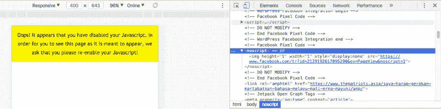
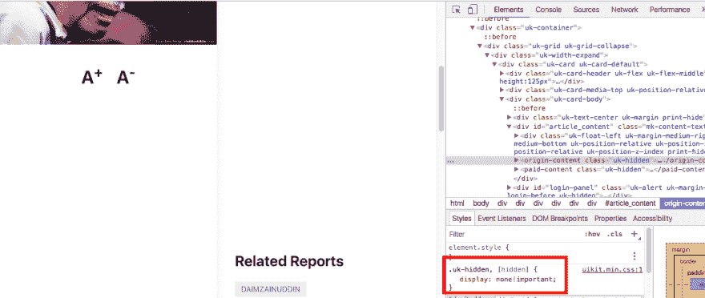
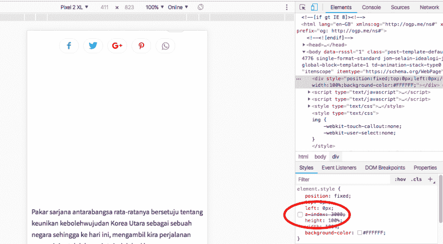
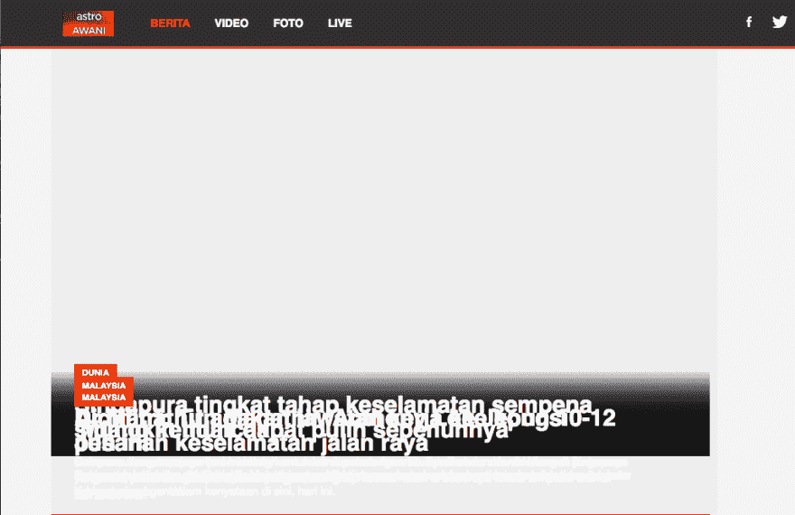

# 网站使用的一些常见的反非 javascript 机制

> 原文：<https://dev.to/k4ml/some-common-anti-non-javascript-mechanism-websites-use-4gef>

多年来，我一直使用默认禁用 JavaScript 的浏览器，我注意到网站很少使用一些机制来避开像我这样的人。

1.使用`<noscript>`标签。

[T2】](https://res.cloudinary.com/practicaldev/image/fetch/s--TkmNpcto--/c_limit%2Cf_auto%2Cfl_progressive%2Cq_auto%2Cw_880/https://thepracticaldev.s3.amazonaws.com/i/xa39pnupousoxcmrl990.png)

2.CSS `display: none;`。虽然看起来很简单，但这里的挑战是找到应用 css 的 div。他们会试着把它埋深几层。

[T2】](https://res.cloudinary.com/practicaldev/image/fetch/s--a37N6i43--/c_limit%2Cf_auto%2Cfl_progressive%2Cq_auto%2Cw_880/https://thepracticaldev.s3.amazonaws.com/i/2vhnpxwksvp4t4wfbbrz.png)

3.叠加/z 索引？不幸的是，我还找不到真正的例子。我经常访问的网站不再使用这种技术，现在我可以在禁用 JavaScript 的情况下随意阅读内容。

[T2】](https://res.cloudinary.com/practicaldev/image/fetch/s--owSNvip3--/c_limit%2Cf_auto%2Cfl_progressive%2Cq_auto%2Cw_880/https://thepracticaldev.s3.amazonaws.com/i/3ect7f9htqdhyq5edx6m.png)

在禁用 JavaScript 的情况下使用浏览器让我感觉到网络与其他人通常看到的有点不同。例如，其中一个网站看起来是这样的

[T2】](https://res.cloudinary.com/practicaldev/image/fetch/s--nV96Qb1W--/c_limit%2Cf_auto%2Cfl_progressive%2Cq_auto%2Cw_880/https://thepracticaldev.s3.amazonaws.com/i/g85byi09yc9lhcl5mo92.png)

大多数时候，我可以通过使用 devtools 来摆脱所有这些 nojs 机制。但是对于完全使用 JavaScript 单独加载内容的网站，我不得不决定使用我的另一个启用了 JavaScript 的浏览器配置文件，而不是仅仅隐藏它。