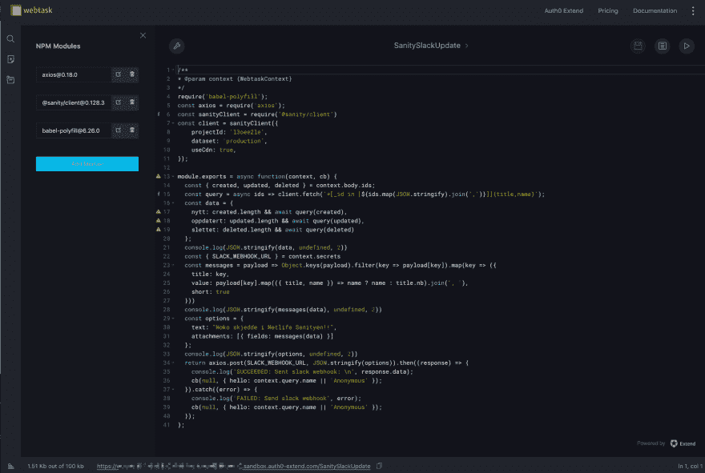
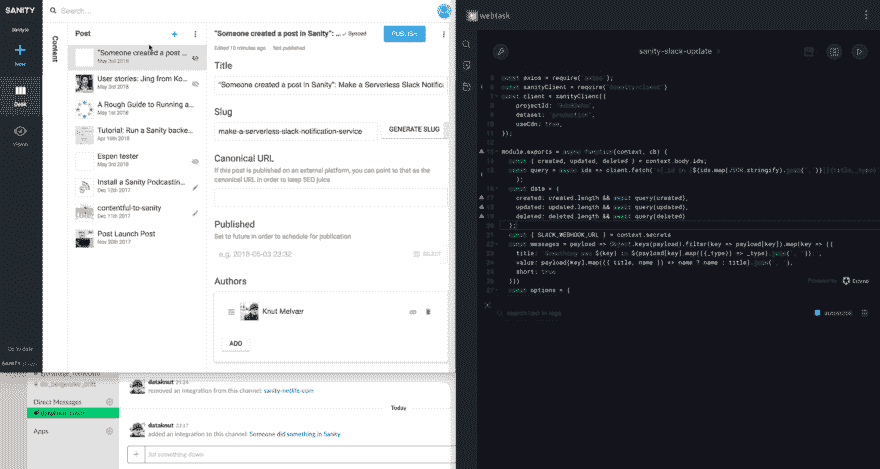

# 创建一个无服务器的 Slack 通知服务——“一个帖子被更新了”

> 原文：<https://dev.to/sanity-io/someone-created-a-post-in-sanity-make-a-serverless-slack-notification-service-373i>

许多人已经将他们的基础设施分割成小的单一用途的片，称为微服务。云功能，或者无服务器功能，如果你喜欢你的流行语服务热，让我们其他人轻松地使用相同类型的架构进行日常任务。

在这篇文章中，我们将制作一个很小很小的服务，每当有人在 Sanity Content Studio 中创建、更新或删除一篇博客文章时，它都会向 [Slack](https://slack.com) 转发一条消息。 [Sanity 是一个“后端即服务”](https://sanity.io/?utm_source=devto&utm_medium=cpc&utm_campaign=serverless)它允许你轻松地构建你的内容，并立即获得一个基于图形的实时 API。它非常简洁，你可以在这里阅读关于在它上面建立一个简单的反应驱动的博客[。](https://www.sanity.io/blog/build-your-own-blog-with-sanity-and-next-js?utm_source=devto&utm_medium=cpc&utm_campaign=serverless)

## 1。设置 Webtask 功能

有多种服务提供易于设置的无服务器功能。可以使用 [Heroku](https://heroku.com) 上的免费 dyno，以及 [stdlib](https://stdlib.com/) 和 [AWS lambda](https://aws.amazon.com/lambda/) 。但是今天，我们将使用 [Webtask.io](https://webtask.io) 作为我们的无服务器函数提供者。不过，它们的工作方式都差不多。您将获得一个可以向其发送 HTTP 请求的 URL，该 URL 运行一个函数，该函数将这个请求和一个回调作为其参数。它没有持久状态(除非您将它连接到某种数据库或会话提供者),并且只适合做一件事。

如果你有 [wt 命令行界面](https://webtask.io/cli) ( `npm i -g wt-cli`)，运行部署这个脚本到你自己的 Webtask-account:

```
$ wt create https://raw.githubusercontent.com/kmelve/webtask-sanity-slack-update/master/sanity-slack-update.js --name sanity-slack-update 
```

Enter fullscreen mode Exit fullscreen mode

你也可以[将代码](https://raw.githubusercontent.com/kmelve/webtask-sanity-slack-update/master/webtask.js)复制粘贴到 webtask.io/make 的[在线编辑器中。](https://webtask.io)

确保安装了节点依赖项(axios 和@sanity/client)。如果您需要手动添加，请单击扳手按钮🔧并选择 *npm 模块*。

[T2】](https://res.cloudinary.com/practicaldev/image/fetch/s--pxSSelqz--/c_limit%2Cf_auto%2Cfl_progressive%2Cq_auto%2Cw_880/https://thepracticaldev.s3.amazonaws.com/i/b5407e83ly9soqy3qw4v.png)

### 2。创建一个松弛的传入 Webhook

进入[Slack 定制集成配置页面](https://netlifedesign.slack.com/apps/manage/custom-integrations)，点击 *Incoming Webhooks* 和*添加配置*。你可以随意定制，完成后记得按保存按钮。复制 webhook 网址(看起来是这样的:`https://hooks.slack.com/services/<code>/<code>/<code>`)。

在你的 webtask 编辑器(`$ wt editor`或【webtask.io/make】T2)中，添加 webhook 作为密匙。找到扳手图标，在菜单中选择*秘密*。将新键命名为`SLACK_WEBHOOK_URL`，并将 webhook 作为值。现在，webtask 知道将更新消息发送到哪里。

是的，一定要把你的 webhook URLs 保密。如果有人得到了它们，他们将能够用垃圾信息淹没你的空闲频道。

### 3。将您的 webtask URL 添加到 Sanity webhooks

复制编辑器页面底部一行打印的 webtask-URL(应该看起来像`https://wt-<SECRET CODE>.sandbox.auth0-extend.com/<SCRIPT NAME>`)并运行`sanity hook create name-of-your-choosing`。选择您想要报告的数据集，并在出现提示时粘贴到您的 webtask-URL 中。

[T2】](https://res.cloudinary.com/practicaldev/image/fetch/s--ikalVNyX--/c_limit%2Cf_auto%2Cfl_progressive%2Cq_66%2Cw_880/https://cdn.sanity.img/3do82whm/production/d4fd812b62724bf0f2e0b0d74bcb9ced63f9dc1f-1905x1016.gif%3Fw%3D1000)

## 自定义

查看 Github 上的[脚本。您可以通过在过滤器查询中设置更多参数(如果您只想更新某个类型等)，或者通过调整](https://github.com/sanity-io/webtask-sanity-slack-update)[消息格式](https://api.slack.com/docs/messages/builder)，轻松地对其进行定制。如果你对理智感兴趣，[看看文档](https://docs.sanity.io/?utm_source=devto&utm_medium=cpc&utm_campaign=serverless)。

如果你尝试这样做，我们很乐意在评论中听到。祝你好运，无服务器！