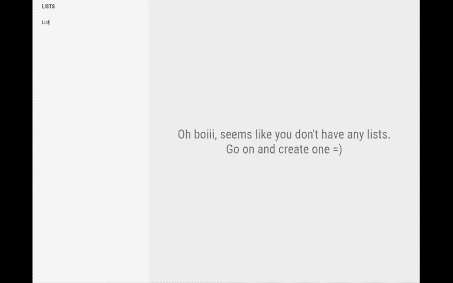

# 很快发布一个新的开源项目:清单

> 原文：<https://dev.to/davidszabo97/soon-releasing-a-new-open-source-project-checklist-5a5f>

> <video loop="" controls=""><source src="https://video.twimg.com/ext_tw_video/1024646701309673473/pu/vid/576x360/0MU4Ob9Ggi5t9y8-.mp4?tag=4" type="video/mp4"></video>大卫·萨博@ messedcode _ 戴夫[@ _ develop it](https://twitter.com/_developit)你知道我为什么爱 Preact 吗？因为它与 React 兼容。你知道我为什么喜欢反应吗？因为它有数百个开源库，我可以利用它们快速构建东西。很快作为开源项目发布；)2018 年 08 月 01 日下午 13:25

敬请关注。随意批评:)