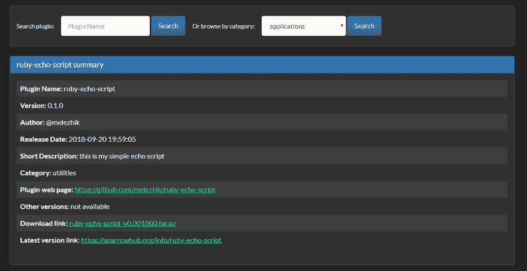

# sparrow-Ruby 脚本的简单部署

> 原文：<https://dev.to/melezhik/sparrow---simple-deploy-of-ruby-scripts-5c6g>

[麻雀](https://github.com/melezhik/sparrow)是一个脚本开发和管理平台。Sparrow 支持 4 种语言编写的脚本——Perl、Bash、Python 和 **Ruby** 。

特别为 ***Ruby 开发者*** 在这篇文章中，我将展示如何使用 Sparrow 部署 Ruby 脚本。

这篇文章是我的麻雀文章系列的第二篇。前一篇是
关于[使用 Sparrow 部署 Python 脚本](https://dev.to/melezhik/sparrow---simple-deploy-of-python-scripts-3iel)，所以如果你是 Python 开发人员——读读*那篇*的帖子(:

但是在讨论技术细节之前，让我们简要说明一下您可能需要它的原因:

# 动机

你想和别人分享你的脚本。由于某些原因，你还没有准备好将你的脚本作为 RubyGem 模块发布，它们是:

*   你的脚本只是一个脚本，这里没有模块，所以 RubyGem 发行版可能有些矫枉过正。

*   你的脚本是一个私有工具，你不想通过公共的 pip repo 来分发它，当你只想分发一个脚本时，维护私有的 RubyGem repo 是一件费力的事情。

所以，继续吧，看看如何用 Sparrow 发布脚本...

# 脚本

假设您有一个脚本`script.rb`，它只从命令行获取几个参数并打印它们(我们省略了解析命令行参数的代码，稍后您会看到*为什么*):

```
$ cat script.rb

puts "main.foo is #{foo}"
puts "main.bar is #{bar}" 
```

Enter fullscreen mode Exit fullscreen mode

```
script.rb --main.foo=1 --main.bar=2 
```

Enter fullscreen mode Exit fullscreen mode

以下是为该脚本制作 Sparrow 发行版的几个简单步骤:

## 安装麻雀

我们需要一个 Sparrow cli 将脚本上传到 SparrowHub - script 存储库。
在上传之前，我们可能还需要一个工具来测试脚本，它叫做`strun`，我们稍后会看到我们将如何使用它。`strun`作为 Sparrow cli 的一部分安装。

```
$ cpanm Sparrow 
```

Enter fullscreen mode Exit fullscreen mode

## 创建 SparrowHub 账户

前往[https://sparrowhub.org/sign_up](https://sparrowhub.org/sign_up)

## 生成 Sparrowhub 令牌:

Sparrowhub 令牌是分配给您的 Sparrowhub 帐户的特殊 UID，在您将分发上传到 SparrowHub - scripts 存储库时需要它。令牌是 SparrowHub 在您上传数据时使用的认证机制。

```
$ cat ~/sparrowhub.json

{
    "user"  : "melezhik",
    "token" : "ADB4F4DC-9F3B-11E5-B394-D4E152C9AB83"
} 
```

Enter fullscreen mode Exit fullscreen mode

## “转换”你的脚本到麻雀插件:

### 给你的剧本命名 story.rb

由于 Sparrow 对行书有一些约定，我们应该遵循它们，尽管这并不困难:

```
$ mv script.rb story.rb 
```

Enter fullscreen mode Exit fullscreen mode

## 处理输入参数

Sparrow 提供了开箱即用的机制来处理脚本的输入参数，只需在您的脚本的开头添加几行:

```
$ nano story.rb

foo = config['main']['foo']
bar = config['main']['bar'] 
```

Enter fullscreen mode Exit fullscreen mode

如果您想为输入参数设置**默认**设置，您可以很容易地做到:

```
$ nano suite.yaml

main:
  foo: 1
  bar: 2 
```

Enter fullscreen mode Exit fullscreen mode

## 宣告从属关系

Sparrow 使用 [bundler](https://bundler.io/) 来解析脚本自带的 Ruby 模块依赖性。只需创建 [gemfile](https://bundler.io/v1.16/gemfile_man.html) 格式的`Gemfile`来声明所有的依赖关系，如果你有:

```
$ nano Gemfile 
```

Enter fullscreen mode Exit fullscreen mode

## 创建分发文件

Sparrow metafile 是 JSON 格式的简单文件，描述您的发行版，最低配置如下:

```
$ nano sparrow.json
{
    "name": "ruby-echo-script",
    "version": "0.1.0",
    "description" : "this is my simple echo script"
} 
```

Enter fullscreen mode Exit fullscreen mode

好了，只需创建 3 个文件(除了初始脚本)并对初始 Ruby 脚本稍作修改，我们就可以发布了。

但是在上传之前，让我们测试一下我们的脚本。我们将使用`strun` -内部 Sparrow 脚本运行程序，它实际上运行脚本:

```
$ strun --param main.foo=10 --param main.bar=20

2018-09-13 18:50:07 :  [path] /
main.foo is 1
main.bar is 2
ok      scenario succeeded
STATUS  SUCCEED 
```

Enter fullscreen mode Exit fullscreen mode

现在我们可以安全上传:

```
$ sparrow plg upload
sparrow.json file validated ...
plugin ruby-echo-script version 0.001000 upload OK 
```

Enter fullscreen mode Exit fullscreen mode

一个直接的好处是，您刚刚上传的插件可以通过 SparrowHub 网站获得，只需[单击此处](https://sparrowhub.org/info/ruby-echo-script)，您将获得一个漂亮的页面，上面有您的发行版详细信息:

[T2】](https://res.cloudinary.com/practicaldev/image/fetch/s--1QnXG-DF--/c_limit%2Cf_auto%2Cfl_progressive%2Cq_auto%2Cw_880/https://raw.githubusercontent.com/melezhik/ruby-echo-script/master/plugin-page.png)

我还没有告诉你，但是你可以添加的 markdown 文档也是受支持的(:，只需将`README.md`放到你的发行版中！

好了，让我们进入安装阶段，当有人想运行你的脚本。

## 安装分配

现在，你的同事们一直在期待你运行整洁的脚本。对麻雀来说，这只是小菜一碟。这些是免费的简单步骤:

*   安装 Sparrow 客户端
*   安装您的发行版
*   和...是...运行您的脚本

这只是三个简单的步骤:

```
$ cpanm Sparrow 
```

Enter fullscreen mode Exit fullscreen mode

```
$ sparrow index update && sparrow plg install ruby-echo-script
get index updates from SparrowHub ... OK
installing public@ruby-echo-script version 0.001000 ... 
```

Enter fullscreen mode Exit fullscreen mode

```
$ sparrow plg run ruby-echo-script --param main.foo=1000 --param main.bar=2000

2018-09-13 18:57:57 : [plg] ruby-echo-script [path] /
main.foo is 1000
main.bar is 2000
ok      scenario succeeded
STATUS  SUCCEED 
```

Enter fullscreen mode Exit fullscreen mode

# 分发私有脚本

最后也是最重要的一点。如果你想让你的脚本保持私有并且不愿意使用公共的 SparrowHub 库，Sparrow 很乐意支持远程 git 分发。只需将这 4 个文件放入 Git repo，并使用这 4 个文件在目标主机上安装 Sparrow 客户端:

```
$ nano ~/sparrow.list
ruby-echo-script   https://github.com/melezhik/ruby-echo-script.git 
```

Enter fullscreen mode Exit fullscreen mode

# 评论、问题、想法

一如既往的受欢迎。

* * *

***【SparrowHub】-小剧本做成大事情***

阿列克谢