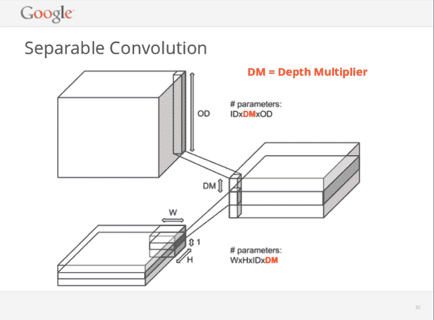
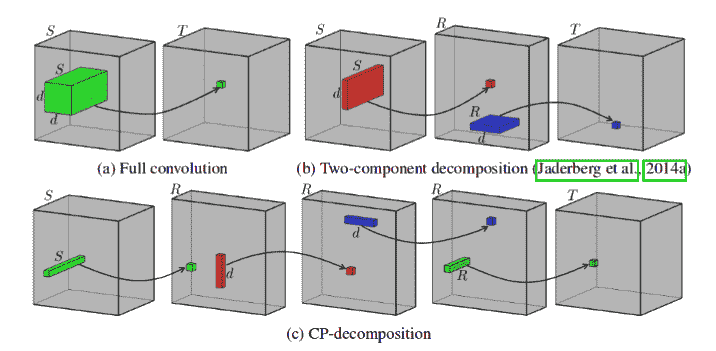

# 加速卷积神经网络

> 原文：<https://dev.to/alexburlacu/speeding-up-convolutional-neural-networks-178g>

*最初发表在媒体上，相当一段时间以前，[这里](https://towardsdatascience.com/speeding-up-convolutional-neural-networks-240beac5e30f)T3】*

加速卷积神经网络训练而不显著影响精度的方法综述。

有趣的是，完全连接的层是神经网络占用大量内存的主要原因，但速度很快，而卷积虽然参数数量很少，但却消耗了大部分计算能力。实际上，卷积是如此的计算饥渴，以至于它们是我们需要如此多的计算能力来训练和运行最先进的神经网络的主要原因。

> 我们能设计出既快速又高效的卷积吗？

某种程度上——是的！

有一些方法可以在不严重降低模型精度的情况下加速卷积。在这篇博文中，我们将考虑以下方法。

*   卷积核的因子分解/分解
*   瓶颈层
*   更宽的回旋
*   深度可分卷积

下面，我将深入研究所有这些方法的实现和背后的原因。

* * *

## 简单因式分解

让我们从 NumPy
中的以下例子开始

```
>>> from numpy.random import random
>>> random((3, 3)).shape == (random((3, 1)) * random((1, 3))).shape
>>> True 
```

Enter fullscreen mode Exit fullscreen mode

你可能会问，为什么我要给你看这个愚蠢的片段？答案是，它表明你可以写一个 NxN 矩阵，把卷积核想象成 2 个较小的矩阵/核的乘积，形状为 Nx1 和 1xN。回想一下卷积运算`requires in_channels * n * n * out_channels`的参数或权重。此外，请记住，每个重量/参数都需要激活。因此，参数数量的任何减少都将减少所需的操作数量和计算成本。

假设卷积运算实际上是使用张量乘法来完成的，而张量乘法是多项式的，依赖于张量的大小，正确应用因式分解应该会产生明显的加速。

在 Keras 中，它看起来像这样:

```
# k - kernel size, for example 3, 5, 7...
# n_filters - number of filters/channels
# Note that you shouldn't apply any activation
# or normalization between these 2 layers fact_conv1 = Conv(n_filters, (1, k))(inp)
fact_conv1 = Conv(n_filters, (k, 1))(fact_conv1) 
```

Enter fullscreen mode Exit fullscreen mode

不过，请注意，不建议使用最接近输入卷积层的因子。此外，分解 3x3 卷积甚至会损害网络性能。最好为更大的内核保留它们。

在我们深入这个主题之前，有一个更稳定的方法来分解大内核:只是堆叠较小的内核。例如，不使用 5x5 卷积，而是堆叠两个 3x3 卷积，或者如果您想要替换 7x7 内核，则堆叠 3 个卷积。有关更多信息，请参见[4]。

* * *

## 瓶颈层

瓶颈层背后的主要思想是通过减少输入通道的数量(也称为输入张量的深度)来减少内核大于 1×1 的卷积层中的输入张量的大小。

下面是它的 Keras 代码:

```
from keras.layers import Conv2D

# given that conv1 has shape (None, N, N, 128) 
conv2 = Conv2D(96, (1, 1), ...)(conv1) # squeeze conv3 = Conv2D(96, (3, 3), ...)(conv2) # map conv4 = Conv2D(128, (1, 1), ...)(conv3) # expand 
```

Enter fullscreen mode Exit fullscreen mode

几乎所有的 CNN，从革命性的概念 1 到现代的 DenseNet，都在以这样或那样的方式使用瓶颈层。这种技术有助于保持参数的数量，从而降低计算成本。

* * *

## 更宽的回旋

另一种加速卷积的简单方法是所谓的宽卷积层。你看，你的模型卷积层数越多，速度就越慢。然而，你需要大量卷积的表示能力。你是做什么的？你使用更少但更胖的层，其中脂肪意味着每层更多的果仁。为什么有效？因为对于 GPU 或其他大规模并行机器来说，处理单个大块数据比处理大量较小的数据更容易。更多信息可以在[6]中找到。

```
# convert from conv = Conv2D(96, (3, 3), ...)(conv)
conv = Conv2D(96, (3, 3), ...)(conv)
# to conv = Conv2D(128, (3, 3), ...)(conv)
# roughly, take the sqrt of the number of layers you want
# to merge and multipy the number to
# the number of filters/channels in the initial convolutions
# to get the number of filters/channels in the new layer 
```

Enter fullscreen mode Exit fullscreen mode

* * *

## 深度方向可分卷积

在深入研究这种方法之前，要知道它非常依赖于可分离卷积在给定框架中的实现方式。就我而言，TensorFlow 可能会对这种方法进行一些特定的优化，而对于其他后端，如 Caffe、CNTK 或 PyTorch，还不清楚。

[](https://res.cloudinary.com/practicaldev/image/fetch/s--EKN1Dy9s--/c_limit%2Cf_auto%2Cfl_progressive%2Cq_auto%2Cw_880/https://cdn-images-1.medium.com/max/716/1%2AodJXfzodb02HDnKy27yfpQ.png)
Vincent Vanhoucke，2014 年 4 月，“大规模学习视觉表征”

这个想法是，不是在图像的所有通道上联合卷积，而是在每个深度为`channel_multiplier`的通道上运行单独的 2D 卷积。`in_channels * channel_multiplier`中间通道连接在一起，并使用 1x1 卷积映射到 out_channels。[5]这样一来，需要训练的参数就少得多。[2]

```
# in Keras from keras.layers import SeparableConv2D
...
net = SeparableConv2D(32, (3, 3))(net)
...
# it's almost 1:1 similar to the simple Keras Conv2D layer 
```

Enter fullscreen mode Exit fullscreen mode

事情没那么简单。请注意，可分卷积有时不是训练。在这种情况下，将深度倍增从 1 修改为 4 或 8。还要注意，这些算法在小数据集上效率不是很高，比如 CIFAR 10，此外还有 MNIST。另一件要记住的事情是，不要在网络的早期阶段使用可分卷积。

* * *

[](https://res.cloudinary.com/practicaldev/image/fetch/s--0Ed8TY1q--/c_limit%2Cf_auto%2Cfl_progressive%2Cq_auto%2Cw_880/https://cdn-images-1.medium.com/max/716/1%2AFjzcTRoe-R680V0hOwYo5A.png) 
资料来源:v .列别杰夫等人，使用微调 CP 分解加速卷积神经网络

## CP-分解和高级方法

上述因式分解方案在实践中工作良好，但是非常简单。它们可以工作，但是还没有达到极限。有许多工作，包括 V. Lebedev 等人的[3],向我们展示了不同的张量分解方案，这些方案大大减少了参数的数量，从而减少了所需的计算量。

受[1]启发，这里有一段如何在 Keras 中进行 CP 分解的代码:

```
# **kwargs - anything valid for Keras layers,
# like regularization, or activation function
# Though, add at your own risk 
# Take a look into how ExpandDimension and SqueezeDimension
# are implemented in the associated Colab Notebook
# at the end of the article 
first = Conv2D(rank, kernel_size=(1, 1), **kwargs)(inp)
expanded = ExpandDimension(axis=1)(first)
mid1  = Conv3D(rank, kernel_size=(d, 1, 1), **kwargs)(exapanded)
mid2  = Conv3D(rank, kernel_size=(1, d, 1), **kwargs)(mid1)
squeezed = SqueezeDimension(axis=1)(mid2)
last  = Conv2D(out,  kernel_size=(1, 1), **kwargs)(squeezed) 
```

Enter fullscreen mode Exit fullscreen mode

遗憾的是，它不起作用，但是它给了你在代码中应该是什么样子的直觉。顺便说一下，文章顶部的图片是 CP 分解如何工作的图形解释。

应该注意诸如 TensorTrain 分解和 Tucker 这样的方案。对于 PyTorch 和 NumPy，有一个名为 [Tensorly](http://tensorly.org/stable/index.html) 的很棒的库，它可以为您完成所有的底层实现。在 TensorFlow 中没有任何接近它的东西，不过，还是有一个 TensorTrain 又名 TT 方案的实现，这里的。

## 后记

完整的代码目前可以作为一个带有特斯拉 K80 GPU 加速器的[合作笔记本](https://colab.research.google.com/drive/1i0Fwh-d8kF05o4QRfJG5dZt_P7G85MCS)获得。给自己做一份拷贝，享受修改代码的乐趣。

如果你正在读这篇文章，我想感谢你，并希望上面写的对你有很大的帮助，就像对我一样。请在评论区让我知道你的想法。你的反馈对我很有价值。

## 参考文献

[1][https://medium . com/@ krishnate jakrothapalli/hi-rain-4e 76039423 e 2](https://medium.com/@krishnatejakrothapalli/hi-rain-4e76039423e2)
【2】f . Chollet，Xception:具有深度方向可分离卷积的深度学习，[https://arxiv.org/abs/1610.02357v2](https://arxiv.org/abs/1610.02357v2)
【3】v . lebe dev 等人，使用微调 CP 分解加速卷积神经网络，[https://arxiv.org/abs/1412.6553](https://arxiv.org/abs/1412.6553)
【4】c . Szegedy 等人，重新思考计算机的初始架构