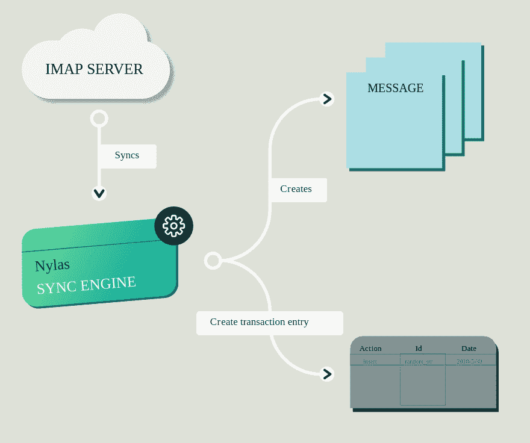
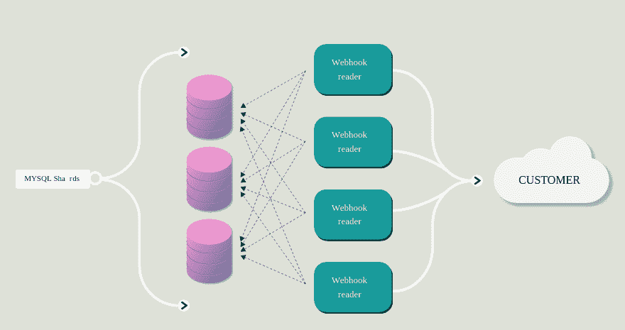
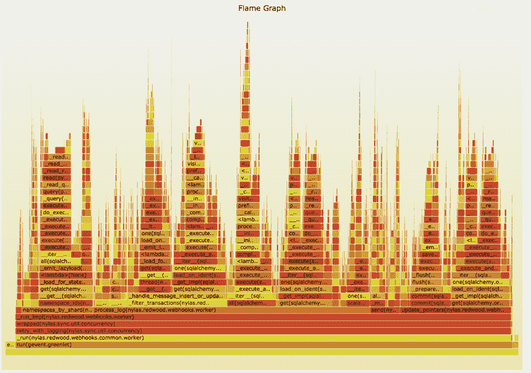
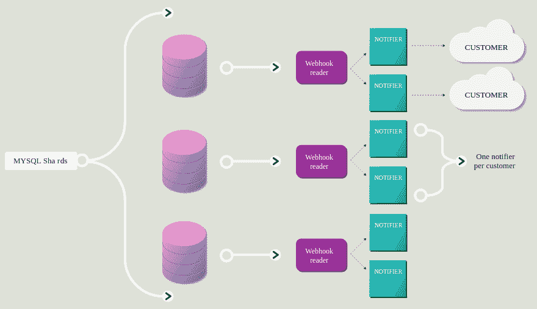
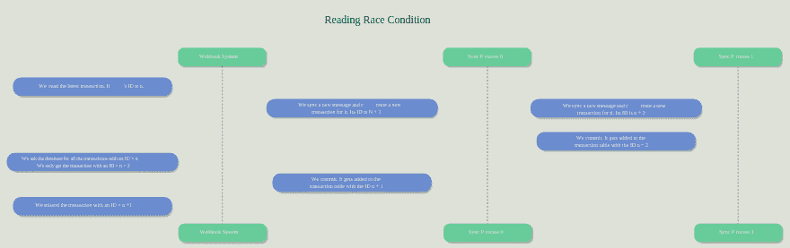
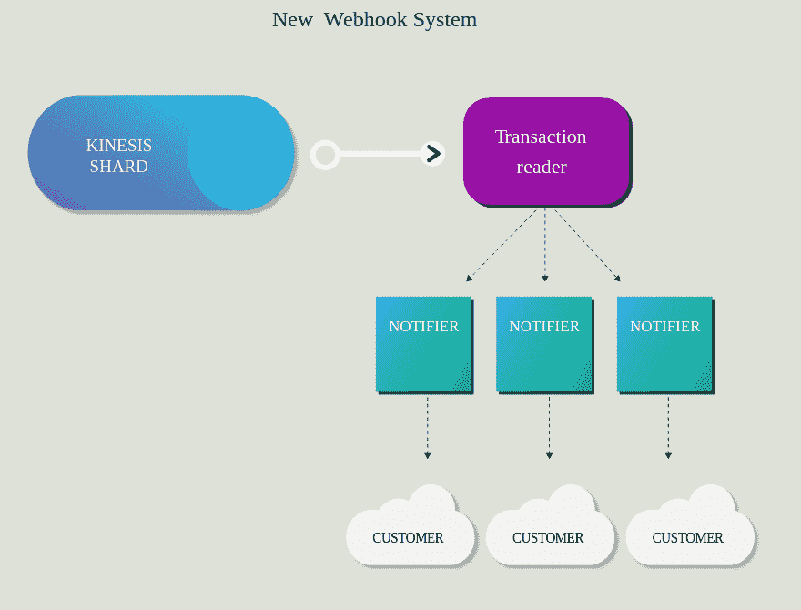

# 将我们的 Webhooks 系统加速 60 倍

> 原文：<https://dev.to/nylas/speeding-up-our-webhooks-system-60x-2idh>

去年 12 月，我们遇到了一个有趣的问题。我们的 webhook 系统让我们的客户知道 Nylas 帐户的变化，它正努力跟上流量。我们看到一些 webhooks 被延迟了 10 分钟，这对我们的大多数终端用户来说是一段很长的时间。我们决定冒险重新设计我们的 webhook 系统，让它变得更快。最终，我们将速度提高了 60 倍，并确保在可预见的未来保持这一速度。在这篇文章中，你会看到如何。

## 绕道:Nylas 事务日志简介

Nylas API 是围绕事务日志的思想构建的。事务日志是一个只附加的日志，记录了我们的 API 对象发生的所有更改。如果您通过 Nylas API 发送一条消息，我们将创建一个事务日志条目，记录一个“message”对象被创建。如果您更新一个事件、日历或任何其他 API 对象，也会发生同样的事情。

[T2】](https://res.cloudinary.com/practicaldev/image/fetch/s--Mj4ARSsW--/c_limit%2Cf_auto%2Cfl_progressive%2Cq_auto%2Cw_880/https://cdn2.hubspot.net/hubfs/3314308/Design-01.svg)

我们使用事务日志来支持所有的变更通知 API。例如，事务日志是您可以询问我们的 delta stream API 在过去 24 小时内特定帐户的所有更改的方式。

在后台，事务日志被实现为一个常规的 MySQL 表。我们已经装备了 ORM (SQLAlchemy ),每当 API 对象发生变化时，它都会写入这个表。在实践中，这相对来说工作得很好，尽管代码库的这一部分在很大程度上依赖于 SQLAlchemy 内部，这使得它非常脆弱(如果你对它是如何工作的感到好奇，请随意查看一下[同步引擎源代码](https://github.com/nylas/sync-engine/blob/master/inbox/models/transaction.py#L56))。

## 我们的传统 webhook 系统是如何工作的

我们最初的 webhook 系统非常简单，而且非常可靠。它将为每个 webhook 生成一个 reader 线程。每个读取线程将顺序读取我们的每个 MySQL 碎片，并发送它发现的更改。这让我们可以将大部分可靠性工作交给 MySQL——例如，如果一台 webhooks 机器崩溃了，我们只需重启它，它就会从中断的地方继续工作。这也意味着，如果客户的 webhook 出现故障，然后又恢复正常，我们将能够向他们发送在此期间发生的所有更改，这使得我们的客户更容易进行停机恢复。

[T2】](https://res.cloudinary.com/practicaldev/image/fetch/s--c52J2jry--/c_limit%2Cf_auto%2Cfl_progressive%2Cq_auto%2Cw_880/https://cdn2.hubspot.net/hubfs/3314308/blog%2520images/Webhooks%2520images/Design-02.svg)

不幸的是，随着我们从几个 MySQL 碎片发展到几百个，从六个客户发展到几百个，这个架构开始变得越来越没有意义。每个客户一个线程意味着随着客户数量的增长，我们的系统会越来越慢。

这听起来像是我们的遗留系统的一个明显的限制，但是当它在三年前被写的时候，这是一个正确的决定。当时，拥有一个简单可靠的系统比拥有一个快速且可扩展的系统更重要。

## 重建 webhooks

一旦我们决定重建系统，我们必须找出哪种架构最适合我们的工作负载。为了做到这一点，我们从查看传统系统的[火焰图](https://www.nylas.com/blog/performance/)开始。下面是一个典型的例子:

[T2】](https://res.cloudinary.com/practicaldev/image/fetch/s--54Lbw25U--/c_limit%2Cf_auto%2Cfl_progressive%2Cq_auto%2Cw_880/https://d2mxuefqeaa7sj.cloudfront.net/s_234B0D79AADA5B4F166BEF2EF90D08BF9C8666FC8D0E26EAFFEA819987372305_1524854788822_Capture%2Bdecran%2B2018-04-27%2Ba%2B11.45.42.png)

有一件事立即浮现出来:我们花了很多时间执行 SQLAlchemy 代码，并等待我们的 MySQL 碎片。看到这个证实了我们很久以来的一个预感——我们有太多的读者。

为了判断这是否正确，我们决定构建一个原型，使用单阅读器架构来发送 webhooks。这是我们想到的架构:

[T2】](https://res.cloudinary.com/practicaldev/image/fetch/s--TGDZCOZj--/c_limit%2Cf_auto%2Cfl_progressive%2Cq_auto%2Cw_880/https://cdn2.hubspot.net/hubfs/3314308/blog%2520images/Webhooks%2520images/Design-03.svg)

基本上，我们将从每个分片有几个阅读器转移到每个分片有一个阅读器。我们决定尝试一下，看看它是否能解决我们的负载问题。

## 幻影读题

经过三周的工作，我们觉得我们有一个足够可靠的系统来运行生产工作负载，所以我们决定发布一个不会发送实际 webhooks 的系统测试版本。这样，我们就能够解决性能问题，并确保遗留系统和新系统之间没有一致性问题。

在做了大量测试后，一个问题一直在发生——有时新系统不会发送本应发送的事务。这在一天中的任何时候都是不可预测的。

我们花了很多时间试图找出问题所在——是我们创建`transaction`对象的方式有问题吗？我们使用`transaction`表的方式中是否存在一个微妙的错误？

这个问题既复杂又不复杂。每次我们向客户发送交易时，我们都会保存它的`id`,以便在发生中断时知道从哪里恢复。然而，事实证明这一点也不安全，因为我们对 MySQL 自动增量有一个误解:我们假设它们是在`COMMIT`时间生成的——这意味着它们会一直递增。

然而，情况并非总是如此，例如，如果两个事务同时执行，其中一个可能不会执行，下面是一个原因示例:

[T2】](///hubfs/blog%20images/Webhooks%20images/Design-05%20(2).svg?t=1529514994570)

这个问题意味着我们不能依靠 MySQL 来处理事务。在我们看来，有三条不同的路可以走:

1.  我们可以从 [MySQL binlog](https://dev.mysql.com/doc/refman/8.0/en/binary-log.html) 中读取，这是 MySQL 用于其复制的机制
2.  我们可以用阿帕奇卡夫卡
3.  我们可以使用亚马逊网络服务的 Kafka 克隆，AWS Kinesis

最后，我们最终选择了 AWS Kinesis，主要是因为它最容易操作 MySQL binlog 和 Kafka 都有相当大的运营成本，我们当时无法支付(顺便说一下，[我们正在招聘运营人员](https://dev.to/jobs/)😅).

## 身势救援

Kinesis 是一个有趣的系统——它真的很可靠，很容易操作，只要你符合它(看似任意)的限制。例如，Kinesis 支持分片，你必须自己决定分片的分配。这很好，但有一个问题——每次 Kinesis 都被限制在每秒 1MB 的写入和 2MB 的读取。最重要的是，每秒只能有 5 个事务用于读取，所以让几个进程从同一个碎片中读取是不可能的。

显然，这些限制并不是世界末日，因为我们必须围绕它们建立我们的系统。这是我们最终使用的系统——与之前的系统一样，我们最终每个分片只有一个读取器，只是这次它从 Kinesis 而不是数据库读取。

[T2】](https://res.cloudinary.com/practicaldev/image/fetch/s--CHqH680l--/c_limit%2Cf_auto%2Cfl_progressive%2Cq_auto%2Cw_880/https://cdn2.hubspot.net/hubfs/3314308/blog%2520images/Webhooks%2520images/Design-04%2520%281%29%2520%281%29.svg)

新系统的一个有趣的特性是，它只使用 Kinesis 来获得有序的更改日志——对于其他方面(例如，在一段时间的停机后赶上客户 webhook)，新系统将从我们的数据库中读取数据，这是耐用性的一个优势，并帮助我们避免 Kinesis 每秒五次交易的限制。

## 铺开

Webhooks 对我们的客户来说非常非常重要。破坏系统意味着无限期地破坏他们的应用程序。为了避免这种情况，我们不得不以不同于我们通常的方式推出这项新服务。

我们通常推出新服务的方式是分阶段推出——我们首先向 10%的用户群发布变更，然后在一天内逐渐增加数量。我们本来可以用新的 webhooks 服务做到这一点，但我们希望避免任何意想不到的问题，如 webhooks 掉线或性能退化等。

为了做到这一点，我们在项目开始时决定开发一个服务版本，模拟发送 webhooks，而不是实际发送它们。这将给我们信心，我们不会在发布时遇到任何问题。当我们向客户推出这项服务时，它已经在“模拟模式”下运行了两个月。这让我们对新系统的可靠性充满信心。

但是我们并没有就此止步——考虑到我们的新系统不应该放弃 webhooks，我们花了几周的时间对它进行测试，以确保不会出现这种情况。对此没有太多好的解决方案，所以我们最终测试了遗留 webhooks 系统和新系统，以确保它们发送相同的事务。没有好的方法来做到这一点，所以我们必须建立一个自定义的 Flask 应用程序，每当我们发送一个 webhook 时，它就会被 pinged。

最终，我们对新系统有了足够的信心，可以向所有客户推广它。这意味着制作每个现有 webhook 的副本，将该副本指向新系统，关闭旧的 web hook，然后打开新的 web hook，并确保没有事务丢失。

## 结论

部署完成后，我们能够衡量所有客户的延迟改善情况。结果是惊人的——旧系统处理一笔交易并发送通常需要一分多钟。我们的 P90 延迟超过 90 秒。借助新系统，我们的 P90 延迟约为 1.5 秒，提高了 60 倍！

最后，感谢与 Nylas 在这个项目上签约的 Russell Cohen，他在这个项目上起了很大的作用！