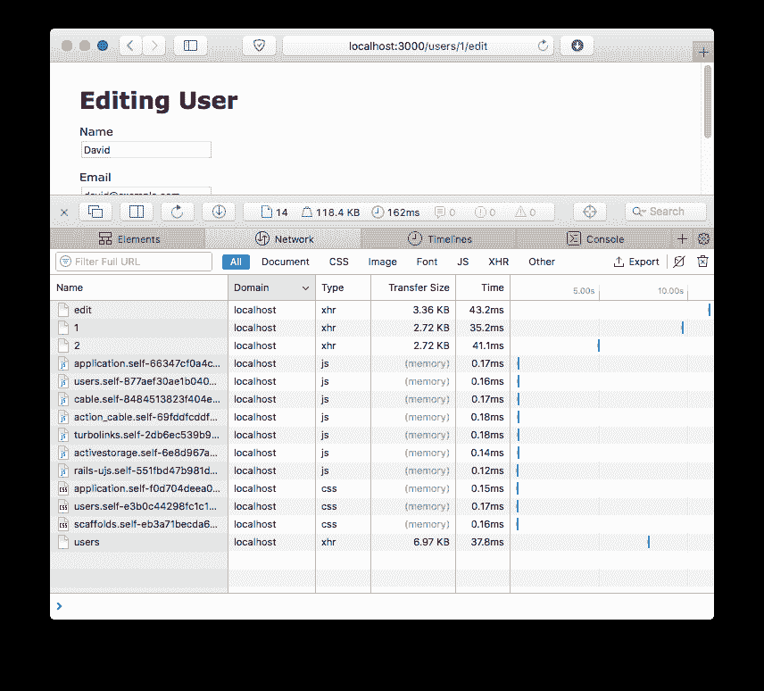
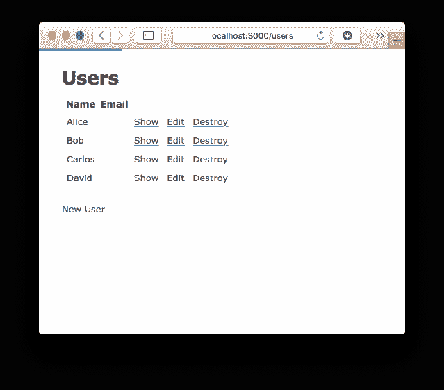

# 使用 Turbolinks 加速您的应用导航

> 原文：<https://dev.to/appsignal/speeding-up-your-apps-navigation-with-turbolinks-4lmn>

Turbolinks 是一种优化，它通过智能地切换页面和重新加载应用程序中的资源来提高*感知的*性能。与[条件 GET 请求](https://blog.appsignal.com/2018/05/01/client-side-caching-in-rails-conditional-get-requests.html)不同，它不需要对 Rails 应用本身的 Ruby 代码做任何修改。Turbolinks 5 是一个可以在任何地方工作的 JavaScript 库(即使没有 Rails，就像在静态页面上一样),并且可以在不受支持的浏览器上优雅地降级。

## 涡轮 5 号

从 Rails 4 开始，Turbolinks 已经与 Rails 捆绑在一起，并默认包含在新的应用程序中。Rails 5 搭载了 Turbolinks 5，这是对现在所谓的 Turbolinks Classic 的重写。

尽管它与 Rails 一起发布，但新版本的 Turbolinks 是一个纯 JavaScript 库，可以在任何 HTML 页面上使用，将其放在页面上的`<script>`标签中，或将其包含在应用程序的 JavaScript 包中。

当包含时，Turbolinks 将自动找到指向同一个域的所有链接，并附加一个点击事件监听器。对这些链接的任何点击都将被拦截。它不像普通的那样跟踪链接，而是使用 [`XMLHttpRequest`](https://developer.mozilla.org/en-US/docs/Web/API/XMLHttpRequest) 通过 JavaScript 在后台请求链接的页面。然后，发生了四件事:

1.  当前页面的副本存储在 Turbolinks 的缓存中以备后用
2.  它*用来自 XHR 结果的`<body>`替换*当前页面的`<body>`
3.  它*将当前页面的`<head>`与来自 XHR 结果的`<head>`合并*
4.  它使用历史 API 更改浏览器中的 URL

通过合并`<head>`标签，浏览器不需要重新加载和重新呈现像 CSS 和 JavaScript 文件这样的资产，它们同时出现在两个页面上。这可以显著提高应用程序的速度，尤其是当你有很多资源在你的大部分页面上重复使用的时候。

[T2】](https://res.cloudinary.com/practicaldev/image/fetch/s--zmmFOmMD--/c_limit%2Cf_auto%2Cfl_progressive%2Cq_auto%2Cw_880/https://blog.appsignal.cimg/blog/2018-05/turbolinks-network.png%3F)

在一个带有一些视图的全新 Rails 5 应用程序中，您可以通过点击链接并按下 back 按钮进行导航来查看 Turbolinks 的运行情况。在浏览器的网络标签中，你会看到通过标有“xhr”的 Turbolinks 加载的页面请求。此外，您的资产不会为每个请求重新加载。

## 缓存和页面预览

为了加快对同一页面的后续请求，Turbolinks 维护了一个最近访问过的页面的缓存。例如，这允许在按下后退按钮时立即呈现上一页。

为了提高慢速页面的感知性能，如果页面存在于缓存中，Turbolinks 将显示该页面的预览。单击该链接后，将显示缓存的版本，同时加载新版本。

## 告诫

Turbolinks 重新实现了浏览器的一些默认特性，所以启用 Turbolinks 和不启用 turbo links 时，有些功能会有所不同。

### `turbolinks:load`和`<script>`标签

因为页面不会在每次点击链接后都刷新，所以在页面加载时使用`window.onload`或`DOMContentLoaded`加载 JavaScript 不再有效。为了解决这个问题，Turbolinks 提供了`turbolinks:load`事件，您可以使用:

```
document.addEventListener("turbolinks:load", function() {
  // ...
}) 
```

Enter fullscreen mode Exit fullscreen mode

### 浏览器加载状态

在页面之间切换时，浏览器不会在您的浏览器中显示加载指示器，因为请求是在后台执行的。

为了解决这个问题，Turbolinks 将在 500 毫秒后在页面顶部显示一个蓝色条(可以用 CSS 进行样式化),表示页面正在加载。

[T2】](https://res.cloudinary.com/practicaldev/image/fetch/s--SzbKkC5n--/c_limit%2Cf_auto%2Cfl_progressive%2Cq_auto%2Cw_880/https://blog.appsignal.cimg/blog/2018-05/turbolinks-loading.png%3F)

# `$ rails new --skip-turbolinks`？

自 Turbolinks Classic 以来，Turbolinks 5 已经走过了漫长的道路，当时 Turbolinks 似乎是您在生成新的 Rails 应用程序时跳过的东西。作为一个优雅退化的纯 JavaScript 插件，它现在不依赖于 Rails，如果你记住警告的话，它对大多数应用程序来说都是现成的。

作为回报，Turbolinks 提供了一个不错的速度提升，并防止您的静态资产在每个页面视图上被重新加载，这节省了一些网络请求。当生成一个新的 Rails 应用程序时，试着保留 Turbolinks，看看它能做什么。在现有的应用程序上，试试 Turbolinks 吧！

以上是我们对 Turbolinks 的概述。你在你的应用程序中使用 Turbolinks 吗？我们希望收到您的来信！此外，我们很想知道你对 AppSignal Academy 的这篇文章和之前的文章有什么看法，或者你希望在 [@AppSignal](https://twitter.com/appsignal) 上读到什么。