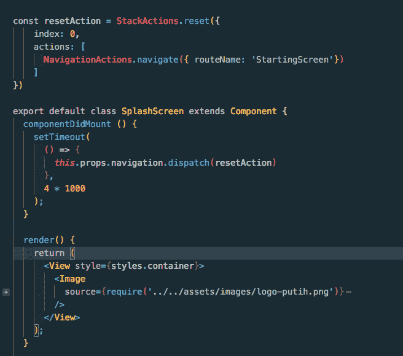
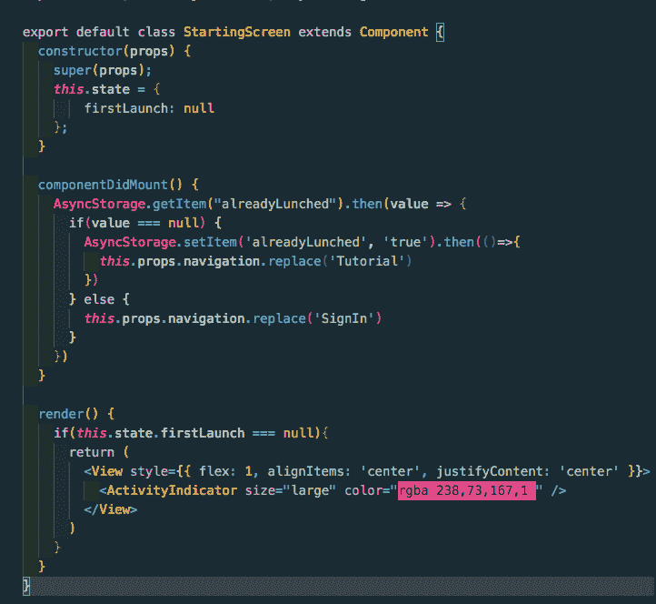

# 闪屏、教程屏、认证屏在 React-Native 中流动

> 原文：<https://dev.to/saadbashar/splash-screen-tutorial-screens-authentication-screens-flow-in-react-native--1364>

最近，我不得不从头开始一个项目，我不得不做出一个闪屏，教程屏幕和认证屏幕的一般流程。今天我将分享我是如何创造心流的，以及在这个过程中我遇到了哪些困难。流是一个非常常见的场景。事情是这样的

1.  首先，用户会看到几秒钟的闪屏
2.  如果用户第一次打开应用程序，那么用户将通过一些教程屏幕。
3.  如果不是第一次，用户将被重定向到身份验证屏幕。如果不是第一次，我们不能再次向用户显示教程屏幕。

***闪屏***

在 react 中，可以本地添加闪屏，也可以使用 react-native-splash-screen 包，但我只是以一种非常简单的方式在 react-native 端创建一个闪屏组件。我不得不使用 set timeout 来显示几秒钟的闪屏，然后重定向回另一个屏幕。闪屏组件如下所示:

[T2】](https://res.cloudinary.com/practicaldev/image/fetch/s--YJymIzxa--/c_limit%2Cf_auto%2Cfl_progressive%2Cq_auto%2Cw_880/https://thepracticaldev.s3.amazonaws.com/i/1nkt6iw0saft24ofzrtc.png)

注意，在重定向时，我不得不使用 resetActions 再次清空堆栈，这样用户就不能使用硬件 back 按钮再次返回闪屏。

***起始画面***

在这个屏幕上，我不渲染任何东西，只是把我的逻辑重定向到正确的位置。组件如下所示:

[T2】](https://res.cloudinary.com/practicaldev/image/fetch/s--267dpuob--/c_limit%2Cf_auto%2Cfl_progressive%2Cq_auto%2Cw_880/https://thepracticaldev.s3.amazonaws.com/i/uqztztg3mxzo9ur9ma4d.png)

我使用异步存储来存储应用程序是否已经启动的值。在 componentDidMount 函数中，我首先检查来自异步存储的 alreadyDidLaunch 值是否为空，如果为空，那么我将在呈现中显示一个加载程序，同时也更改 alreadyDidLaunch 的值。因此，更改值后，我将用户重定向到教程屏幕。

下次当用户再次打开应用程序时，alradyDidLaunched 值将设置为 true，用户将被重定向到身份验证屏幕。

请注意，asyncStorage 本质上是异步的，因此需要一些时间来获取值。在获取值的同时，我显示了一个加载器。

我就是这么做的。请让我知道比这更好的方法，我可以做到这一点。感谢阅读！