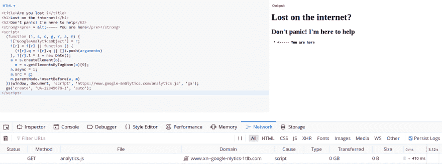

# 发现恶意软件

> 原文：<https://dev.to/antogarand/spot-the-malware-4cmo>

# 挑战

## 救命！

我的网站最近被感染了，我似乎无法摆脱它产生的赌场广告！我提供的只是这个普通的 html 文件，你能帮我找出它的原因吗？

google analytics 部分是从[将 analytics.js 添加到您的站点](https://developers.google.com/analytics/devguides/collection/analyticsjs/)页面中生成的！

Index.html:

```
Are you lost ?
<h1>Lost on the internet?</h1>
<h2>Don't panic! I'm here to help</h2>
<strong><pre> * &lt;----- You are here</pre></strong>
<!-- Google Analytics -->
<script>
(function(i,s,o,g,r,a,m){i['GoogleAnalyticsObject']=r;i[r]=i[r]||function(){
(i[r].q=i[r].q||[]).push(arguments)},i[r].l=1*new Date();a=s.createElement(o),
m=s.getElementsByTagName(o)[0];a.async=1;a.src=g;m.parentNode.insertBefore(a,m)
})(window,document,'script','https://www.google-аnаlytics.com/analytics.js','ga');

ga('create', 'UA-XXXXX-Y', 'auto');
ga('send', 'pageview');
</script>
<!-- End Google Analytics --> 
```

Enter fullscreen mode Exit fullscreen mode

# 解

这可能看起来像一个附有谷歌分析的常规网站，但有一个转折！
It **可能**在服务页面和检查网络选项卡时更明显:
[](https://res.cloudinary.com/practicaldev/image/fetch/s--akHKebaF--/c_limit%2Cf_auto%2Cfl_progressive%2Cq_auto%2Cw_880/https://thepracticaldev.s3.amazonaws.com/i/4zih0adpm9zbc89je484.png)

不是加载预期的`google-analytics.com`域，而是加载`xn--google-nlytics-1tlb.com`域。

你可能会问为什么？

好吧，答案在`google-analytics.com`的两个`a`里:它们不是你的好的旧 ascii `a`，而是实际上的[西里尔字母 a](https://en.wiktionary.org/wiki/%D0%B0) ！

自己查:[https://www.google-аnаlytics.com](https://www.google-%D0%B0n%D0%B0lytics.com)(注:域名未注册)

这让我们想到了一个很好的古老的同形异义词攻击，我们大多数人会看到合法的谷歌分析域，而它的对等物`xn--google-nlytics-1tlb.com`将被加载。

双关语和同形异义词攻击在网络钓鱼活动中经常使用，但大多数浏览器会显示解码后的`xn--` url。

尽管在阅读源代码时，IDE 和文本编辑器通常会显示一个普通的西里尔字母 a，我们肉眼很难分辨。
恶意软件创建者可以利用这一点，注册类似于流行的 CDN 和注入脚本的主机，然后用自己的域名替换正版域名。

这将使人们在简单地查看源代码时无法看到，比如查看`index.html`文件，但这将允许他们在网站上注入恶意软件。

# 引用

*   [同形异义词-攻击](https://dev.to/loganmeetsworld/homographs-attack--5a1p)如果你需要更多，请查看这篇帖子的参考资料，我无法匹配它的完整性。