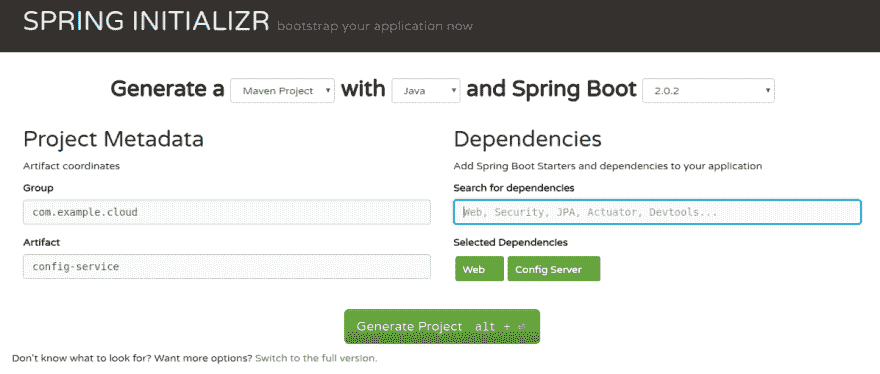
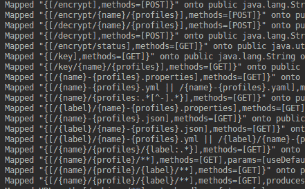

# 春云循序渐进(第二部分)

> 原文：<https://dev.to/piczmar_0/spring-cloud-step-by-step-part-2-12o2>

在[之前的文章](https://dev.to/piczmar_0/spring-cloud-step-by-step-part-1-1670)中，我们为租赁定价创建了基本的 Spring Web REST API。

在本文中，我们将把它转换成 Spring Cloud 项目，并添加集中式配置。

这意味着我们将把所有服务的配置保存在一个地方，易于修改，所有的更改都将被服务发现，而无需更改它们的代码。

这个帖子的项目可以在 GitHub 分支 [spring-cloud-2](https://github.com/piczmar/spring-cloud-rental/tree/spring-cloud-2) 获得

### 配置配置服务

我们需要另一个应用程序，这将是我们的配置服务和定价服务将连接到它。

我们可以在 [http://start.spring.io](http://start.spring.io) 用 Spring Initializr 生成配置服务 app。

我们只需要从依赖项中选择“配置服务器”和“Web”。

[T2】](https://res.cloudinary.com/practicaldev/image/fetch/s--xe4KKSJM--/c_limit%2Cf_auto%2Cfl_progressive%2Cq_auto%2Cw_880/https://thepracticaldev.s3.amazonaws.com/i/m1p4aejb2jt57ggpvf6k.png)

这将在 pom.xml:
中生成带有 maven 依赖项的 app

```
 <dependency>
            <groupId>org.springframework.boot</groupId>
            <artifactId>spring-boot-starter-web</artifactId>
        </dependency>
        <dependency>
            <groupId>org.springframework.cloud</groupId>
            <artifactId>spring-cloud-config-server</artifactId>
        </dependency> 
```

然后我们需要告诉 Spring Boot，这是一个配置服务应用程序，在主类上有注释:

```
@EnableConfigServer 
```

它将向应用程序添加一些新的 REST 映射，当应用程序启动时，我们可以在日志中看到这些映射。

[T2】](https://res.cloudinary.com/practicaldev/image/fetch/s--4YCEvOBW--/c_limit%2Cf_auto%2Cfl_progressive%2Cq_auto%2Cw_880/https://thepracticaldev.s3.amazonaws.com/i/yd17shqa50pv02mfmcpv.png)

然后在`application.properties`中添加这些属性

```
server.port=8888
spring.cloud.config.server.git.uri=${HOME}/cloudconfigs 
```

最后一个属性告诉配置服务在哪里寻找服务配置，例如，我们可以使用本地 git repo、GitHub 或 bitbucket。

我们将使用本地 git 回购。让我们创造它。在 bash 中执行命令:

```
mkdir -p ${HOME}/cloudconfigs
cd ${HOME}/cloudconfigs
git init 
```

然后在`${HOME}/cloudconfigs`中创建一个新文件`pricing-service.yaml`，并添加这些属性:

```
pricing:
  plan:
    basic: 5
    standard: 200
    vip: 500 
```

提交文件。

```
git add pricing-service.yaml
git commit -m 'added config' 
```

这里，我们使用与初始定价服务配置不同的值来指出差异。

这些值将覆盖定价服务中的任何本地配置。

如果我们愿意，我们还可以将`application.properties`或`application.yaml`添加到 repo 中，这将为所有服务保留公共属性。

例如，我们可以把

```
pricing:
  plan:
    basic: 1 
```

但在这种情况下，如果我们启动配置服务并查询定价服务的配置，该值将被来自`pricing-service.yaml`
的设置覆盖。我们可以在[http://localhost:8888/pricing-Service/default](http://localhost:8888/pricing-service/default)
检查这一点

```
{  "name":"pricing-service",  "profiles":[  "default"  ],  "label":null,  "version":"8ab2211dd33751b797afa3d0a0eea8fccc10e676",  "state":null,  "propertySources":[  {  "name":"/home/marcin/tmp/cloudconfig/application.yaml",  "source":{  "pricing.plan.basic":5,  "pricing.plan.standard":200,  "pricing.plan.vip":500  }  }  ]  } 
```

### 配置配置客户端

在定价服务中，我们需要添加一个依赖关系

```
<dependency>
    <groupId>org.springframework.cloud</groupId>
    <artifactId>spring-cloud-starter-config</artifactId>
</dependency> 
```

和`dependencyManagement`部分:

```
<dependencyManagement>
    <dependencies>
        <dependency>
            <groupId>org.springframework.cloud</groupId>
            <artifactId>spring-cloud-dependencies</artifactId>
            <version>${spring-cloud.version}</version>
            <type>pom</type>
            <scope>import</scope>
        </dependency>
    </dependencies>
</dependencyManagement> 
```

`properties` :
中的版本配置

```
<properties>
    ...
    <spring-cloud.version>Finchley.RC2</spring-cloud.version>
</properties> 
```

然后添加一个文件`resources/bootstrap.yaml`

这是一个属性文件，当应用程序启动时，它将首先被读取。

这就是春云的工作方式。它首先读取`bootstrap.yaml`以确定要使用的附加配置。

在我们的例子中，它将使用来自配置服务的配置。

该文件将如下所示:

```
spring:
  application:
    name: pricing-service
  cloud:
    config:
      uri: http://localhost:8888 
```

其中`spring.application.name`将是服务的名称，告诉配置服务从配置 git repo 中获取哪个文件，而`spring.cloud.config.uri`是配置服务的 URL。

默认情况下，配置服务从`localhost:8888`开始。

现在，如果我们开始定价服务，解析属性的顺序如下:

*   `pricing-service.properties`在配置 git repo 中
*   `application.yaml`在配置 git repo 中(如果属性不在`pricing-service.properties`中)
*   `application.yaml`在定价服务中(如果资产不在配置 git 回购的`application.yaml`中)

如果配置服务关闭，会发生什么情况？将使用定价服务的本地属性。

配置服务有很多不错的特性，比如每个 spring 配置文件的属性或者标签和属性加密。
你可以在这里或者当然在[春云文档](https://cloud.spring.io/spring-cloud-config/multi/multi__spring_cloud_config_server.html)查看一个很好的解释

该部分的最终代码可从 GitHub [spring-cloud-2](https://github.com/piczmar/spring-cloud-rental/tree/spring-cloud-2) 分支获得。

现在，我们已经对配置服务交付的服务进行了集中配置，但是所有服务都需要有运行时给定的配置服务的 URL(在本地`application.yaml`中或者通过环境变量)。

如果集成、QA、生产环境有不同的 URL，这就有点麻烦了。

在下一篇文章中，我们将添加服务发现机制，以便服务可以只使用友好的名称，并且 URL 将从服务注册中心提供。