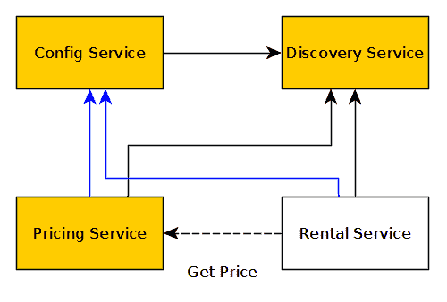

# 春云步步为营(第四部分)

> 原文：<https://dev.to/piczmar_0/spring-cloud-step-by-step-part-4-l00>

这是之前博文的延续:

*   [春云步步为营(上)](https://dev.to/piczmar_0/spring-cloud-step-by-step-part-1-1670)
*   [春云步步为营(下)](https://dev.to/piczmar_0/spring-cloud-step-by-step-part-2-12o2)
*   [春云步步为营(第三部)](https://dev.to/piczmar_0/spring-cloud-step-by-step-part-3-4jeg)

这次我将向您展示如何使用 Eureka discovery 客户机查询其他服务，而不知道它们的 URL。

在[之前的文章](https://dev.to/piczmar_0/spring-cloud-step-by-step-part-3-4jeg)中，我们已经看到了如何配置 Spring 云服务发现。

我们用它来发现配置服务器。它是由 Spring 自动处理的，但是我们还没有看到如何从 java 代码中手动调用其他服务(例如使用 RestTemplate)。

让我们添加另一个微服务，它将使用定价服务来获取用户租赁物品的价格。

姑且称之为租赁服务吧。

它将有一个在特定时期租赁项目的 API，并将返回租赁价格。
API 将这样工作:

```
curl -H 'Content-Type:application/json' http://localhost/v1/rentals/{id}/charges 
```

其中{id}是租赁 id。我们现在不会创建一个 API 来创建租金。为了演示调用另一个服务，我们将只传递任何{ id }, API 将用硬编码的值来响应，比如:

```
{"price" : "1231.00"} 
```

我们的 Spring 云系统现在将包含如下图所示的服务:

[T2】](https://res.cloudinary.com/practicaldev/image/fetch/s--xTvj2ZJI--/c_limit%2Cf_auto%2Cfl_progressive%2Cq_auto%2Cw_880/https://thepracticaldev.s3.amazonaws.com/i/z5gyp01la0ajbu1otofz.png)

使用服务发现有不同的方式:

1.  用`org.springframework.cloud.client.discovery.DiscoveryClient`
2.  带有名为 [Ribbon](https://cloud.spring.io/spring-cloud-netflix/multi/multi_spring-cloud-ribbon.html) 的客户端负载平衡器
3.  用[假装](https://cloud.spring.io/spring-cloud-netflix/multi/multi_spring-cloud-feign.html)休息客户端

在这篇文章中，我将专注于第一个例子，并在单独的文章中展示其他例子。

## 使用 EurekaClient API

`com.netflix.discovery.EurekaClient`是网飞对`DiscoveryClient`的实现。

在我们可以创建的新服务中，类似于我们创建的其他 Spring 云服务，我们将在`pom.xml` :
中添加新的依赖项

```
 <dependency>
            <groupId>org.springframework.cloud</groupId>
            <artifactId>spring-cloud-starter-eureka</artifactId>
            <version>1.4.2.RELEASE</version>
        </dependency> 
```

我们还需要在主类上添加注释:`@EnableEurekaClient`。

最后，一些配置让 Eureka 客户机知道发现服务器在哪里——在`bootsrap.yaml`中添加:

```
eureka:
  client:
    serviceUrl:
      defaultZone: ${EUREKA_URI:http://localhost:8761/eureka}
  instance:
    preferIpAddress: true 
```

这意味着我们期望服务器位于`http://localhost:8761/eureka`，但是它也可以从环境变量`EUREKA_URI`中解析，例如在生产环境中。

什么时候使用`preferIpAddress`属性？当我们希望我们的应用程序通过 IP 而不是主机名在 Eureka 服务器上注册时(参见这里的解释)。

现在我们可以在新的控制器中使用`EurekaClient`，例如，我们可以像这样列出所有可用的服务:

```
 import com.example.rental.rentalservice.v1.dto.RentalChargesResponse;
import com.netflix.appinfo.InstanceInfo;
import com.netflix.discovery.EurekaClient;
import com.netflix.discovery.shared.Application;
import org.apache.commons.lang.builder.ToStringBuilder;
import org.springframework.http.HttpStatus;
import org.springframework.http.ResponseEntity;
import org.springframework.web.bind.annotation.PathVariable;
import org.springframework.web.bind.annotation.RequestMapping;
import org.springframework.web.bind.annotation.RequestMethod;
import org.springframework.web.bind.annotation.RestController;

import java.math.BigDecimal;
import java.util.Iterator;
import java.util.List;

@RestController
@RequestMapping(path = "/v1")
public class RentalController {

    private final EurekaClient eurekaClient;

    public RentalController(EurekaClient eurekaClient) {
        this.eurekaClient = eurekaClient;
    }

    @RequestMapping(path = "/rentals/{id}/charges", method = RequestMethod.GET)
    public ResponseEntity getPossibleCharges(@PathVariable("id") String id) {

        eurekaClient.getApplications();
        Iterator i = eurekaClient.getApplications().getRegisteredApplications().iterator();

        while (i.hasNext()) {
            Application app = (Application) i.next();
            System.out.println(app.getName());

        }

        return new ResponseEntity<>(new RentalChargesResponse(BigDecimal.ZERO), HttpStatus.OK);
    }
} 
```

当我们启动应用程序并用
调用端点时

```
curl localhost:8080/v1/rentals/123/charges 
```

我们会在应用程序日志中看到

```
PRICING-SERVICE
CONFIG-SERVICE
RENTAL-SERVICE 
```

所以它也返回了关于它自己的信息(`RENTAL-SERVICE`)。每个服务只有一个实例，但在实际系统中会有更多，因为我们希望支持一些容错和规模应用。

我把尝试我们还能从`EurekaClient`API 中得到什么的任务留给了你，但是让我们最终看看如何查询定价服务。
我们开始:

```
@RequestMapping(path = "/rentals/{id}/charges", method = RequestMethod.GET)
public ResponseEntity getPossibleCharges(@PathVariable("id") String id) {

    InstanceInfo instance = eurekaClient.getNextServerFromEureka("pricing-service", false);
    ZonedDateTime startTime = ZonedDateTime.now();
    ZonedDateTime endTime = startTime.plus(2, ChronoUnit.DAYS);
    HttpEntity<PriceRequest> request = new HttpEntity<>(
            new PriceRequest("vip", startTime, endTime)
    );
    PriceResponse response = restTemplate.postForObject(
        instance.getHomePageUrl() + "/v1/prices", request, PriceResponse.class);
    return new ResponseEntity<>(new RentalChargesResponse(response.getPrice()), HttpStatus.OK);
} 
```

在上面的代码中，我们对定价服务的输入参数进行了硬编码。我们应该首先获得租金并从中提取这些值，但是由于我们还没有创建租金的 API，这是一条捷径。

在下一篇文章的[中，我将向你展示一种使用带有](https://dev.to/piczmar_0/spring-cloud-step-by-step-part-5-1g62)[功能区](https://cloud.spring.io/spring-cloud-netflix/multi/multi_spring-cloud-ribbon.html)的 Eureka 调用端点的更简单的方法。