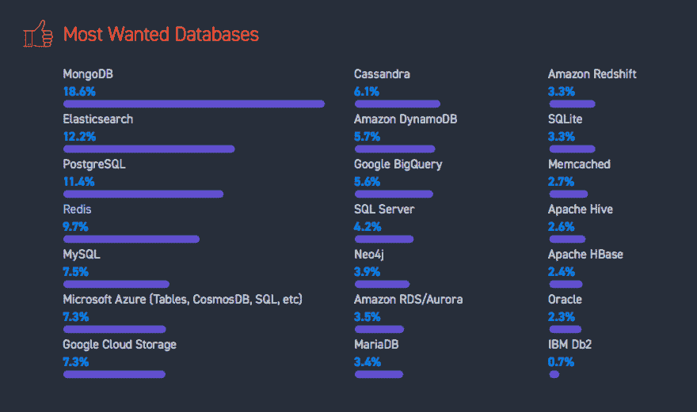
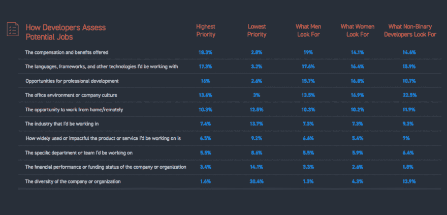
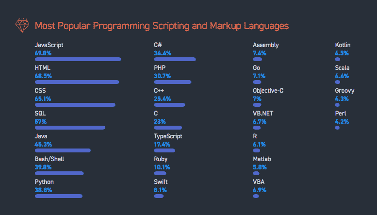

# 对 100，000 名开发人员进行的堆栈溢出研究发现，MongoDB 是最受欢迎的数据库

> 原文：<https://dev.to/mongodb/stack-overflow-research-of-100000-developers-finds-mongodb-is-the-most-wanted-database--m4h>

众所周知，开发人员希望使用具有灵活性、多功能性和易用性的数据库。可伸缩性和可靠性当然也没有坏处。对于越来越多的开发人员来说，MongoDB 是满足所有这些需求的理想解决方案。这已经是连续第二年被那些最重要的人——开发者自己——的观点所证实。

今天，我们很高兴地宣布，MongoDB 连续第二年成为 [Stack Overflow 开发者调查 2018](https://insights.stackoverflow.com/survey/2018/) 中**最受欢迎的数据库**，这是世界上最大的开发者调查，有超过 100，000 名受访者。

[T2】](https://res.cloudinary.com/practicaldev/image/fetch/s--et2SS78j--/c_limit%2Cf_auto%2Cfl_progressive%2Cq_auto%2Cw_880/https://webassets.mongodb.com/_com_assets/cms/Screen%2520Shot%25202018-03-13%2520at%25203.38.03%2520PM-qxj2aahz6b.png)

### 人气稳步上升

自首次亮相以来，MongoDB 在开发者中的受欢迎程度稳步上升。这种流行主要是由平台的易用性和灵活性推动的；最近，[完全托管数据库服务 MongoDB Atlas](https://www.mongodb.com/cloud/atlas) 的发布使得在任何主要云平台上运行数据库比以往任何时候都更容易。

MongoDB 不断创新，倾听从小型创业公司到大型企业的开发人员的需求并做出反应。该平台令人兴奋的新功能包括将实时数据更新推送到下游应用程序的[变更流](https://www.mongodb.com/blog/post/an-introduction-to-change-streams)、[可重试写操作](https://docs.mongodb.com/manual/core/retryable-writes/)、在不增加复杂性的情况下增强可靠性的[多文档 ACID 事务](https://www.mongodb.com/blog/post/multi-document-transactions)，将于今年晚些时候推出 4.0 版本。

### 为什么是 MongoDB？

MongoDB 的文档模型通过允许开发人员以与他们思考和创建应用程序的方式一致的方式存储数据，为开发人员提供了巨大的生产力提升。此外，MongoDB 的本机复制和水平分区让开发人员有信心和自由专注于区分代码，而不必担心与数据局部性、可靠性和可伸缩性相关的挑战。最后，MongoDB 提供了从本地开发环境到最大的大型机部署全程一致运行的自由。数据库可以部署在内部、混合云中或任何公共云中。

### 你如何能从这条新闻中获益？

寻找有才华的开发人员的招聘经理可能会很好地回顾一下今天发布的一些额外统计数据。在题为“开发人员如何评估潜在工作”的图表中可以找到一个有趣的统计数据。如果你是一名招聘经理，你正在寻找吸引顶级人才，考虑最想要的数据库平台可能是一种提高机会吸引力的方法。

[T2】](https://res.cloudinary.com/practicaldev/image/fetch/s--aQm6-zZa--/c_limit%2Cf_auto%2Cfl_progressive%2Cq_auto%2Cw_880/https://webassets.mongodb.com/_com_assets/cms/Screen%2520Shot%25202018-03-13%2520at%25203.48.22%2520PM-9jlp7s8ju5.png)

随着这些开发环境越来越受欢迎，审查堆栈溢出报告的 Javascript 和 Python 开发人员将受到鼓舞。像 MEAN 或 MERN 这样的 web 应用程序栈的流行为 Javascript 开发人员提供了快速构建应用程序的框架。

[T2】](https://res.cloudinary.com/practicaldev/image/fetch/s--lj031zL4--/c_limit%2Cf_auto%2Cfl_progressive%2Cq_auto%2Cw_880/https://webassets.mongodb.com/_com_assets/cms/Screen%2520Shot%25202018-03-13%2520at%25203.43.55%2520PM-tnah73u9sx.png)

不用 Javascript 或者 Python？MongoDB 完全支持这些和所有流行的开发语言。想配合 MongoDB 使用 Golang？一个完全支持的 MongoDB [Golang 驱动程序已经开发到了 Alpha 阶段](https://github.com/mongodb/mongo-go-driver)，给开发者更多的选择来使用最新和最流行的语言进行构建。

### 总结

开发人员是新的 *[决策者](https://www.mongodb.com/press/developers-are-the-enterprise-kingmakers-but-monotony-coding-is-killing-innovation)* ，他们的意见至关重要。堆栈溢出调查的结果令人兴奋地验证了 MongoDB 为构建一个全世界开发人员都需要的弹性、灵活且易于使用的平台所做的努力。

* * *

#### 您想了解更多信息吗？

[MongoDB 大学](https://university.mongodb.com/)为[初学者](https://university.mongodb.com/courses/M001/about)、[开发者](https://university.mongodb.com/courses/M101P/about)、[数据库管理员](https://university.mongodb.com/courses/M102/about)、[运营人员](https://university.mongodb.com/courses/M103/about)提供免费课程。获取关于 [MongoDB Atlas](https://university.mongodb.com/courses/M123/about) 、 [Compass](https://www.mongodb.com/products/compass) 等产品的在线教育，帮助开发者构建伟大的现代应用。

想马上用 MongoDB 构建吗？今天就从 MongoDB Atlas [管理的 512 MB 数据库开始吧。](https://www.mongodb.com/cloud/atlas)