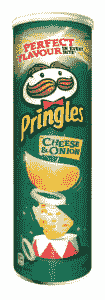

# 堆积在(食物)壳里

> 原文：<https://dev.to/jainroe/stacks-in-a-foodshell-2hi8>

欢迎回来，夜魔侠！我看你喜欢冒险。

如果你不知道我在说什么，你应该在读这篇文章之前看看这篇文章。

这个数据结构系列的目标是通过思考和将数据结构应用到现实生活环境中来毁掉你的生活。它不会向您介绍编程的实际世界，但是对概念的掌握将为理解计算的本质提供一个开端。

让我从最简单但也是最重要的数据结构——“栈”开始这个系列。近来，这个词到处都在使用。无论是寻找全栈开发者的公司，还是分享他们技术栈的创业公司。

那么什么是堆栈呢？

在我继续解释之前，让我给出一个合理的警告。这篇文章不适合正在节食的人。

食物出现在我们的许多例子中，原因很简单:

*   首先，食物比复杂的代码&抽象的符号更容易可视化。
*   第二，我想给你提供一点消遣。他们有时会让你心烦意乱，稍微分散一下注意力会有助于你保持清醒。

**本文的先决条件**:

读者必须能够自如地阅读英语，并且能够控制对食物的渴望。

**栈到底是什么？**

> 虽然这个词有不同的含义——在编程中，堆栈是根据*后进先出(* ***LIFO*** *)原则插入(**推入**)和移除(**弹出**)的对象(数据)的集合。*

我听你说这有点复杂。不要担心，做好准备(食物)例子来简单说明这一点。

[T2】](https://res.cloudinary.com/practicaldev/image/fetch/s--TZR1LIfB--/c_limit%2Cf_auto%2Cfl_progressive%2Cq_auto%2Cw_880/https://jshilpa.com/wp-content/uploads/2018/02/pringles-105x300.jpg)

[来源:品客官网](https://www.pringles.com/uk/products.html)

今天就来说说品客薯片筒吧。如果你仔细观察，品客薯片筒不过是一堆薯片。包装过程中最后进入管中的薯片是我们吃饭时第一个进入胃中的薯片。

在吃顶部的薯片之前，你不能在马铃薯管的底部吃薯片，因为管的顶部只有一个开口。

你看到我做了什么吗？

好吧，克制住想要筹码的冲动，教你筹码的重要概念。

如果你回头看一下栈的定义，你会发现我用粗体显示了几个术语，push，pop 和 LIFO。现在让我们试着把这些点联系起来。

*   **添加(推送)&删除(弹出)**

就像我们从品客薯片筒的顶部添加(推送)和取出(弹出)薯片一样，在堆叠中，您只需从一端添加和取出，即只从顶部。

*   **后进先出(LIFO)**

就像你不能在没有完成上面的芯片的情况下在底部有芯片一样，最后被推入堆栈的项目将是第一个被取出的。

堆栈的基本操作如下:

1.  **push(element)** —在栈顶添加新元素
2.  **pop()** —从堆栈顶部移除/返回元素
3.  **peek()/top()** —返回对堆栈顶部元素的引用
4.  **is_empty()** —如果堆栈中没有元素，则返回布尔值 true
5.  **len(stack)**–返回堆栈中元素的数量。

是的，是的…我听到你说我只是向你解释了前两种方法。

让我们再举一个例子来理解其余的问题。

T3】

假设你有一叠煎饼(一叠一叠地叠在一起)。

1.  **Peek/top :**

一次应该吃一块薄饼。再多一点，你就没有足够的糖浆了。

因此，您将在堆栈上使用 peek/top 函数来获取最上面的煎饼。

1.  **Is_empty :**

我肯定你想知道谁一次只吃一块煎饼。一起(叠在一起)，在每块蛋糕的顶部涂上一层糖浆，这是吃这一叠蛋糕的正确方法。假设我一口气吃完了整个煎饼。现在，如果有人问我还有煎饼剩下吗，我会转头说没有。

同样，这个 is_empty 函数告诉我们堆栈中元素的状态。如果堆栈为空，则返回 true，否则返回 false。

1.  **len(堆栈):**

如果我在我们的煎饼堆栈上调用这个函数，它将仅仅返回一些煎饼(在我们的例子中是 5 个)。

我们到了。在堆栈的底部。

实现堆栈有两种方式:

*   使用[数组](https://jshilpa.com/array-of-s-u-n-s-h-i-n-e/)
*   使用[链表](https://jshilpa.com/seekers-guide-to-linked-list/)

正如我在文章开头提到的，本文旨在涵盖堆栈的概念。在以后的文章中，我将介绍这种数据结构的代码实现。

也就是说，你现在可以去填饱肚子了。

回头见！

感谢阅读！如果你喜欢这篇文章，你可以在这里查看[我的其他作品](https://jshilpa.com)或者请考虑[在这里输入你的电子邮件](https://goo.gl/forms/QwZzdUPzEega5VvN2)如果你想被添加到我每周一次的电子邮件列表或者在 [Twitter 上关注我](https://twitter.com/JainShilpa26)