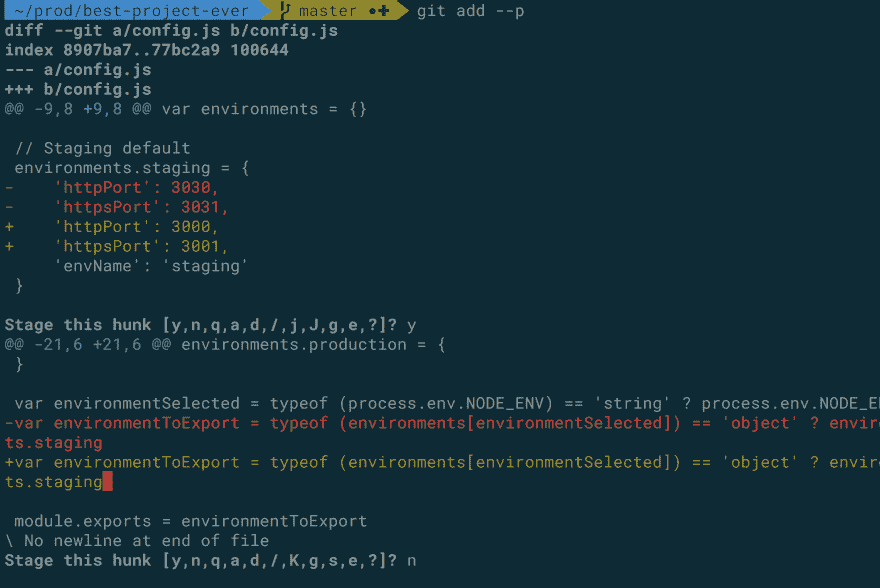
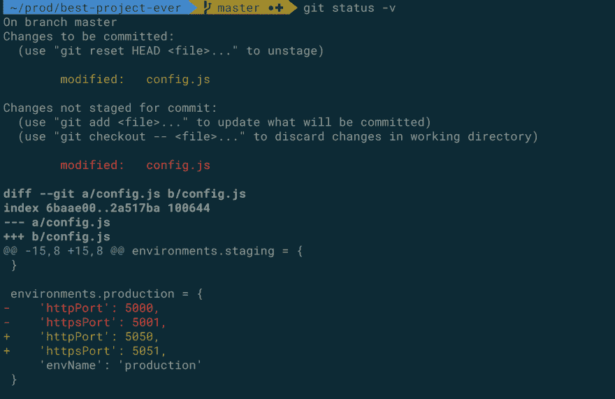

# 使用 git add -p 满怀信心地登台

> 原文：<https://dev.to/osuka42/stage-with-confidence-using-git-add--p-52i6>

来自官方文件

> -p
> - patch
> 交互选择索引和工作树之间的大块补丁，并将它们添加到索引中。这使用户有机会在将修改的内容添加到索引之前检查差异。
> 这有效地运行了 add - interactive，但是绕过了初始命令菜单，直接跳转到 patch 子命令。详见“互动模式”。

也就是说，`git add -p`允许你从你当前所有的变更中挑选出将要进行的代码块。

[T6】](https://res.cloudinary.com/practicaldev/image/fetch/s--AaB6Ybch--/c_limit%2Cf_auto%2Cfl_progressive%2Cq_auto%2Cw_880/https://thepracticaldev.s3.amazonaws.com/i/n4wofe0t28x514wbk7yc.png)

我一直用这个来避免犯一些意想不到的错误。
试试看！