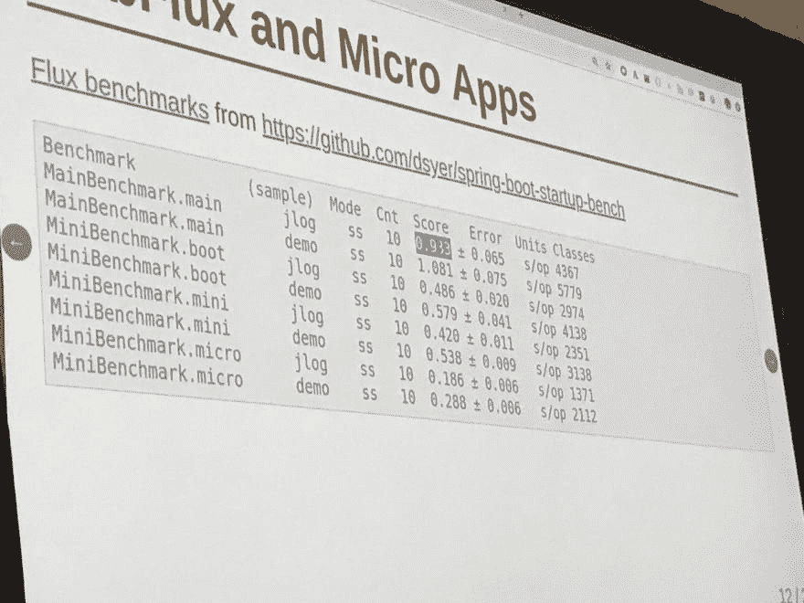
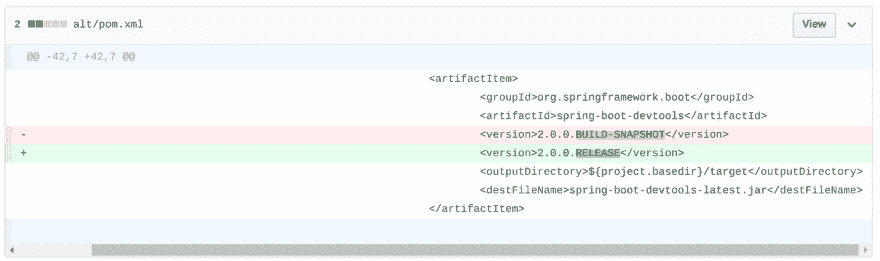
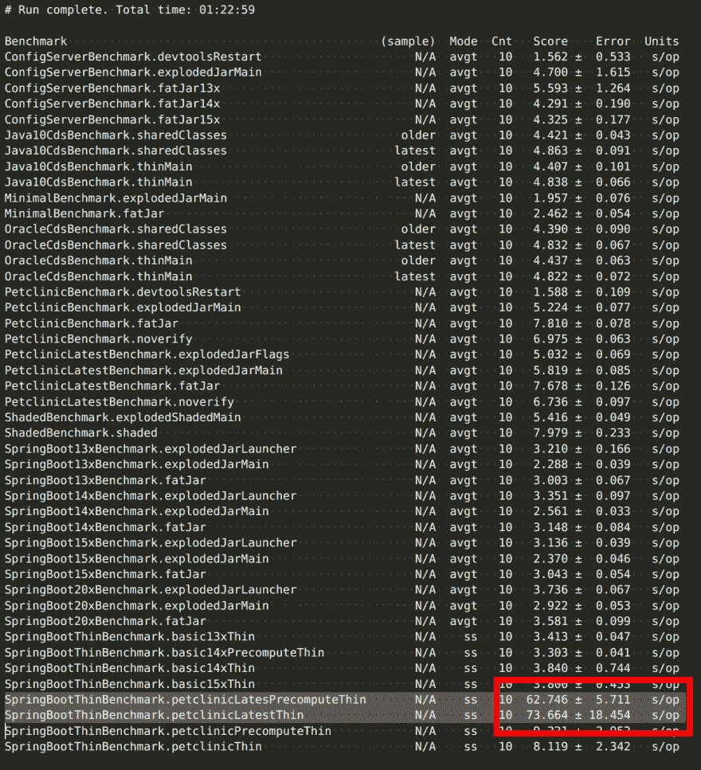
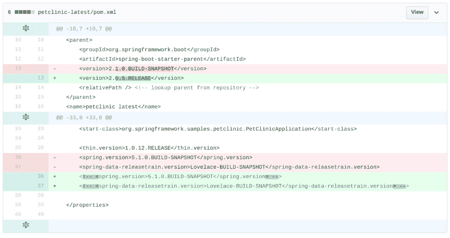
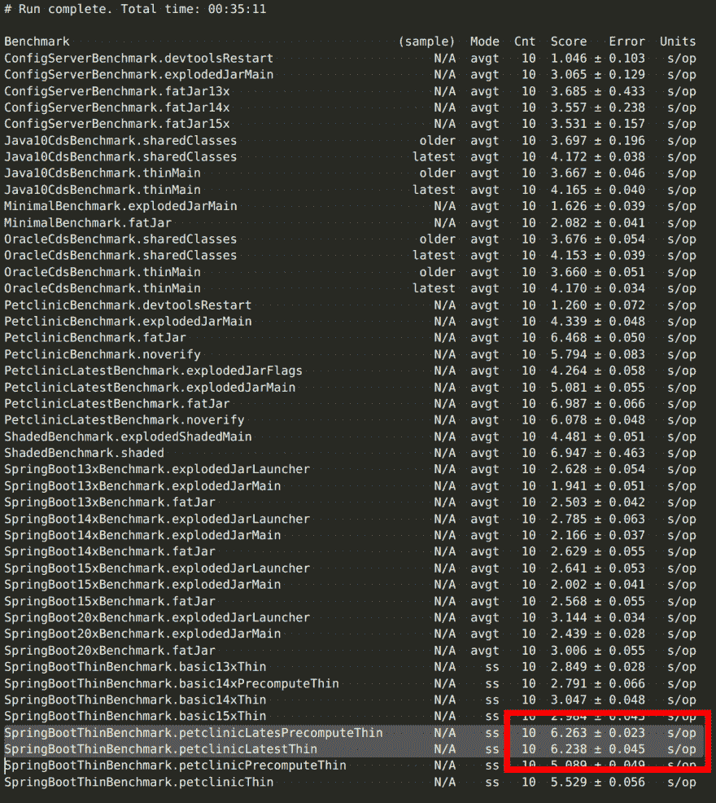

# 开始享受弹簧启动椅

> 原文：<https://dev.to/bufferings/started-enjoying-spring-boot-startup-bench-1ahj>

关注 s1p 的推文，今天早上发现一个很有意思的。

> Marcin Grzejszczak@ mgrzejszczak窟？！ [@david_syer](https://twitter.com/david_syer) 显示你可以用 Netty 在不到 0.2 秒的时间内运行一个 [@springframework](https://twitter.com/springframework) app！！！😱😱😱2018 年 9 月 27 日下午 15:24[](https://twitter.com/intent/tweet?in_reply_to=1045333296555732992)[](https://twitter.com/intent/retweet?tweet_id=1045333296555732992)[](https://twitter.com/intent/like?tweet_id=1045333296555732992)

这就是我今天喜欢这个知识库的原因。
[https://github.com/dsyer/spring-boot-startup-bench](https://github.com/dsyer/spring-boot-startup-bench)

## 构建失败

当我试图用`$ ./mvnw clean install`构建它时，它失败了。阅读错误消息后，我修改了一行代码，构建成功了。

[https://github . com/buffer ings/spring-boot-startup-bench/commit/4218301 f 4139274 Abe 489 ddaeb 09058039184 da 7](https://github.com/bufferings/spring-boot-startup-bench/commit/4218301f4139274abe489ddaeb09058039184da7)

[T2】](https://res.cloudinary.com/practicaldev/image/fetch/s--Uen5BSZO--/c_limit%2Cf_auto%2Cfl_progressive%2Cq_auto%2Cw_880/https://thepracticaldev.s3.amazonaws.com/i/5h00ihnlfsdi9t8wkqs7.png)

## 奇怪的结果

然后我用`$ (cd benchmarks/; java -jar target/benchmarks.jar)`跑了基准。但是它显示了一个奇怪的结果。

[T2】](https://res.cloudinary.com/practicaldev/image/fetch/s--8cMJpUM4--/c_limit%2Cf_auto%2Cfl_progressive%2Cq_auto%2Cw_880/https://thepracticaldev.s3.amazonaws.com/i/ye67dpui9lki23or1wgb.png)

结果太慢了。

## 瘦？

我不知道`Thin`是什么意思。然后我联系了 https://github.com/dsyer/spring-boot-thin-launcher T2，并了解到这是一个实验性的库，用来在第一次启动时将 jar 文件变薄并下载 jar 文件。

我看了基准模块的源代码，知道它是怎么运行目标的，还加了`--thin.debug=true`看调试输出。

```
java -Xmx128m -Djava.security.egd=file:/dev/./urandom \
  -XX:TieredStopAtLevel=1 \
  -jar petclinic-latest/target/petclinic-latest-1.4.2-thin.jar \
  --thin.debug=true \
  --server.port=0 
```

Enter fullscreen mode Exit fullscreen mode

## 快照？

我忘记带备忘录了，但它显示了 jar resolution 日志。我注意到 petclinic-latest 加载了一些快照版本库。

> 光之幸 Shi IBA[@ buffer ings](https://dev.to/bufferings)啊，如果 app 依赖快照版本的话 ThinJarWrapper 可能会慢一些？2018 年 9 月 29 日下午 16:35[](https://twitter.com/intent/tweet?in_reply_to=1046075993134444549)[](https://twitter.com/intent/retweet?tweet_id=1046075993134444549)[](https://twitter.com/intent/like?tweet_id=1046075993134444549)

我猜每次它都会检查 maven 资源库的快照版本。所以我修改了 pom 文件以使用发布版本。

[https://github . com/buffer ings/spring-boot-startup-bench/commit/17 FB 6 be 5511 a 928 ebf 26 cc 49d 6044 ce 6 ffd CD 73d](https://github.com/bufferings/spring-boot-startup-bench/commit/17fb6be5511a928ebf26cc49d6044ce6ffdcd73d)

[T2】](https://res.cloudinary.com/practicaldev/image/fetch/s--c6tfJrjI--/c_limit%2Cf_auto%2Cfl_progressive%2Cq_auto%2Cw_880/https://thepracticaldev.s3.amazonaws.com/i/i85av2lyzmjy9xpch7ho.png)

## 然后…

> 光之幸 Shi IBA[@ buffer ings](https://dev.to/bufferings)在我把快照换成发布版之后就变得速度不达标了(∩∀`∩)2018 年 9 月 16 日下午 16 点 57 分[](https://twitter.com/intent/tweet?in_reply_to=1046081515870965760)[](https://twitter.com/intent/retweet?tweet_id=1046081515870965760)[](https://twitter.com/intent/like?tweet_id=1046081515870965760)

[T2】](https://res.cloudinary.com/practicaldev/image/fetch/s--F2rC6sqI--/c_limit%2Cf_auto%2Cfl_progressive%2Cq_auto%2Cw_880/https://thepracticaldev.s3.amazonaws.com/i/8ld8241ii8jsh1u7y3ui.png)

虽然比较快照版本的速度与最初的目标有所不同，但我喜欢这个库，我想了解这个库的细节，特别是 tweet 图片上的 Flux 基准。