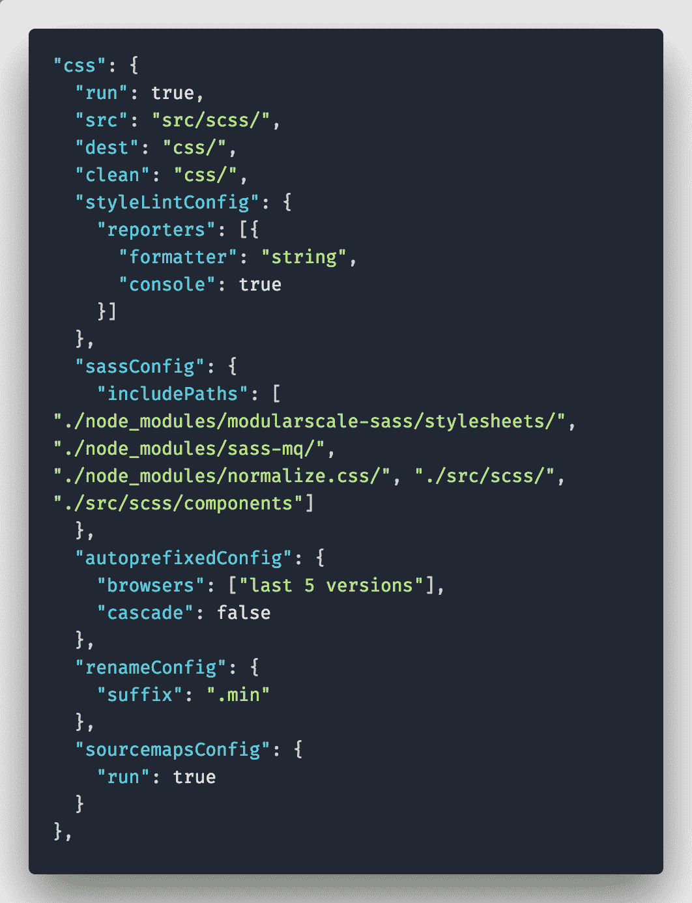

# 启动项目 CSS 的吞咽任务

> 原文：<https://dev.to/starbist/starter-project---gulp-tasks-for-css-156p>

[T2】](//res.cloudinary.com/starbist/image/upload/v1524384850/starter-project-gulp-tasks-for-css_shybn0.png)

*这篇文章最初发表于 [silvestar.codes](https://www.silvestar.codes/articles/starter-project-gulp-tasks-for-css/) 。*

这篇文章是关于 [Starter 项目](https://starter.silvestarbistrovic.from.hr/)的系列文章的一部分，这次我将解释所有关于 CSS 的吞咽任务。

## 设置

Starter Project 的想法是为所有 Gulp 任务创建一个单独的配置文件。如果你打开 [`config.json`](https://github.com/maliMirkec/starter-project/blob/master/config.json) 文件，你可以看到一个 CSS 部分。

[T2】](//res.cloudinary.com/starbist/image/upload/v1524385137/config-json-css_ha2n75.png)

第一个选项是`run`。如果设置为 true，将执行 CSS 吞咽任务。CSS 还有另外三个强制选项:

*   `src` -带有 Sass 文件的文件夹的路径，
*   `dest` -保存编译后的 CSS 文件的文件夹路径，以及
*   `clean` -执行吞咽之前将被清理的文件夹的路径(几乎总是与`dest`选项相同)。

*所有路径前都有全局`root`路径。*

其他选项有 [gulp-cssimport](https://www.npmjs.com/package/gulp-cssimport) 、 [gulp-autoprefixer](https://www.npmjs.com/package/gulp-autoprefixer) 、 [gulp-rename](https://www.npmjs.com/package/gulp-rename) 和 [gulp-sourcemaps](https://www.npmjs.com/package/gulp-sourcemaps) 。

## 萨斯

Starter Project 使用 [Sass](https://sass-lang.com/) 作为 CSS 的预处理器。正如其官网所说，萨斯是“拥有超能力的 CSS。”相当多的开发人员是这个健壮程序的支持者和用户。它有一些有用的特性，比如变量、函数和混合。

> 拥有超能力的 CSS。

Starter 项目使用 [gulp-sass](https://www.npmjs.com/package/gulp-sass) 插件将 sass 编译成 CSS。

## 进口

[gulp-cssimport](https://www.npmjs.com/package/gulp-cssimport) 是一个插件，允许通过在 CSS 文件中包含内容来导入链接文件。这意味着你不能使用原生 CSS `@import`实现，但是在大多数情况下，这被认为是一种不好的做法。

要使用这个插件，在 Sass 文件中添加`@import`语句。

```
// Plugins
@import 'normalize';
@import 'modularscale';
@import 'mq';

// Configuration
@import 'variables';
@import 'fonts';
@import 'locks';
@import 'helpers';
@import 'typography';
@import 'theme'; 
```

Enter fullscreen mode Exit fullscreen mode

您可以将`includePaths`选项添加到`sassConfig`设置中，以避免写入包含的库的完整路径。

```
"sassConfig":  {  "includePaths":  [  "./node_modules/modularscale-sass/stylesheets/",  "./node_modules/sass-mq/",  "./node_modules/normalize.css/",  "./src/scss/",  "./src/scss/components"  ]  }, 
```

Enter fullscreen mode Exit fullscreen mode

## 萨斯库

Starter 项目导入了三个库:

*   Normalize.css，
*   模块化秤，以及
*   媒体询问。

```
@import 'normalize';
@import 'modularscale';
@import 'mq'; 
```

Enter fullscreen mode Exit fullscreen mode

如果你的网站在不同的浏览器上看起来不一致，你可能需要使用 CSS 技术来重置浏览器的行为。在 Starter 项目中， [Normalize.css](https://necolas.github.io/normalize.css/) 用于此任务。

> Normalize.css 让浏览器渲染所有元素更加一致，符合现代标准。它只针对需要规范化的样式。
> 
> 尼古拉斯·加拉格尔

[模块化比例](http://www.modularscale.com/)有助于字体大小的一致性。 [modularscale-sass](https://www.npmjs.com/package/modularscale-sass) 是一个数值列表，用于确定字体大小，并在设计中营造一种和谐感。

sass-mq 是一个 Sass mixin，它帮助开发者以优雅的方式编写媒体查询。

## 自动修复

Starter Project 使用 [gulp-autoprefixer](https://www.npmjs.com/package/gulp-autoprefixer) 插件为 CSS 文件添加供应商前缀。这个插件很方便，因为开发者不必手动添加这些前缀。在`config.json`中，您可以将[自动修复选项](https://github.com/postcss/autoprefixer#options)添加到`autoprefixedConfig`设置中。

```
"autoprefixedConfig":  {  "browsers":  ["last 5 versions"],  "cascade":  false  }, 
```

Enter fullscreen mode Exit fullscreen mode

## 来源地图

源代码映射允许开发人员查看压缩资产的源代码。在 Starter 项目中， [gulp-sourcemaps](https://www.npmjs.com/package/gulp-sourcemaps) 插件用于为 CSS 和 JavaScript 文件创建源地图。如果您的环境不需要源地图，您可以通过在`sourcemapsConfig`中将`run`选项设置为`false`来禁用它。

```
"sourcemapsConfig":  {  "run":  true  } 
```

Enter fullscreen mode Exit fullscreen mode

## 缩小

[gulp-clean-css](https://www.npmjs.com/package/gulp-clean-css) 是一个 gulp 插件，充当 [clean-css](https://github.com/jakubpawlowicz/clean-css) 的包装器。在 Starter 项目中，这个插件用于 CSS 缩小。为了减少与文件名的混淆，`gulp-rename`插件用于通过给文件名添加前缀或后缀来重命名缩小的资产。

```
"renameConfig":  {  "suffix":  ".min"  } 
```

Enter fullscreen mode Exit fullscreen mode

## 林挺

> 林挺是运行一个程序来分析代码中潜在错误的过程。
> 
> 来源: [StackOverflow](https://stackoverflow.com/a/8503586)

在 Starter 项目中， [gulp-stylelint](https://www.npmjs.com/package/gulp-stylelint) 插件用于 lint CSS 文件。您可以在`config.json`文件中配置插件。

```
"styleLintConfig":  {  "reporters":  [{  "formatter":  "string",  "console":  true  }]  }, 
```

Enter fullscreen mode Exit fullscreen mode

默认设置将控制台中的错误输出为字符串。在此查看所有可用设置[。](https://www.npmjs.com/package/gulp-stylelint#options)

Stylelint 选项存储在`.stylelintrc`文件中。

```
{  "plugins":  [  "stylelint-scss",  "stylelint-order"  ],  "extends":  "stylelint-config-sass-guidelines"  } 
```

Enter fullscreen mode Exit fullscreen mode

Stylelint 也有它的插件。在 Starter 项目中，使用了 [stylelint-scss](https://www.npmjs.com/package/stylelint-scss) 和 [stylelint-order](https://www.npmjs.com/package/stylelint-order) 插件。此外，还有 [Stylelint Sass 指南](https://github.com/bjankord/stylelint-config-sass-guidelines)，用于扩展默认的 Stylelint 设置。在官网了解更多关于 Stylelint [的信息。](https://stylelint.io/)

## 奖金

对于所有 VS 代码用户，这里是如何在编辑器中使用 Stylelint 的技巧。首先，为 VS 代码安装 [stylefmt](https://marketplace.visualstudio.com/items?itemName=mrmlnc.vscode-stylefmt) 和 [Run On Save](https://marketplace.visualstudio.com/items?itemName=emeraldwalk.RunOnSave) 扩展。然后按下`cmd + shift + p`调用命令面板，并输入`open workspace settings`。

[T2】](//res.cloudinary.com/starbist/image/upload/v1524388057/open-workspace-settings_luw5ru.png)

打开工作空间设置时，添加这些设置。

```
{  "emeraldwalk.runonsave":  {  "commands":  [{  "match":  "\\.scss?$",  "cmd":  "cd ${workspaceRoot} && stylefmt -c .stylelintrc ${file}"  }]  }  } 
```

Enter fullscreen mode Exit fullscreen mode

当您保存`.scss`文件时，这应该会运行 stylelint。如果不起作用，[联系我](//mailto:%20admin@silvestarbistrovic.from.hr?Subject=VSCode)寻求帮助。

## 结论

在之前的文章中，我试图解释这个项目的想法。这篇文章将帮助你理解如何使用 Gulp 来优化、lint 和交付最好的 CSS 输出。

启动项目被认为是一个样板文件，包含了产生最佳结果的最新最佳实践。如果你对这个项目如何变得更好更有趣有任何想法或建议，请[联系我](//mailto:%20admin@silvestarbistrovic.from.hr?Subject=Starter)，打开[一个问题](https://github.com/maliMirkec/starter-project/issues/new)，或者在 [GitHub](https://github.com/maliMirkec/starter-project) 上创建[一个拉取请求](https://github.com/maliMirkec/starter-project/compare)。

请分享！🙏