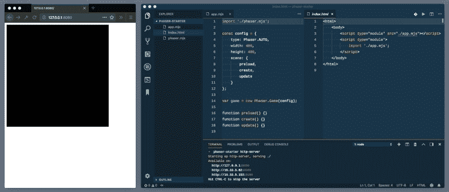

# 以快速而现代的方式启动 JS 游戏开发项目

> 原文：<https://dev.to/niorad/starting-js-game-dev-projects-the-quick--modern-way-----479b>

如果你想花更多的时间编码，而不是花更少的时间在麦片里哭泣，请阅读这篇文章。

几年前，我花了整整一个晚上试图建立一个游戏开发项目。

*   我想使用现代的 JS 特性，这些特性还不可用。搭建巴别塔花了半个小时..

*   没有模块，我无法生活，因为模块让一切井井有条。一个小时的与老网络包的战斗，他再也回不来了..

*   Phaser(游戏库)还没有真正的模块就绪。
    *默默流泪，他将编译好的包脚本标记到 head-tag 中。*

我想你已经抓住要点了。

浏览器和库已经改进到前端开发再次变得更加简单的程度。至少感觉是这样。开发者工具更加重视易用性，现在现代浏览器确实支持最有用的 ES6+特性。

为了学习和原型化现代范例，我不再需要经历任何提到的步骤。他会用这些节省下来的时间做什么？

让我们看看发生了什么变化:

*   Chrome，Safari，Edge，Firefox 都支持现代的 JS 语法，比如类，箭头函数，async/await 等等。
*   JS 模块是受支持的，所以在发送到浏览器之前不需要捆绑和编译。
*   Phaser 已经到了第 3 版，很容易将其作为一个模块导入。

好吧，但这到底是怎么回事呢？

首先但并非最不重要的是，ol' index.html:

```
<html>
    <body>
        <script type="module" src="./app.mjs"></script>
        <script type="module">
            import './app.mjs';
        </script>
    </body>
</html> 
```

Enter fullscreen mode Exit fullscreen mode

我打赌你注意到了“app.mjs”文件的“mjs”结尾。意思是“迈克尔·杰克逊剧本”(我觉得)。这样浏览器就知道它应该以模块的形式加载文件。我只能在“mjs”文件中使用“import”语法。

他从来没有承认过，但他是在开玩笑。mjs 真正的意思是

先管好 app.js，刚够 Phaser 上手:

```
import './phaser.mjs';

const config = {
    type: Phaser.AUTO,
    width: 400,
    height: 400,
    scene: {
        preload,
        create,
        update
    }
};

var game = new Phaser.Game(config);

function preload() {}
function create() {}
function update() {} 
```

Enter fullscreen mode Exit fullscreen mode

我还需要相位枪！Bzzzssshhhhh！让我们从他们的[版本第](https://github.com/photonstorm/phaser/releases)页中获取它，并将“phaser.js”重命名为“phaser.mjs ”,这样它就被认为是一个模块。

现在这里有一个小小的警告:“mjs”——文件只有在我的服务器以正确的 MIME 类型传输它们时才会被加载和解析。我无法让它与普通的 PHP 服务器一起工作(我通常使用 MacOS 的“PHP-S localhost:9999”-命令)。自从他听到琼恩·布洛在他的溪流上使用“警告”这个词，他就想用它了。

基于节点的服务器似乎工作得更好。http-server(NPM install-g http-server)正在按预期处理文件。我可以在我的项目文件夹中执行“http-server ”,并直接访问它输出的链接。

万岁！我在浏览器中看到一个空画布和 Phaser。以下是您需要的所有内容:

[T2】](https://res.cloudinary.com/practicaldev/image/fetch/s--zCN0ANsG--/c_limit%2Cf_auto%2Cfl_progressive%2Cq_auto%2Cw_880/https://thepracticaldev.s3.amazonaws.com/i/2r00wklads1wm5l0evyk.jpg)

恐怖 Vacui 来了，不过那是另一篇文章。

在我的目录中有三个文件:

*   index.html
*   app.mjs
*   相位枪，mj

不需要 node_modules 是不是很棒？
*跟旧时代差不多，不是吗？*

☝️不要误会我。如果是关于性能、运输和支持各种各样的浏览器，我绝对会想捆绑、通天塔和缩小我的代码。这一切都是为了让你的想法尽快出来，同时仍然能够使用现代功能。再也没有晚上靠投机建立东西了。他不会又错过了他女儿的第二次婚礼吧！

一旦我决定全身心投入捆绑和传输，以后设置它就不会有更多的工作了。JS 文件可以保持原样，仍然可以与 Webpack 或 package 一起使用。

准备编码了吗？查看 Phaser 3 的精彩介绍！