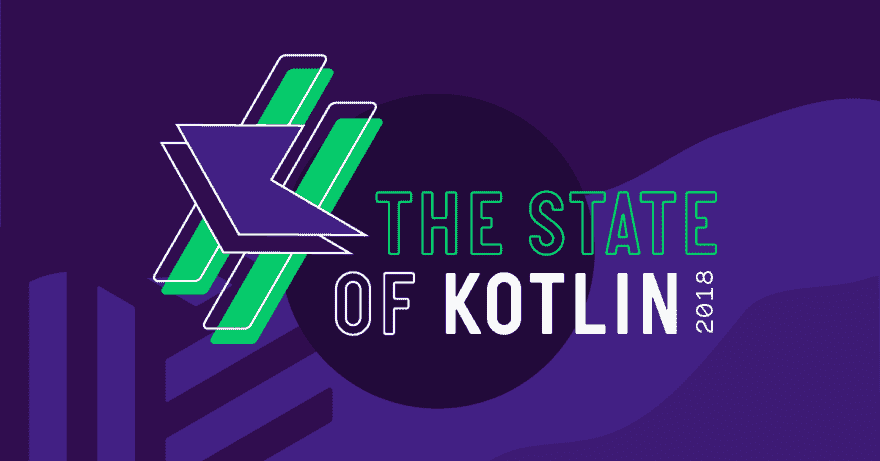
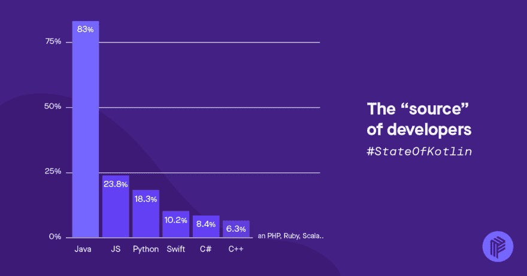
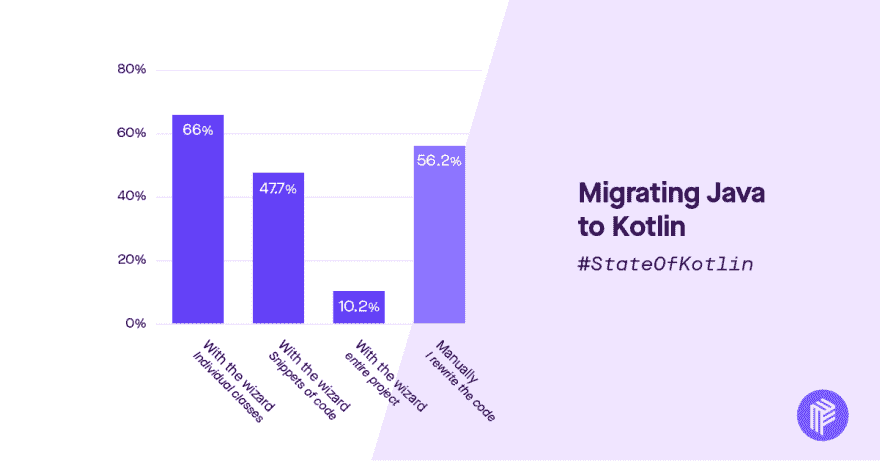

# 《科特林报告 2018》已经发布！

> 原文：<https://dev.to/zmarkan/state-of-kotlin-report-2018-has-landed-51ch>

[T2】](https://res.cloudinary.com/practicaldev/image/fetch/s--82ITjv0O--/c_limit%2Cf_auto%2Cfl_progressive%2Cq_auto%2Cw_880/https://thepracticaldev.s3.amazonaws.com/i/8csz1mvsptxrqtdakfo2.png)

今年年初，我们对 Kotlin 的状态进行了一项调查，询问开发人员对这种语言、其生态系统以及他们如何学习这种语言的想法、意见和经验。我们收到了来自世界各地超过 25000 名 Kotliners 的热烈响应(令人印象深刻，因为我们最初的希望是只收到 1000 个响应！).

但是我们为什么要这么做呢？

首先，我们喜欢在 [Pusher](https://pusher.com) 的 Kotlin，在那里我们为希望在他们的应用中建立协作和通信功能的应用开发者提供实时 API。自 2017 年以来，我们所有新的 Android SDKs 都是在 Kotlin 中构建的。

我们也知道 Kotlin 语言在开发人员中广受欢迎，这让他们中的大多数人非常高兴。最后，我们认为调查既有帮助又有趣，所以我们决定为 Kotlin 社区创建一个。人们可以用它来说服他们的朋友和同事加入到 Kotlin 中来。

我们发现的一些事情…

*   Android 是巨大的，大约 80%的受访者说他们是 Android 开发者。
*   Kotliners 是一群通晓多种语言的人，受访者称他们使用 30 多种其他编程语言(尽管 Java 很庞大)

[T2】](https://res.cloudinary.com/practicaldev/image/fetch/s--AvSfFppg--/c_limit%2Cf_auto%2Cfl_progressive%2Cq_auto%2Cw_880/https://thepracticaldev.s3.amazonaws.com/i/8199uv5rjq40znus873y.png)

*   说到 Java，两种语言之间的互操作性，以及将 Java 转换成 Kotlin 的工具帮助了将近 97%的开发人员迁移他们的代码。

[T2】](https://res.cloudinary.com/practicaldev/image/fetch/s--_Sz6SVMN--/c_limit%2Cf_auto%2Cfl_progressive%2Cq_auto%2Cw_880/https://thepracticaldev.s3.amazonaws.com/i/thklb337y76q60qxmrdx.png)

阅读他们在迁移中取得的成功，以及报告中的更多信息[。](https://pusher.com/state-of-kotlin)

总而言之，Kotlin 正在变得强大，似乎它将继续增长，其生态系统也将继续增长。

我们预测，随着时间的推移，越来越多的增长将来自新的开发人员，对于他们来说，Kotlin 将是他们第一次涉足编程，这可能会发生，他们将根据 Kotlin 来判断其他语言。它的特性和灵活性带来了巨大的生产力，这也可能极大地影响其他编程语言的开发。

如果你对此感兴趣，冲浪吧🏄pusher.com/state-of-kotlin 在去[‍♀️](https://pusher.com/state-of-kotlin)查看报告时，看到了一些闪亮的图表📊，快乐。