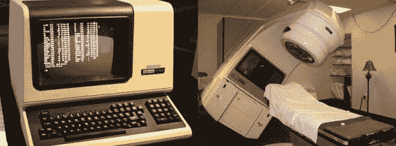
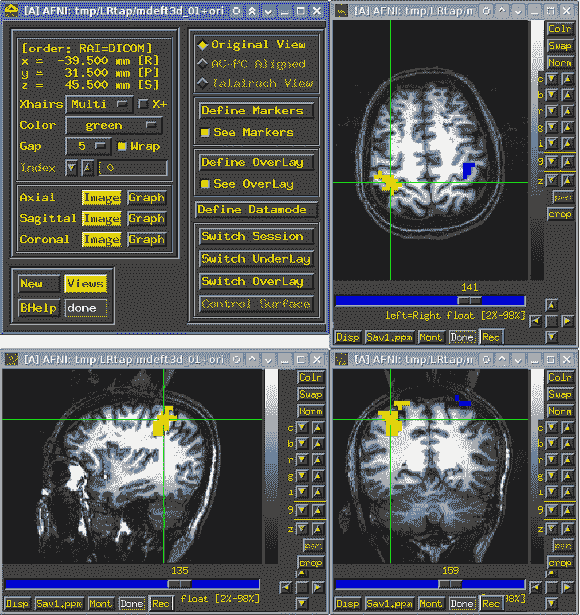
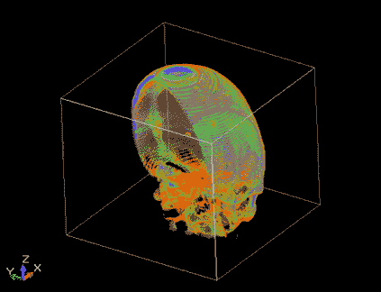

# 静态代码分析器:医疗软件的附加保险

> 原文：<https://dev.to/alexastva/static-code-analyzer-the-additional-insurance-of-the-medical-software-3d94>

软件缺陷不仅会导致物质损失，还会损害人类健康。例如，如果突然有一个场景在错误的时间出现在舞台上，剧院舞台上的演员可能会受伤。然而，代码中的错误与医疗软件的健康损害之间的联系更加明显。就说这个话题吧。

本文关注的是为医疗设备创建程序的开发团队。我希望他们不会无动于衷，会检查他们的代码。让我们回忆一下两个著名的案例，在这两个案例中，与医学相关的程序错误成为了坏消息的原因。

[T2】](https://res.cloudinary.com/practicaldev/image/fetch/s--GN5v2GGr--/c_limit%2Cf_auto%2Cfl_progressive%2Cq_auto%2Cw_880/https://www.viva64.com/medimg/content/b/0564_Medic/image4.png)

首先，它是由放射治疗 Therac-25 装置的错误引起的一系列悲剧事件。这种装置在 1985 年 6 月至 1987 年 1 月期间至少造成了 6 次辐射过量，一些病人接受了数万拉德的剂量。至少有两人直接死于辐射过量。设备的软件缺陷是悲剧的原因，主要问题是不正确的安全策略。

[T2】](https://res.cloudinary.com/practicaldev/image/fetch/s--uY8CHvNL--/c_limit%2Cf_auto%2Cfl_progressive%2Cq_auto%2Cw_880/https://www.viva64.com/medimg/content/b/0564_Medic/image6.png)

其次，软件漏洞也会间接造成危害。[例如](http://www.pnas.org/content/early/2016/06/27/1602413113)，核磁共振扫描仪软件中的错误引发了关于 40 000 项研究的问题。几十年来，神经科学家和认知心理学家一直使用统计程序 AFNI、SPM 和 FSL 来分析 [fMRI](https://en.wikipedia.org/wiki/Functional_magnetic_resonance_imaging) 数据。事实证明，由于不正确的算法，这些程序可能会返回高达 70%的假阳性结果，而不是预计的 5%。

如您所见，代码错误不仅会导致诸如崩溃或数据丢失之类的麻烦，还会导致更严重的后果，这些后果会影响许多人多年的生活和健康。

此外，开发人员不仅要对自己的代码负责，还要对所用库的代码负责。这种情况是完全真实的，当由于来自第三方库的错误而在创建图像/视频时出现伪影时，这将导致诊断时的混乱。

这不是一个抽象的理论问题。我自己也面临过这样的情况，在将程序移植到 64 位系统时，导致 MRI 数据处理错误的错误开始显现。幸运的是，错误非常明显:图像的一大块碎片不见了。然而，错误可能不那么明显，并且存在于一些细节的不正确显示中，这将更难检测出来。

[T2】](https://res.cloudinary.com/practicaldev/image/fetch/s--mR9B-H8p--/c_limit%2Cf_auto%2Cfl_progressive%2Cq_auto%2Cw_880/https://www.viva64.com/medimg/content/b/0564_Medic/image8.png)

关于这个错误的更多信息可以在文章“ [PVS-Studio project - 10 年的失败和成功](https://www.viva64.com/en/b/0465/)”中找到。正是这一点和其他一些 [64 位错误](https://www.viva64.com/en/t/0002/)启发了 Viva64 工具的创建，该工具后来变成了 PVS-Studio 静态代码分析器。

不可能预测哪里会出错，哪些错误会导致麻烦。误差可能很复杂，但不一定会影响生活，它潜伏在数据处理和显示的算法中。我可以想象这样一种情况，由于比较函数中的错误，将选择错误患者的数据进行处理，或者描述患者状况的程序不会注意到数据结构中的一些差异。

我邀请所有读者开始使用 PVS-Studio 静态代码分析器。是的，分析器和其他工具一样，不能保证你的程序没有错误。然而，它成为了对抗臭虫战场上的一道额外的防线。它可以帮助在发展的早期阶段发现许多错误，并可能有助于挽救某人的健康。

阅读更多-[https://how not 2 code . com/2018/03/21/PVS-studio-the-additional-insurance-of-the-medical-software/](https://hownot2code.com/2018/03/21/pvs-studio-the-additional-insurance-of-the-medical-software/)