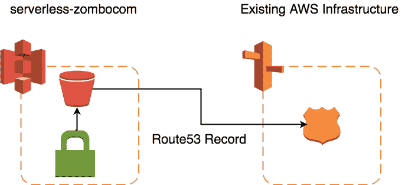
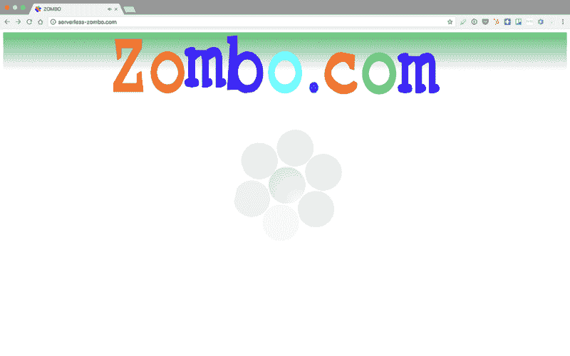

# 基于 AWS S3 的无服务器框架的静态网站

> 原文：<https://dev.to/tmclaughbos/static-websites-on-aws-s3-with-serverless-framework-21b7>

[T2】](https://res.cloudinary.com/practicaldev/image/fetch/s--AtJrb0JO--/c_limit%2Cf_auto%2Cfl_progressive%2Cq_auto%2Cw_880/https://www.serverlessops.io/hs-fs/hubfs/blog/WWW%2BS3.png%3Fnoresize)

在寻找一个项目时，我注意到有一个非常简单的无服务器模式，我没有看到太多关于它的文章:网站托管。我们通常会立即想到 Lambda 和 AWS serverless，但它不仅仅是功能即服务(FaaS)。像托管一个静态网站这样的简单用例不需要 EC2 就可以完成，并且可以使用[无服务器框架](https://serverless.com/framework/)进行管理。

让我们来看看如何使用无服务器框架部署静态网站。即使是动态网站通常也有静态资产，下面的信息应该对任何在 AWS 上构建网站的人都有用。

## 利用 S3 托管一个静态网站

如果你正在建立一个公司内部网站，网站原型，或者只是一个你不想看到太多流量的网站，S3 可能是你的正确选择。为什么？

*   S3 提供了一个简单方便的方法来托管一个静态网站。
*   S3 为规模较小的网站提供了一个简单而又便宜的解决方案。

尽管 S3 主机有其局限性。对于具有分布式观众的高流量网站，CloudFront 更适合静态 web 托管。另外，如果你需要 SSL 和自己的域名，那么你就需要 CloudFront。但是，根据您的需要和要求，您可能不需要增加复杂性和成本。我们将在以后的帖子中解决添加 CloudFront 的问题。

## 我们在建造什么

我们将部署一个包含声音和图形的静态 HTML 页面的网站。如果你已经在互联网上呆了很长时间，你会喜欢这个即将被部署的站点。如果这个网站对你来说是新的，那么欢迎来到 Zombo.Com！(原来的网站是用 Flash 写的，这是基于原来的 [HTML5 端口](https://github.com/bertrandom/HTML5-Zombocom)。)它简单、有趣，证明了您可以使用无服务器做任何事情。

## 它是如何建成的

现在，让我们来看一下如何构建这个项目！该项目将需要创建以下资源:

*   S3 水桶
*   S3 水桶政策
*   Route53 资源记录

我们假设环境中已经存在 Route53 区域资源。根据您的需要，您可以在自己的项目中创建一个区域。因为区域通常是共享资源，所以我选择从 serverless-zombocom 项目中单独创建区域。

该项目大致如下:

[T2】](https://res.cloudinary.com/practicaldev/image/fetch/s--SBsG5COv--/c_limit%2Cf_auto%2Cfl_progressive%2Cq_auto%2Cw_880/https://www.serverlessops.io/hs-fs/hubfs/blog/Serverless%2520Zombo%2520S3%2520Diagram.png%3Ft%3D1518484684999%26width%3D686%26height%3D313%26name%3DServerless%2520Zombo%2520S3%2520Diagram.png)

### 无服务器框架设置

我们的项目是用无服务器框架部署和管理的。与其他无服务器管理框架相比，它的优势之一是其强大的插件生态系统(我们很快就会谈到)。我们需要[节点。JS 和 NPM 为了使用它而安装的](https://nodejs.org/en/download/)。一旦这些都安装好了，我们就可以安装无服务器框架做以下事情:

```
npm install -g serverless 
```

Enter fullscreen mode Exit fullscreen mode

安装了无服务器框架后，我们可以继续创建我们的项目了。`serverless`命令可以使用模板创建不同类型的项目。然而，因为我们没有使用 Lambda，所以我们选择什么并不重要。这个 *hello-world* 模板就足够好了。

```
serverless create -t hello-world -n serverless-zombocom -p serverless-zombo.com
cd serverless-zombocom 
```

Enter fullscreen mode Exit fullscreen mode

将要创建的是一个 *serverless.yml* 模板文件、一个基本的处理程序脚本(我们将丢弃它)和一个. gitignore。

无服务器框架本身不处理上传文件到 S3 桶，但这是它的插件系统真正闪光的地方。您不会受限于无服务器框架的现有功能。其他人认为将文件上传到 S3 存储桶的功能也很有用。我们将使用[无服务器 s3 同步](https://github.com/k1LoW/serverless-s3-sync)插件；这让我们可以定义要上传的文件的本地目录，以及将它们上传到的 Bucket 和可选前缀。

通过运行以下命令安装插件:

```
serverless plugin install -n serverless-s3-sync 
```

Enter fullscreen mode Exit fullscreen mode

既然我们的项目是用无服务器框架设置的，让我们继续配置项目的资源。

### 项目布局

现在让我们简单看一下我们项目的布局。我们已经删除了 *handler.js* 文件，因为我们不再需要它了。你几乎可以忽略 *package.json* 、 *package-lock.json 和* node_modules。它们是 NPM 包装管理的结果。README.md 是我们可以为人们提供一些关于这个项目的快速文档的地方。

已经添加了 *static/* 目录，并且站点静态资产已经放在那里。任何在*静态/* 目录下的文件都会被上传到 S3。在那个目录里，我们拥有 zombo.com 所有的荣耀

*serverless.yml* 文件是我们配置服务的地方。我们将回到这个文件，因为它是我们项目的驱动力。

下面是目录结构的样子——为了清楚起见， *node_modules/* 的内容被删减了。

```
serverless-zombo.com
├── README.md
├── node_modules
│ └── <SNIP>
├── package-lock.json
├── package.json
├── serverless.yml
└── static
├── favicon.ico
├── index.html
├── zombo.mp3
├── zombo.ogg
└── zombocom.png 
```

Enter fullscreen mode Exit fullscreen mode

### 项目资源

我们现在将开始使用 *serverless.yml* 来配置我们的服务。我已经为我们的开始清理了一些文件。这就是 *serverless.yml* 现在的样子。

无服务器。yml :

```
service: serverless-zombocom
plugins:
  - serverless-s3-sync

custom:

provider:
  name: aws
  runtime: nodejs6.10 
```

Enter fullscreen mode Exit fullscreen mode

我们没有功能，所以我删除了这一部分。我已经把插件部分移到了顶部。我还将提供者设置为 AWS。注意:我没有修改运行时，因为它需要被定义，即使它与我们的项目无关。

注意空的*自定义*部分。在 *serverless.yml* 中的自定义部分，您可以定义将在模板中的其他地方重用的配置和变量。在后面的那一节中，我们将添加像 S3 文件同步配置和站点的 DNS 记录信息这样的内容。

#### AWS S3 斗和斗策

我们将从添加静态文件将驻留的 S3 桶开始。

无服务器。yml :

```
resources:
  Resources:
    StaticSite:
      Type: AWS::S3::Bucket
      Properties:
        AccessControl: PublicRead
        BucketName: ${self:custom.siteName}
        WebsiteConfiguration:
          IndexDocument: index.html 
```

Enter fullscreen mode Exit fullscreen mode

对于 S3 网站托管， *AccessControl* 属性必须设置为 [PublicRead](https://docs.aws.amazon.com/AWSCloudFormation/latest/UserGuide/quickref-s3.html#scenario-s3-bucket-website) 。*网站配置*是我们为网站定义索引文档的地方。该值与*静态/* 目录中的*index.html*相同。通常，您不需要命名一个 bucket，因为 CloudFormation 生成的 bucket 名称就可以了，但这里不是这样。我们将创建一个 Route53 别名记录，在此过程中，S3 地址段名称和 DNS 记录名称需要匹配。我们将添加一个[无服务器变量](https://serverless.com/framework/docs/providers/aws/guide/variables/)作为 BucketName，并添加一个键到*自定义*部分，定义如下:

无服务器。yml :

```
custom:
  siteName: serverless-zombo.com 
```

Enter fullscreen mode Exit fullscreen mode

为了授予对静态内容的访问权，我们附加了一个许可的存储桶策略。

无服务器。yml :

```
StaticSiteS3BucketPolicy:
      Type: AWS::S3::BucketPolicy
      Properties:
        Bucket:
          Ref: StaticSite
        PolicyDocument:
          Statement:
            - Sid: PublicReadGetObject
              Effect: Allow
              Principal: "*"
              Action:
              - s3:GetObject
              Resource:
                Fn::Join: [
                  "", [
                    "arn:aws:s3:::",
                    {
                      "Ref": "StaticSite"
                    },
                    "/*"
                  ]
                ] 
```

Enter fullscreen mode Exit fullscreen mode

bucket 策略将 *s3:GetObject* 授予 bucket 中任何对象的所有主体。在 S3 存储桶资源中，我们没有提供存储桶名称，这没有问题。注意在*桶*和*资源*下，我们使用 CloudFormation [Ref](https://docs.aws.amazon.com/AWSCloudFormation/latest/UserGuide/intrinsic-function-reference-ref.html) 内在函数来获取作为堆栈一部分的桶的名称。

添加了 S3 存储桶资源后，我们将添加 S3 存储桶同步信息。这是在前面提到的*自定义*部分完成的。

无服务器。yml :

```
custom:
  siteName: serverless-zombo.com
  s3Sync:
    - bucketName: ${self:custom.siteName}
      localDir: static 
```

Enter fullscreen mode Exit fullscreen mode

*s3Sync* 键接受一个要同步的桶和目录对的列表。 *bucketName* 键将 S3 存储桶的名称作为我们之前添加的 set bt BucketName。 *localDir* 键是要同步到 S3 的目录的相对路径，该目录是 *static/* 。附加配置选项可以在插件[文档](https://github.com/k1LoW/serverless-s3-sync)中找到。现在，当部署服务时， *static/* 的内容将被上传到 S3。

随着 S3 存储桶的配置，是时候设置 DNS 了，这样人们就可以用一个容易记住的域名访问网站。

#### Route53 记录

我们现在将创建一个 Route53 记录，它将把*serverless-zombo.com*指向 S3 桶。不过，我们不会用 CNAME！Route53 不允许在域的顶点使用 CNAMEs，但是我们可以创建一个 A 记录，它是 AWS 资源的别名，就像 S3 存储桶一样。

无服务器。yml :

```
DnsRecord:
      Type: "AWS::Route53::RecordSet"
      Properties:
        AliasTarget:
          DNSName: ${self:custom.aliasDNSName}
          HostedZoneId: ${self:custom.aliasHostedZoneId}
        HostedZoneName: ${self:custom.siteName}.
        Name:
          Ref: StaticSite
        Type: 'A' 
```

Enter fullscreen mode Exit fullscreen mode

该记录需要一个由 DNS 名称和托管区域 ID 组成的别名目标。我们将回到下面的内容。注意，name 属性是对 StaticSite S3 存储桶资源的引用。S3 存储桶的名称和 DNS 记录需要匹配，通过使用资源引用而不是无服务器变量，我们确保 Cloudfromation 在尝试更新 DNS 之前创建 S3 存储桶。

配置 Route53 记录后，需要在文件的 custom 部分设置 *aliasDNSName* 、 *aliasHostedZoneId* 和 *siteName* 键。

无服务器。yml :

```
custom:
  hostedZoneName: serverless-zombo.com
  aliasHostedZoneId: Z3AQBSTGFYJSTF # us-east-1
  aliasDNSName: s3-website-us-east-1.amazonaws.com
  s3Sync:
    - bucketName: ${self:custom.hostedZoneName}
      localDir: static 
```

Enter fullscreen mode Exit fullscreen mode

*SiteName* 值被用作应该在其中创建记录的 Route53 域的名称，因为我们没有使用子域，所以它兼作要创建的记录的名称。 *aliasHostedZoneId* 是 S3 桶域的区域 Id。我们使用 us-east-1 并给出了它的值。要获得适当的 *aliasHostedZoneId* 值，请参见 AWS [文档](https://docs.aws.amazon.com/general/latest/gr/rande.html#s3_region)。另请注意，如果我们更改了部署的区域，我们也必须更新该值。

## 正在部署

完成 serverless.yml 的编写后，我们现在可以进行部署了。

```
serverless deploy -v 
```

Enter fullscreen mode Exit fullscreen mode

现在，如果我们浏览到[http://serverless-zombo.com](http://serverless-zombo.com)，我们又回到了互联网的全盛时期。

[T2】](https://res.cloudinary.com/practicaldev/image/fetch/s--HgEj8hgl--/c_limit%2Cf_auto%2Cfl_progressive%2Cq_auto%2Cw_880/https://www.serverlessops.io/hs-fs/hubfs/blog/Serverless%2520Zombo%2520Home%2520Page.png%3Ft%3D1518484684999%26width%3D800%26height%3D500%26name%3DServerless%2520Zombo%2520Home%2520Page.png)

## 结论

这只是使用 S3 在 AWS 上创建静态站点的一种方式。它既快又简单，但也有其局限性。首先，除非您想通过 S3 桶 URL 而不是创建的 DNS 记录来访问站点，否则 SSL 会因为无效的证书而抛出一个错误。S3 没有我们正在使用的 DNS 域的 SSL 证书。此外，我们仅限于单个 AWS 区域，这意味着该站点会受到 us-east-1 中的问题的影响，如果该站点变得不可用，我们需要重新部署。S3 在提供网络内容方面也不是最快的。

使用 CloudFront 可以让我们处理 SSL 证书，并将我们的内容分发到多个边缘位置，以避免在单个数据中心区域出现问题，并提供更快的响应时间。这会让 CloudFront 变得更好吗？你为什么会使用 S3 服务一个网站呢？...

答案在于，要构建的正确系统取决于您的需求。CloudFront 也是一个额外的成本。如果您没有 SSL 需求，您可以处理 us-east-1 中偶尔出现的问题，稍微慢一点(可能不明显)的响应时间差不是问题，那么这可能是您的完美解决方案。

如果这不是你的正确解决方案，我们将在下面的博客中介绍 S3 支持的 CloudFront。

*这最初出现在 [ServerlessOps 博客](https://www.serverlessops.io/blog)上。请访问以阅读更多我们的作品！*

[T2】](https://res.cloudinary.com/practicaldev/image/fetch/s--JjbwS03H--/c_limit%2Cf_auto%2Cfl_progressive%2Cq_66%2Cw_880/https://track.hubspot.com/__ptq.gif%3Fa%3D277116%26k%3D14%26r%3Dhttps%253A%252F%252Fwww.serverlessops.io%252Fblog%252Fstatic-websites-on-aws-s3-with-serverless-framework%26bu%3Dhttps%25253A%25252F%25252Fwww.serverlessops.io%25252Fblog%26bvt%3Drss)