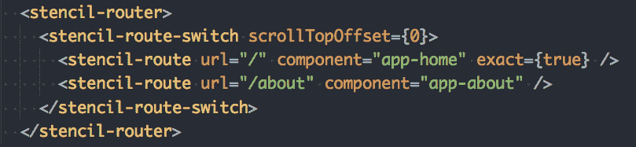
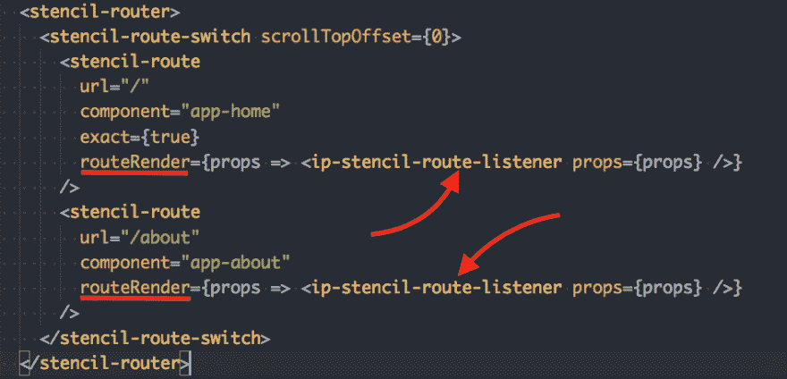
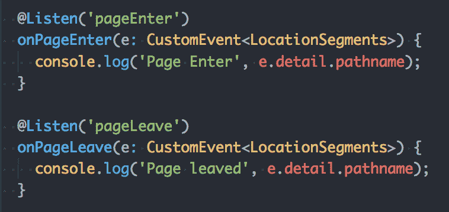

# 模板路由器事件

> 原文：<https://dev.to/wanoo21/stenciljs-router-events-23n>

如果你看一下**模板路由器**的文档，你不会发现任何关于**打开**和**关闭**页面事件的信息，那么我们怎么会听到它们呢？我为这个范围做了一个简单的库。

假设我们有一个由包含不止一页的[模板](https://stenciljs.com/)编译的应用程序。现在，我们想在我们的页面上添加**谷歌分析**。让我们看看如何实现这个目的。

这里有一个标准的模版路由器配置:

[](https://res.cloudinary.com/practicaldev/image/fetch/s--pmfnZ_we--/c_limit%2Cf_auto%2Cfl_progressive%2Cq_auto%2Cw_880/https://yon.fun/conteimg/2018/10/stencil-default-router.png)

没什么特别的，我们只是给一个**模板-路由**组件提供一些道具，以便基于*历史*链接动态生成我们的 **app-home** 和 **app-about** 组件。更多关于[如何设置模版路由器，查看本文](https://yon.fun/stencil-router-step-by-step/)。

现在让我们安装**IP-stencil-route-listener**库并做一些修改:

```
npm i ip-stencil-route-listener 
```

安装后，我们必须在`<stencil-riuter />`的功能下的**router 内添加`<ip-stencil-route-listener />`组件。看一看红色线条:

[](https://res.cloudinary.com/practicaldev/image/fetch/s--UTMND90V--/c_limit%2Cf_auto%2Cfl_progressive%2Cq_auto%2Cw_880/https://yon.fun/conteimg/2018/10/stencil-route-listener-1.png)**

没什么！现在每当你进入或离开一个页面时，EventListener 将触发 *pageEnter* 或 *pageLeave* 事件。这些事件的名字谈论他们自己。

请看这张图片:

[T2】](https://res.cloudinary.com/practicaldev/image/fetch/s--ylT6yA7L--/c_limit%2Cf_auto%2Cfl_progressive%2Cq_auto%2Cw_880/https://yon.fun/conteimg/2018/10/stencil-listen-page-events.png)

因此，让我们在*页面添加谷歌分析，进入*事件:

```
 @Listen('pageEnter')
  onPageEnter(e: CustomEvent<LocationSegments>) {
    // This is a Goolge Analytics event
    ga('send', 'pageview', e.detail.pathname);
  } 
```

[这里的](https://stencil-route-listener.netlify.com/)就是这个演示的一个例子。

考虑使用这个库，直到有一些官方事件支持被**模板路由器**委托。我估计他们很快就会实施类似的活动。