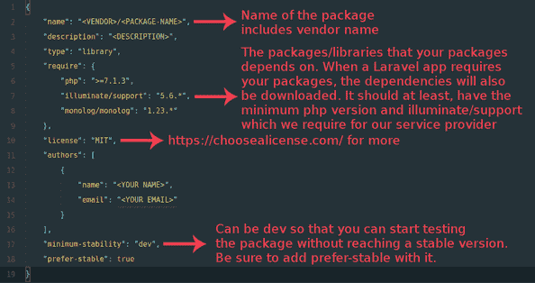

# Laravel 软件包开发分步指南

> 原文：<https://dev.to/gauravmak/step-by-step-guide-to-laravel-package-development-4nj1>

你是否好奇开源的 Laravel 包是如何从零开始开发的？或者您不确定任何特定的功能是否是 Laravel 包的良好用例？

今天就来说说这些以及其他相关的问题。

我们都是 Laravel 及其生态系统的粉丝，因为它的简单性和可扩展性。软件包在推动 it 发展的过程中发挥了重要作用。尤其是拉勒维尔、[斯帕蒂](https://spatie.be/en/opensource)、[巴里 vd 的官方包。](https://github.com/barryvdh/)，还有其他人让我们的生活和代码变得更好。

### 为什么您应该构建一个 Laravel 包

**更好的编码技能**

开源是神奇的。将你的代码公之于众会让你在开始时有点脆弱，但会让你发挥出最好的一面。对做错事的恐惧阻止你去做每一件事，但这总是值得的。Laracasts 关于[开源项目管理](https://laracasts.com/series/how-to-manage-an-open-source-project)的系列文章可以给你很大帮助，如果你对 GitHub 不是很熟悉的话。

更多(更好)的工作

你将建立自己的品牌，从而带来更多的工作。

> “空谈是廉价的。给我看看代码。”-Linus Torvalds(Linux 和 Git 的创造者)

随着开发人员和客户看到您的代码并从中受益，您将获得更多的认可。

**节省时间**

当您将在多个项目中使用的一段代码转换成一个包时，您将会节省大量的时间。“干”方法并不是什么新鲜事。我们知道它的好处。

简而言之，开源包开发让你的开发者生活更美好。

既然我们对继续进行包开发的需要有了更好的了解，现在让我们一起做一个吧。

另外，如果已经有了自己选择的开源包/库，那么为现有的解决方案做贡献也是一个很好的开始。

#### 从零开始的新 Laravel 包

我说过我们将打造一个真正的产品包。在考虑一个例子时，我能想到的唯一好的选择是我自己的包之一- [Laravel Log Enhancer](https://github.com/freshbitsweb/laravel-log-enhancer) 。它足够短，可以很快地涵盖包开发的重要部分，从而正确地学习基础知识。

[https://www.youtube.com/embed/DQnUyQEcs_A](https://www.youtube.com/embed/DQnUyQEcs_A)

如果你以前没有创建过任何 Laravel 包，我建议你和我一起做。会很有趣的。即使你做了同样的包，你也会有更多的自信，并会被激励去立即做出改变或创建一个新的包。所有的步骤都是不可撤销的——你不会有任何损失。真正的学习是实际地做事情。我们的要求是基本的。如果你已经在本地运行任何一款 Laravel 应用，你就拥有了全部。

我们开始吧。

**1。新的包目录**

用包的名称创建一个目录。我就叫它`laravel-log-enhancer`。

```
mkdir laravel-log-enhancer && cd laravel-log-enhancer 
```

Enter fullscreen mode Exit fullscreen mode

**2。对 git 的爱**

初始化 git 存储库。我们需要 GitHub repo 把包裹放到网上。

```
git init 
```

Enter fullscreen mode Exit fullscreen mode

**3。composer.json**

每个包都以一个`composer.json`文件开始。让我们创造它。创建它最简单的方法是启动`init`命令。

```
composer init 
```

Enter fullscreen mode Exit fullscreen mode

或者你可以从这个存根中复制它，并做相应的修改。

[T2】](https://res.cloudinary.com/practicaldev/image/fetch/s--TDyNdoRP--/c_limit%2Cf_auto%2Cfl_progressive%2Cq_auto%2Cw_880/https://dev-to-uploads.s3.amazonaws.com/i/t4kxstetmqwseoh7rkcf.png)

提交更改。不是强制性的，但我们会在每一个独特的步骤后作为一个好习惯去做。

**4。命名空间和自动加载**

我们将把我们包的主要代码放在`src`目录中。

```
mkdir src && cd src 
```

Enter fullscreen mode Exit fullscreen mode

顺便说一下，就像 Laravel web 应用程序开发一样，这里没有关于目录结构的硬性规则，但有一个有用的约定可以遵循。

我们将为两件重要的事情更新我们的`composer.json`文件。

*   当一个 Laravel 项目使用我们的包时，我们可以通过将路径放在`composer.json`的 PSR-4 自动加载部分来通知它要加载的包的文件的位置。
*   为了方便开发者安装，我们将把服务提供商的位置放在文件的`extra`部分，这个位置应该由 Laravel 自动检测。

```
...
"autoload": {
    "psr-4": {
        "Freshbitsweb\\LaravelLogEnhancer\\": "src/"
    }
},
"extra": {
    "laravel": {
        "providers": [
            "Freshbitsweb\\LaravelLogEnhancer\\LaravelLogEnhancerServiceProvider"
        ]
    }
}
... 
```

Enter fullscreen mode Exit fullscreen mode

通过*自动加载*，父 Laravel web 应用知道我们的基本名称空间，即`Freshbitsweb\LaravelLogEnhancer`和文件位置，即`src`目录。Laravel 令人敬畏的[包发现](https://laravel-news.com/package-auto-discovery)功能帮助我们从包安装过程中去掉了一个步骤。

**5。服务提供商的困境:**

很多初学者都停留在这个阶段。别担心。让我们试着简化一下。服务提供者是一个文件，它可以告诉父 Laravel 应用程序关于包的各种提供。

人们普遍认为，我们总是需要一个服务提供商来提供一个包。事实并非如此。如果你的包不需要提前*自动加载* [任何资源](https://laravel.com/docs/packages#resources)，它可以跳过服务提供商。但是在大多数情况下，要使一个包足够有用，服务提供者是必需的。

在我们的例子中，我们将使用它来加载包的默认配置选项，并提供一个将这些配置选项导出到父 Laravel web 应用程序的选项。

```
<?php

namespace Freshbitsweb\LaravelLogEnhancer;

use Illuminate\Support\ServiceProvider;

class LaravelLogEnhancerServiceProvider extends ServiceProvider
{
    /**
     * Publishes configuration file.
     *
     * @return  void
     */
    public function boot()
    {
        $this->publishes([
            __DIR__.'/../config/laravel_log_enhancer.php' => config_path('laravel_log_enhancer.php'),
        ], 'laravel-log-enhancer-config');
    }

    /**
     * Make config publishment optional by merging the config from the package.
     *
     * @return  void
     */
    public function register()
    {
        $this->mergeConfigFrom(
            __DIR__.'/../config/laravel_log_enhancer.php',
            'laravel_log_enhancer'
        );
    }
} 
```

Enter fullscreen mode Exit fullscreen mode

这里的代码非常简单。在`boot`方法中，我们编写代码，允许开发人员通过简单地编写:
来导出配置选项

```
php artisan vendor:publish -tag=laravel-log-enhancer-config 
```

Enter fullscreen mode Exit fullscreen mode

在`register`方法中，我们告诉 Laravel 应用程序将配置选项从我们的文件添加到 web 应用程序配置中。提交更新，接下来让我们创建配置文件。

**6。配置选项:**

作为惯例的一部分，我们将把我们的配置文件放在 src 目录下的根文件夹内的`config`目录中。

```
mkdir config && cd config && touch laravel_log_enhancer.php 
```

Enter fullscreen mode Exit fullscreen mode

将以下代码放入文件中。

```
<?php

return [
    'log_request_details' => true,

    'log_input_data' => true,

    'log_request_headers' => false,

    'log_session_data' => true,

    'log_memory_usage' => false,

    'log_git_data' => false,

    // You can specify the inputs from the user that should not be logged
    'ignore_input_fields' => ['password', 'confirm_password'],
]; 
```

Enter fullscreen mode Exit fullscreen mode

这个文件包含一些配置选项，就像一个常规的 Laravel 配置文件一样。提交。

**7。包类别**

实际增强 Laravel 日志的最后一段代码是`LogEnhancer.php`文件。为了保持文章的长度易于理解，我将直接把你链接到[你可以复制的实际类](https://github.com/freshbitsweb/laravel-log-enhancer/blob/master/src/LogEnhancer.php)。我们包里还有 [`RequestDataProcessor.php`](https://github.com/freshbitsweb/laravel-log-enhancer/blob/master/src/RequestDataProcessor.php) 。把它们都放在`src`目录中，你就可以开始了。

**8。其他重要文件**

最后，我们还需要添加一些其他文件。

*   [。gitignore〔t1〕](https://github.com/freshbitsweb/laravel-log-enhancer/blob/master/.gitignore)
*   [执照](https://github.com/freshbitsweb/laravel-log-enhancer/blob/master/LICENSE)
*   [README.md](https://github.com/freshbitsweb/laravel-log-enhancer/blob/master/README.md)

自述文件在这里需要特别提及。这是包装的正面。您应该在此文件中以适当的流程编写详细的安装步骤和其他说明。浏览本 [GitHub 指南](https://guides.github.com/features/wikis/)了解更多信息。

提交这个更改，现在我们的包就可以使用了。

接下来呢？是时候释放了。

#### 如何发布包

如果你还没有把包代码推送到 GitHub，那就先推吧。如果你不知道怎么做，[这篇文章](https://help.github.com/articles/adding-an-existing-project-to-github-using-the-command-line/)可以帮忙。

然后，前往 [Packagist](https://packagist.org/) ，创建一个帐户或登录，点击提交，指定 GitHub repo URL，…步骤非常简单，一目了然。您还应该启用包的自动更新，并考虑[语义版本](https://semver.org/)和[发布](https://help.github.com/articles/creating-releases/)。

[T2】](https://res.cloudinary.com/practicaldev/image/fetch/s--FyxkMCqB--/c_limit%2Cf_auto%2Cfl_progressive%2Cq_auto%2Cw_880/https://dev-to-uploads.s3.amazonaws.com/i/euf25jnzvbbh3hlziyty.png)

恭喜你。我们完成了。呼吸几分钟。还有更多。

接下来，还有许多其他事情不是包开发的一部分，但是对开发生命周期和维护很重要。让我们快速浏览一遍。

#### 如何在本地使用软件包

在本地测试之前，我们不必将更新推送到网上。作曲家资料库拯救之路。

不仅仅是包，我们可以对任何存储库都这样做。这里有一篇[很棒的文章](https://tighten.co/blog/testing-laravel-framework-changes-locally-before-submitting-a-pull-request)解释细节。

让我们开始吧。在你的包目录旁边安装一个新的 Laravel 应用。

```
laravel new laravel-with-package 
```

Enter fullscreen mode Exit fullscreen mode

在它的`composer.json`文件
中进行更改

```
...
"repositories": [
    {
        "type": "path",
        "url": "../laravel-log-enhancer"
    }
],
... 
```

Enter fullscreen mode Exit fullscreen mode

通过执行以下命令来安装软件包。

```
composer require gauravmak/laravel-log-enhancer 
```

Enter fullscreen mode Exit fullscreen mode

完成[安装步骤](https://github.com/freshbitsweb/laravel-log-enhancer#installation)，您现在就可以使用该软件包了。

#### 测试

> "我发现数周的编码和测试可以节省我数小时的计划时间."-
> 未知

他们说——不要使用未经测试的包装。他们是对的。随着包变得越来越大，越来越多的贡献者进入场景，一些随机提交可能会破坏代码功能。我们不想让它发生，对吗？

这并不难。我们所需要做的就是在每次更改/提交后检查包是否在做它应该做的事情。在这个包中，我们将处理器添加到 Monolog 处理程序中，以便可以记录更多的数据。

不幸的是，到目前为止，Monolog 还没有提供获取处理器的方法，所以我们受到了限制，但是让我们为这个包创建一个测试基础，这样你就知道如何向你的定制包添加测试。

首先，我们将向`composer.json`文件添加需求。

```
...
"require-dev": {
    "phpunit/phpunit": "^7.0",
    "orchestra/testbench": "~3.6.0"
 },
 "autoload-dev": {
    "psr-4": {
        "Freshbitsweb\\LaravelLogEnhancer\\Test\\": "tests"
    }
 },
 ... 
```

Enter fullscreen mode Exit fullscreen mode

我们基本上是在测试一个在 Laravel 应用之外的包。orchestra/test bench 是一个很棒的包，它可以添加必要的依赖项，这样我们就可以像拥有所有 Laravel 好东西一样测试它。

我还添加了以下文件，为我们的应用程序做测试的基础。

*   [phpunit.xml.dist](https://github.com/freshbitsweb/laravel-log-enhancer/blob/master/phpunit.xml.dist)
*   [LogEnhancerTest.php](https://github.com/freshbitsweb/laravel-log-enhancer/blob/master/tests/LogEnhancerTest.php)
*   [TestCase.php](https://github.com/freshbitsweb/laravel-log-enhancer/blob/master/tests/TestCase.php)

仔细阅读 testbench 包的 README 文件，了解在测试我们的包时如何与 Laravel 交互的所有细节。

#### 集成

有许多有用的工具与 GitHub repo 集成在一起，帮助我们轻松地维护包/库。

我建议用 [Travis CI](https://github.com/marketplace/travis-ci) 在每次更新后测试软件包，用 [StyleCI](https://github.com/marketplace/styleci) 保持代码风格。

我已经将 StyleCI 集成到包中了。您还应该考虑将徽章添加到自述文件中。

[T2】](https://res.cloudinary.com/practicaldev/image/fetch/s--BTSeSEjS--/c_limit%2Cf_auto%2Cfl_progressive%2Cq_auto%2Cw_880/https://dev-to-uploads.s3.amazonaws.com/i/kujka3mxmuct6g7x38u2.png)

#### 成功包的秘制酱料

当越来越多的开发人员使用这个包时，你就获得了制作它的好处。为此，有这么多的因素开始从背后的基本想法包的稳定性和年龄包(明星)。

如果让我来决定最重要的一点，那就是这个包的*开发者友好性*。是的，Laravel 受欢迎的确切原因。

尽量减少安装步骤和使用软件包所需的代码。此外，它必须有足够的可读性，不需要用冗长的注释。

例如，

```
$users = User::with('roles')->get(); 
```

Enter fullscreen mode Exit fullscreen mode

如此简单，我们知道这个操作涉及连接查询和其他东西。尽管如此，你还是喜欢写它，喜欢读它。在相似的水平上做事。

#### 期末笔记

今天到此为止。我们学习了为什么包开发对每个人都有好处，以及如何使用一个真实的例子一步一步地去做。如果您有任何问题或遇到任何困难，请在下面添加评论，我很乐意帮助您。

如果你认为这可以帮助你的在线网络中的其他 Laravel 开发者，我很乐意看到你与他们分享这个。谢了。