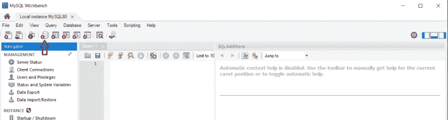
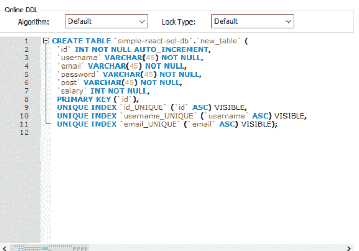

# 步步 React，NodejS 和 MySQL 简单全栈应用 2018(第二部分)

> 原文：<https://dev.to/kmaryam27/step-by-step-react-nodejs-and-mysql-simple-full-stack-application-2018-2oie>

#### 在这篇文章中，我描述了如何在 MySQL 数据库中创建新的数据库和表格。

*   要在 MySQL workbench 上创建新数据库，请按顶部导航栏中的数据库图标。就好像:

    ##### 正在写入 mysql 命令行上的 CREATE SCHEMA nameOf _ db

    命令
*   然后插入新的数据库名称，并按应用按钮:
*   现在在侧边栏中找到你的数据库名称，右击它，看到创建表格选项，然后点击它:
*   在打开的窗口中写下表名和表中的字段名以及每个字段的数据类型:在继续之前，了解一下 sql 中的数据类型是很有用的:
*   字符[(长度)]或字符[(长度)] ->字符串，包括 Unicode
*   VARCHAR (length) ->字符串
*   NVARCHAR(length)->字符串与其他语言字符串
*   布尔->真或假
*   SMALLINT ->介于 2^ -15 和 2^15 -1 之间的整数值
*   INTEGER 或 INT ->介于 2^ -31 和 2^31 -1 之间的整数值
*   小数->精度默认为 38，小数位数默认为 0
*   小数(p) ->小数位数默认为 0
*   小数(p，s) ->精度和小数位数由用户定义
*   NUMERIC [(p[，s])] ->与 DECIMAL 数据类型相同
*   实数->近似数值，最大精度为 64 位
*   浮点(p) ->近似数值
*   双精度->近似数值
*   日期->日期值 YYYY-MM-DD
*   时间->时间值 HH:MM:SS
*   时间戳->时间戳值 YYYY-MM-DD HH:MM:SS
*   CLOB [(length)]或 CHAR LARGE OBJECT [(length)]或 CHAR LARGE OBJECT [(length)] ->比 CHARACTER [(length)]或 VARCHAR (length)数据类型中允许的长度更长的字符串
*   BLOB [(length)]或二进制大型对象[(length)] ->二进制值我们也可以使用 MySQL 命令提示符添加下面的代码，并在没有 workbranch 的情况下创建此表:

资源:
[http://www . cs . Toronto . edu/~ nn/CSC 309-20085/guide/point base/docs/html/html files/dev _ datatypesandconversionsfin . html](http://www.cs.toronto.edu/%7Enn/csc309-20085/guide/pointbase/docs/html/htmlfiles/dev_datatypesandconversionsFIN.html)