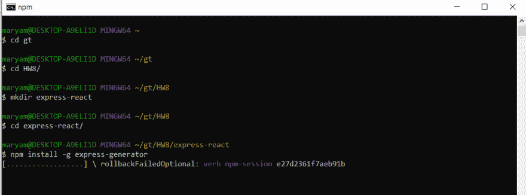
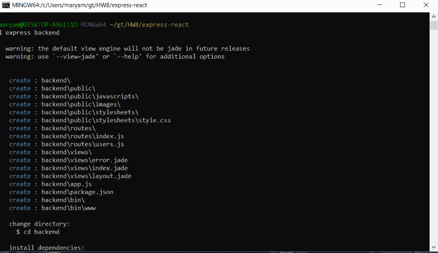
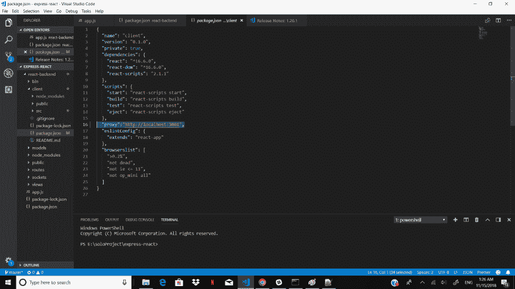
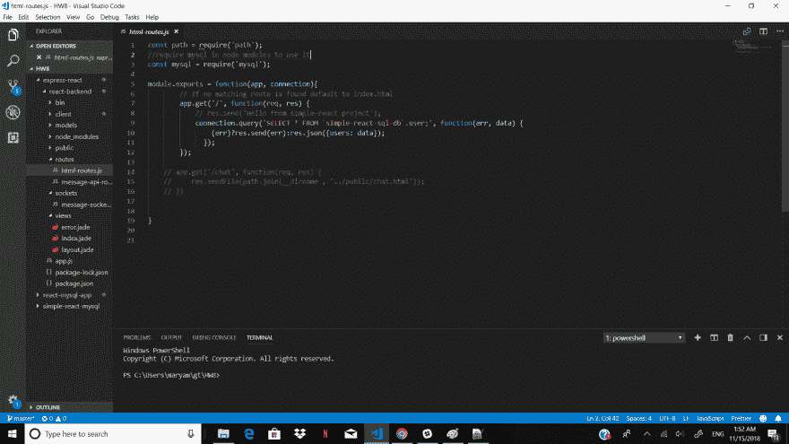
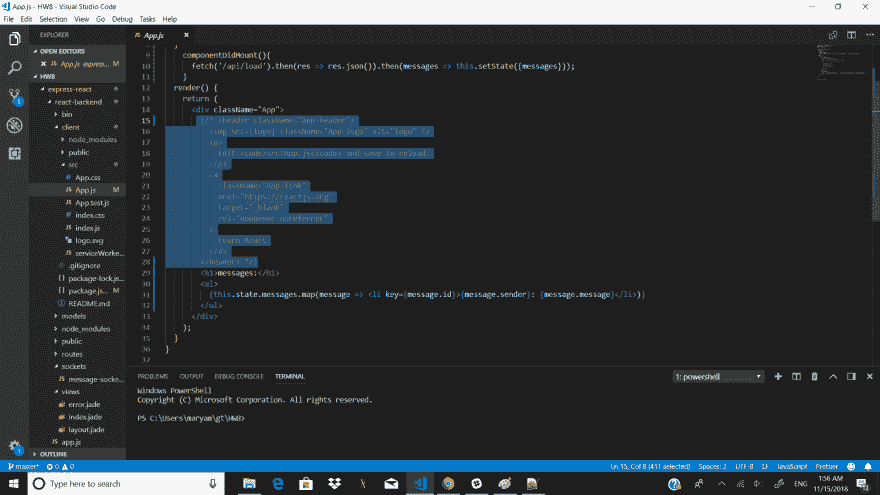
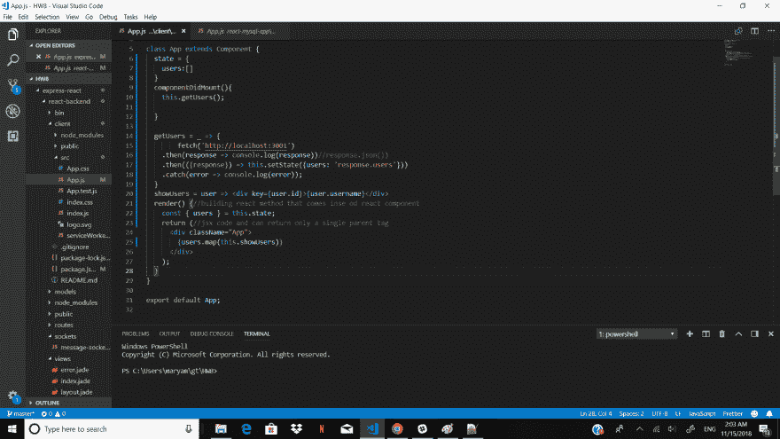
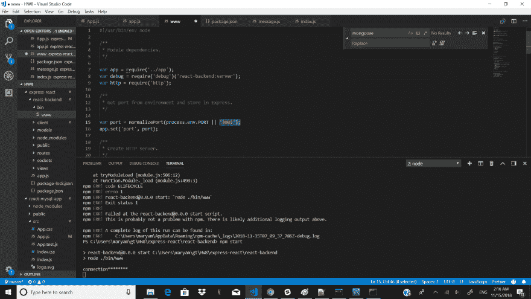
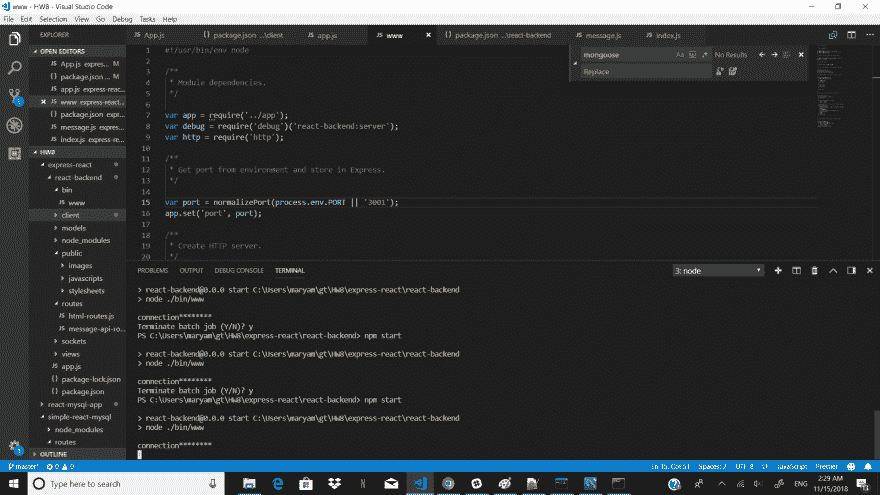
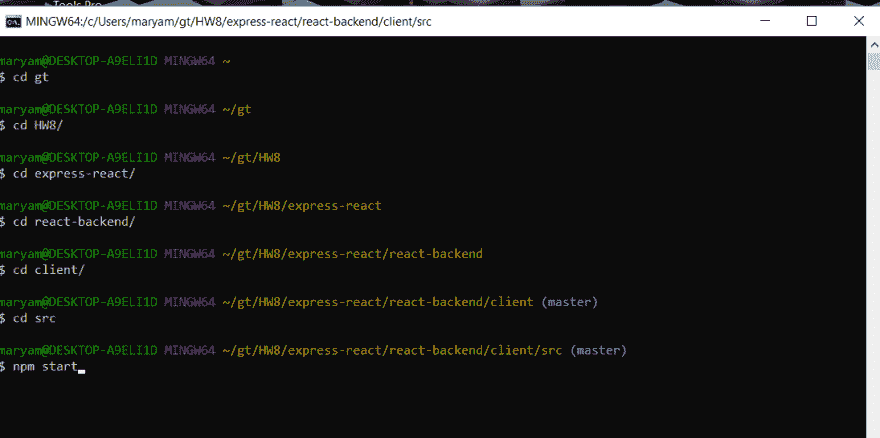
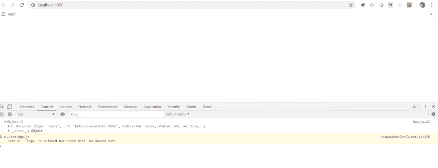

# 步步 React，NodejS 和 MySQL 简单全栈应用 2018(第四部分)

> 原文：<https://dev.to/kmaryam27/step-by-step-react-nodejs-and-mysql-simple-full-stack-application-2018-part-4-2bhg>

#### 在这篇文章中，我描述了使用 react 库开发简单的前端，以在浏览器中显示我们的后端数据

对于 react 库的开始工作，可以使用由脸书开发人员构建的 create-react-app 工具来帮助您构建 react 应用程序。欲了解更多信息，请访问:[https://github.com/facebook/create-react-app](https://github.com/facebook/create-react-app)

1-打开 GitBash，新建一个文件夹，运行这个命令:npm install-g express-generator on it:

with command:express nameofbackenfolder 默认为项目做一个后端文件夹，用 NPM install 命令， 安装您需要的所有模块:
 
2-为前端创建 react 转到后端文件夹并运行 npm install -g create-react-app，安装后运行:create-react-app 客户端
3-打开 VSCode 项目，然后打开客户端文件夹的 package.json 文件并向其中添加代理密钥:
 
4-在后端文件夹中的 app.js 中，就像您在后端创建的 server.js 一样添加这些
const connection = MySQL . create connection({
主机:' localhost '，
用户:' root '，
密码:' myjs123 '，//您的 mysql db
数据库的密码:' simple-react-SQL-db '
})；

connection . connect(function(err){
(err)？console . log(err+' +++++++++++++++/////////'):console . log(' connection * * * * * * * * *)；
})；

要求('。/routes/html-routes')(app，连接)；

5-在终端中打开 app.js 并运行 npm install mysql 将 mysql 数据库添加到新项目中
6-将 html-routes.js 文件更改为您的 html-route.js，该文件写在您的后端
 
7-在 app.js 文件的客户端文件夹中移除标签:
 
8-在 render 方法之前编写这些代码:
state = {
users:[]
}

}

getUsers = _ = > {
fetch('[http://localhost:3001 '](http://localhost:3001'))
。然后(response =>console . log(response))//response . JSON())
。然后(({ response })=>this . setstate({ users:' response . users ' }))
。catch(error =>console . log(error))；
}
showUsers = user = >

{user.username}

*   (在下一篇文章中将解释这些代码的概念)9-然后将 render 函数改为:render() {//building react 方法，该方法来自 od react 组件 const { users } = this.statereturn (//jsx 代码并且只能返回一个父标记{ users . map(this . show users)})；}

 
10-运行 MySQL 命令行客户端添加密码并回车启动 Mysql
11-在 bin 文件夹中打开 www 文件并将端口 3000 改为 3001:

 
12-在这一步结束时，您必须将后端文件夹的 app.js 打开到 VSCode 的终端，并运行 npm start 命令以在端口 3001 上运行服务器:
 
13-现在打开 gitbash 并转到客户端 app.js 路由，然后运行命令:npm star 以运行 react:
 
现在您必须在端口 3001 上看到您的后端，在端口上看到 fronend 由于“Cors”异常，我将在下一篇文章中继续解决这个问题。

[T21】](https://res.cloudinary.com/practicaldev/image/fetch/s--CsDnE-lc--/c_limit%2Cf_auto%2Cfl_progressive%2Cq_auto%2Cw_880/https://thepracticaldev.s3.amazonaws.com/i/w9vp4qv75q3ueejr3igj.png)