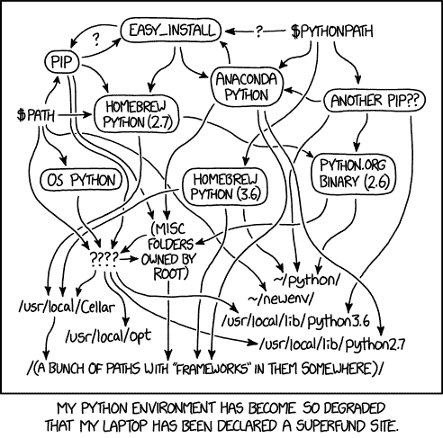

# 停止使用 sudo pip 安装

> 原文：<https://dev.to/elabftw/stop-using-sudo-pip-install-52mn>

我们都做过:

```
pip install numpy
# run into permissions issues
sudo pip install numpy # or "sudo !!" for the power users ;) 
```

故事结束，它的工作，这是什么写在自述文件，所以有什么问题呢？

你看，当你通过 pip 安装一个库的时候，你是在用 root 权限执行`setup.py`。该文件可能包含恶意代码。您还会弄乱系统库，这总是会导致问题。

相关 XKCD (thx u/truh):

[T2】](https://res.cloudinary.com/practicaldev/image/fetch/s--Xcb2Ca7X--/c_limit%2Cf_auto%2Cfl_progressive%2Cq_auto%2Cw_880/https://imgs.xkcd.com/comics/python_environment.png)

一个更好更安全的方法是:

```
pip install --user numpy # libs will be installed in ~/.local/lib 
```

这更好，可以用于安装应用程序，但是它没有解决不同 python 项目需要不同版本的问题。输入 [pipenv](https://pipenv.readthedocs.io/en/latest/) 。`pipenv`对于 python 就像`composer`对于 PHP 一样。它让你**轻松**安装和使用每个项目的库。它不是唯一允许您这样做的工具，但它是我使用的工具，所以它是我要向您展示的工具。示例:

```
pipenv install numpy matplotlib pandas
# to start your program
pipenv run ./crunch-data.py
# to install libs from another machine, after a git pull:
pipenv sync
# to get a shell in the env (like `source myenv/bin/activate` for venv)
pipenv shell 
```

这为你的程序提供了一个非常可复制的环境，不需要求助于 Docker，也不需要弄乱用户或系统库。从未来的 bug 中拯救自己，马上开始使用 pipenv，venv，conda 或者 virtualenv！比`requirements.txt` + pip 好多了。:)

干杯，
~尼科