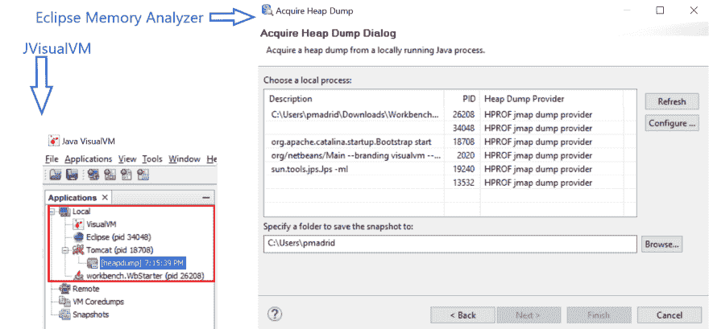

# 阻止 Java 内存泄漏

> 原文：<https://dev.to/pmadridb/stopping-a-java-memory-leak-35ae>

Java 对象存储在称为堆的内存区域中。根据应用程序运行的 Java 版本，这个区域的大小会增加和减少，但是空间有限，这是由几个因素决定的。无论你如何达到这个极限，你都会得到一个`OutOfMemoryError`类型的错误。如果您通过设置 jvm 参数 [`-Xmx`](https://docs.oracle.com/cd/E13150_01/jrockit_jvm/jrockit/jrdocs/refman/optionX.html) 来增加最大内存分配，而您的应用程序一直达到极限并抛出这个错误，那么很可能您有内存泄漏。

当您的应用程序开始在内存中存储比垃圾收集器能够处理的更多的对象时，就会发生内存泄漏。当没有对一个对象的引用时，垃圾收集器可以将该对象从内存中移除，这意味着您的应用程序保留了对它不再需要的对象的引用，或者需要以不同的方式处理以防止填满堆。

## 采取堆转储

为了正确了解应用程序内存管理中发生的事情，您需要做的第一件事是堆转储。有几种方法可以实现这一点。第一种是当你的应用程序到达一个`OutOfMemoryError`时，启用自动堆转储。当启动应用程序时，你可以通过命令行选项来启用它，就像这样:
`java -XX:+HeapDumpOnOutOfMemoryError -XX:HeapDumpPath=my/favorite/path MyApp`

*   当应用程序耗尽内存时，让 JVM 进行堆转储。
*   `-XX:HeapDumpPath=my/favorite/path`指定要保存转储的位置。

获得堆转储的另一种方法是使用`jmap` jdk 工具。如果您的应用程序只在 JRE 上运行，那么您必须安装 JDK，这样您才能使用`jmap`。
命令的用法如下:`jmap -dump:format=b,file=heapdump.bin <process_id>`

下面的选项对于在生产环境中执行分析很有用，因为您可以提取堆转储，将文件复制到您的机器上，并将其加载到工具中。提取堆转储的另一种方法是将工具远程连接到正在运行的 java 应用程序。这涉及到使用 JMX，这又需要一个开放的端口，但是如果应用程序是在本地运行的，在与您的工具相同的机器上，您将看到它被列出:
 
一旦您连接到应用程序，您就能够加载堆转储。参考每个工具的文档和教程，了解如何获取堆转储。

## 分析数据

有了堆转储之后，就该检查数据并确定导致内存泄漏的原因了。可以使用许多商业、免费和开源工具来分析转储文件。我推荐两个工具:jvisualvm 和 eclipse 内存分析器。如果您已经在您的环境中安装了 JDK，那么您已经有了 JVM(它在 bin 目录中)。eclipse 内存分析器(MAT)是 eclipse.org 的一个项目，可以从这里的[下载。](https://www.eclipse.org/mat/downloads.php)

JVM 会给你一个在堆转储中最常用的对象的列表，这有助于通过检查在堆中有更多实例的对象或者那些占用最多字节的对象来识别内存泄漏。

如果你决定使用 MAT，我强烈建议遵循这篇博客文章中描述的过程，在这篇文章中，作者描述了该工具组织数据的方式，并给出了如何找出罪魁祸首的说明。